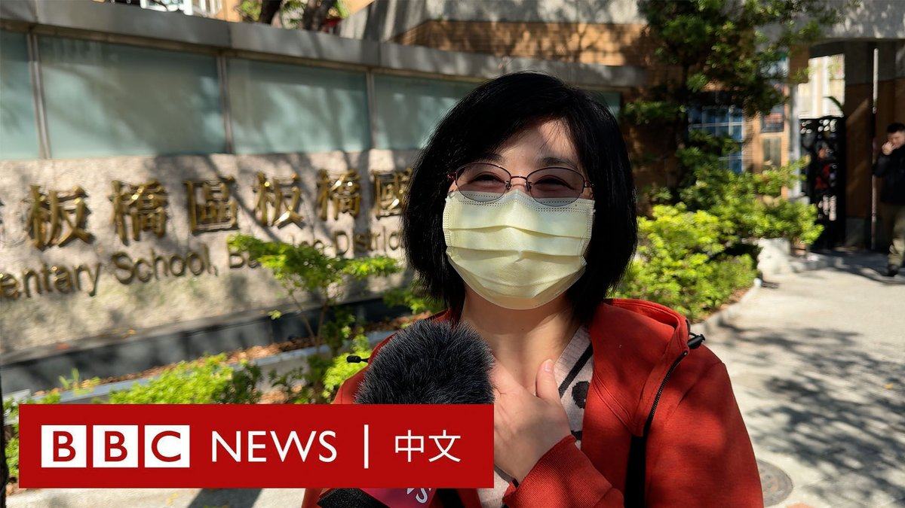
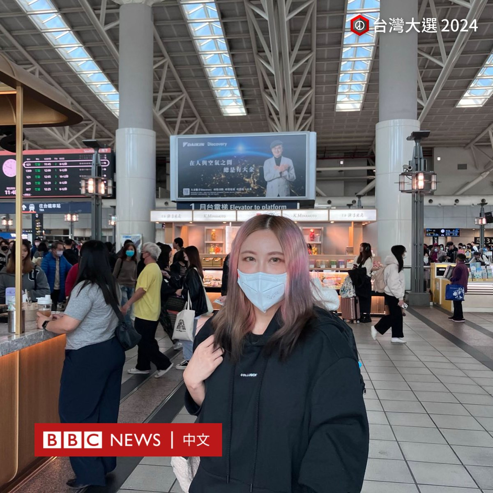
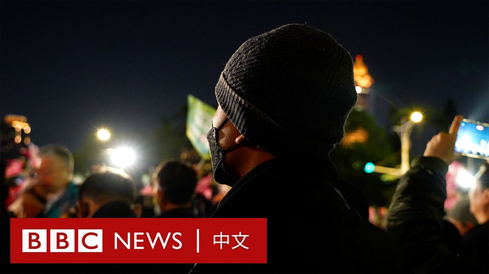
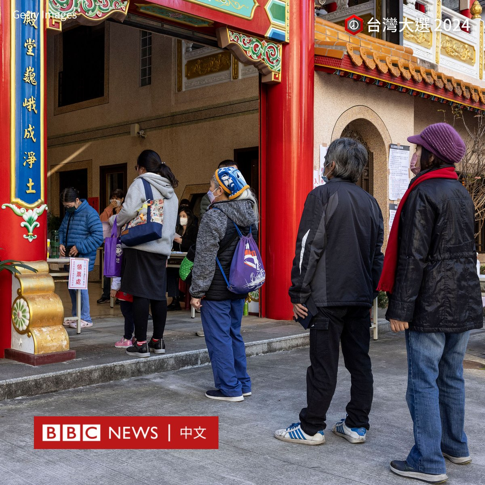
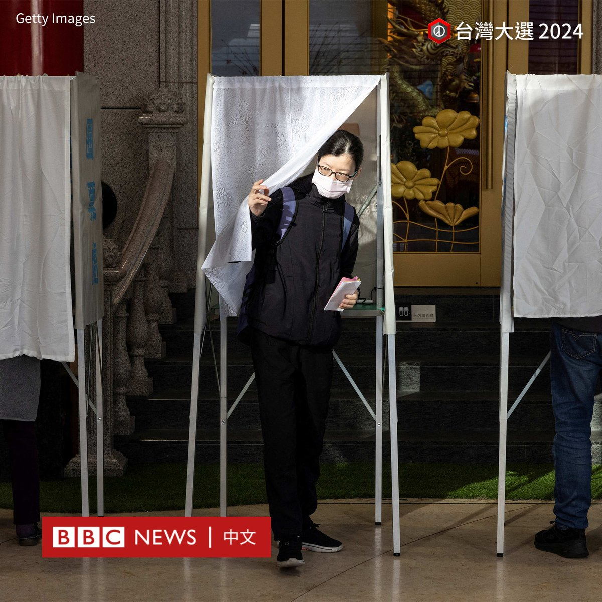
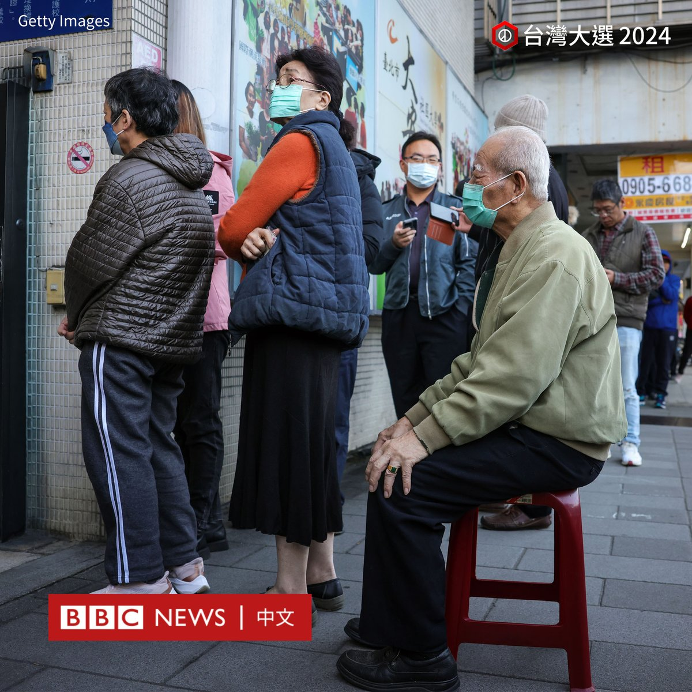
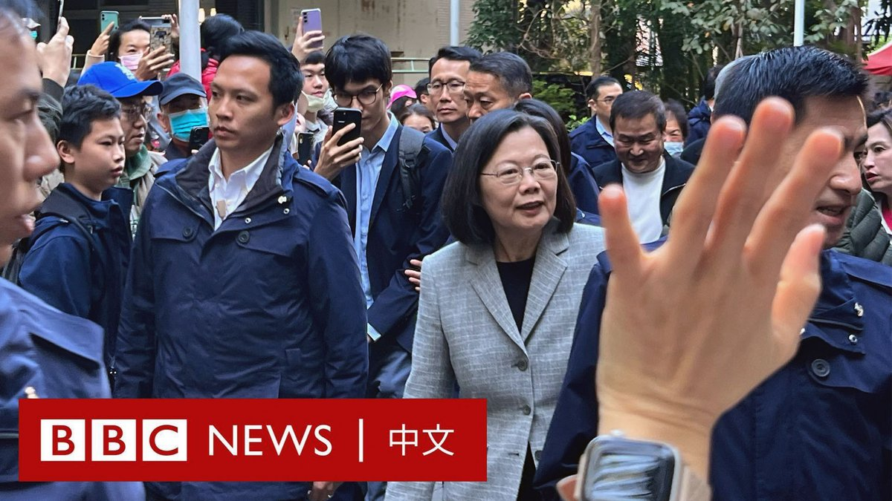

D英国广播公司BBC 北京时间 2024-01-13T13:13:56Z 1746037842508415028 台湾大选投票正在进行。在新北市板桥国小投票站外，和朋友一起来投票的市民吴女士对BBC中文分享了她的感受。她称，对政府近年的执政并不满意，因为“经济不好，造成恐慌，社会不安定”。

对于两岸关系趋于紧张，她表示并不认为对她的工作和生活造成很大的影响，但在经济上双方不可避免要合作。 https://t.co/QGMhQnJm1u   D英国广播公司BBC 北京时间 2024-01-13T13:35:59Z 1746043393464017155 在高雄的高铁站，目前在科技公司工作的洪女士在一个月前就抢下从台北到高雄的高铁票回乡投票。

她对BBC中文称，自己“北漂”20多年，投了好几次票，但这一次“特别紧张”。她表示，以前不会在社交媒体上谈论政治，但这次她感到情况“忧心”。

她表示倾向于尊重女性同志群体的候选人，希望能选出一个维系台湾民主及言论自由，“立场坚定不摇摆”的总统。

2024台湾大选持续更新：https://t.co/QR3W6yE5v9   D英国广播公司BBC 北京时间 2024-01-13T14:22:25Z 1746055079940211021 随着台湾迎来2024年总统大选，一批香港人加入了一场特别的旅行——“观选团”。

五天来，30名团员参观了三个政党的竞选总部，并参加了有关台湾政治的研讨会。

有参加者表示，加入的原因是希望“感受选举的气氛”。还有参加者称，希望通过此次选举来进一步了解台湾社会，看看这里是否适合未来发展。 https://t.co/bcYYeMHicF   D英国广播公司BBC 北京时间 2024-01-13T10:42:32Z 1745999742578917445 【图辑：台湾民众排队投票】

2024台湾大选投票正在进行。官方数据显示，此次有资格投票的选民人数逾1950万人，他们预计将前往各地设置的1.7万个投票所投票。投票时间从当地时间上午8点起至下午4点止。

周六上午，在台湾多个投票所都能看到排队投票的人潮。在台湾，投票所主要设置在学校和居民活动中心，一些宫庙也被布置为票站。

这次大选将选出总统、副总统，以及113位立法委员。据报导，选民共可投三张选票，包括总统副总统的选票、区域或原住民立委的选票、以及选出不分区及侨居国外国民立委的政党票。

根据台湾的选举规定，选民需携带身分证、印章，及投票通知单，到指定的投票所投票。

当局还表示，自投票日零时起，不得用任何方式为候选人或政党拉票，包括在社交媒体上进行助选，如有违反将处以罚款。

2024台湾大选持续更新：https://t.co/xPNsBSoGP4   D英国广播公司BBC 北京时间 2024-01-13T11:22:37Z 1746009829536129438 在新北市板桥国小，国民党总统候选人侯友宜抵达票站投票。

他在投票后接受采访时表示，“看到人民都自动自发、一早就出来投票，展现我们台湾民主在选举过程非常重要的投票行为，很开心”。

他还开心地展现了手上的伤痕，称这是因为有许多民众与他握手时握得太紧而留下的痕迹，他将其称为“幸运符号”。

他还表示，在选前之夜，他与三个女儿聊天聊到凌晨时分。

2024台湾大选持续更新：https://t.co/faDbya1WO3   D英国广播公司BBC 北京时间 2024-01-13T12:15:03Z 1746023027475644603 2024台湾总统大选投票正在进行。执政两届的民进党能否能打破台湾政坛的“八年魔咒”？或者台湾将迎来再一次的政党轮替？蓝绿之外的民众党候选人柯文哲，会否以第三势力在台湾政坛崛起？

BBC News 中文1月13日全天为你送上全方位、多视角的直播报道。https://t.co/vlZVpmP6jC https://t.co/ieH8E5OI7z   D英国广播公司BBC 北京时间 2024-01-13T09:24:17Z 1745980050166673871 当地时间上午九点左右，即将卸任的台湾总统蔡英文抵达新北市秀朗国小票站投票。

投票后，她向选民打招呼并问他们：“你们投票了吗？”

在接受媒体简短访问时，她呼吁民众通过踊跃投票，来决定台湾未来的前途，并叮嘱“记得带身分证”。

2024台湾大选持续更新：https://t.co/lPcVkln1vM https://t.co/7qzNdMHKif   D英国广播公司BBC 北京时间 2024-01-13T09:49:45Z 1745986459902083433 民进党总统候选人、副总统赖清德现身户籍地台南市投票。

他称，今天天气“风和日丽”，是投票的好天气，呼吁民众“展现台湾的民主活力”。

他还表示，昨晚“睡得很好”，接下来还有很多忙碌的行程。

2024台湾大选持续更新：https://t.co/lPcVkln1vM https://t.co/iIuefGAJz6   D英国广播公司BBC 北京时间 2024-01-13T10:26:29Z 1745995704231731393 【图辑：台湾民众排队投票】

2024台湾大选投票正在进行。官方数据显示，此次有资格投票的选民人数逾1950万人，他们预计将前往各地设置的1.7万个投票所投票。投票时间从当地时间上午8点起至下午4点止。

周六上午，在台湾多个投票所都能看到排队投票的人潮。在台湾，投票所主要设置在学校和居民活动中心，一些宫庙也被布置为票站。

这次大选将选出总统、副总统，以及113位立法委员。据报导，选民共可投三张选票，包括总统副总统的选票、区域或原住民立委的选票、以及选出不分区及侨居国外国民立委的政党票。

根据台湾的选举规定，选民需携带身分证、印章，及投票通知单，到指定的投票所投票。

当局还表示，自投票日零时起，不得用任何方式为候选人或政党拉票，包括在社交媒体上进行助选，如有违反将处以罚款。

2024台湾大选持续更新：https://t.co/xPNsBSoGP4   D英国广播公司BBC 北京时间 2024-01-13T08:38:51Z 1745968618452512970 2024台湾总统大选及立委选举在1月13日举行，投票时间自当地时间上午8时至下午4时止。

时间刚过八点，反对党民众党总统候选人柯文哲到达台北金瓯女中投票所投票。

他在投票前接受媒体访问，称自己家住附近，步行前来投票。他还表示今天天气不错，相信民众会出来投票。

2024台湾大选持续更新：https://t.co/xPNsBSoGP4   