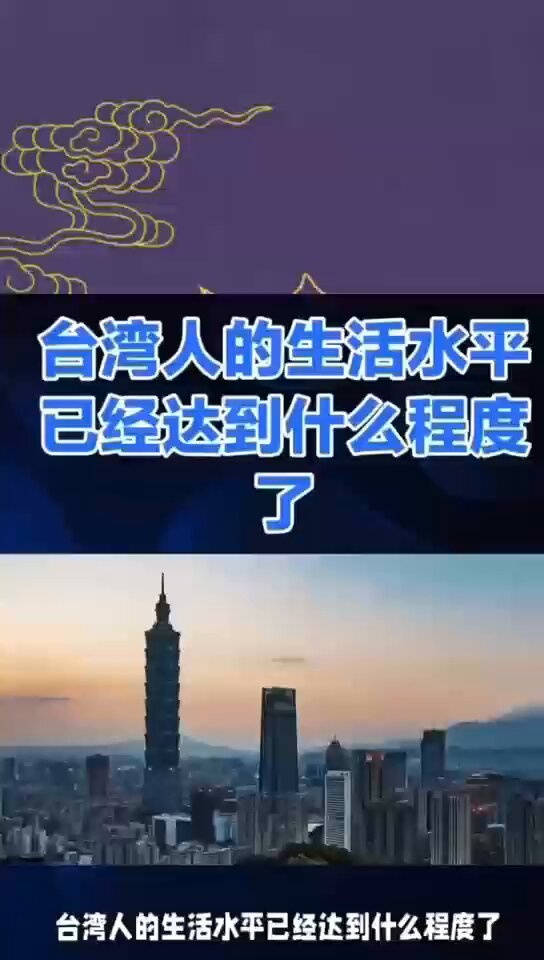
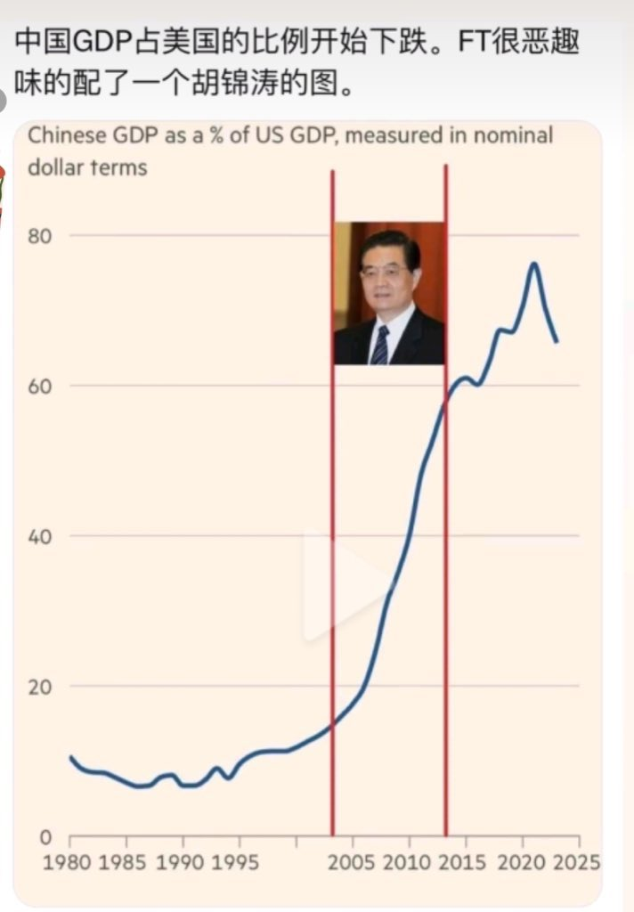

Petrichor 北京时间 2024-01-13T10:06:42Z 1745990725290914106 台湾普通人的工资还是比不上美国和加拿大的人，但是已经比中国大陆好多了，关键是台湾有免费的医疗和中小学教育，仅此两项就是中共绝对不愿给中国百姓的。还有，台湾的官员和民众的待遇平等，官员没有高干病房和食品特供。 https://t.co/8CHYk4f8GD   Petrichor 北京时间 2024-01-13T10:10:06Z 1745991578861150576 中共官员的性福生活
结果是下代都是杂种 https://t.co/ltyn2KrPjn   Petrichor 北京时间 2024-01-13T06:51:16Z 1745941542840238494 中国经济跳水，习近平不见棺材不落泪。紧急派出候任外长刘建超去美国代表中共认怂服软：中国不寻求改变现行国际秩序，更不会另起炉灶，再搞一套所谓新秩序。”“中国无意改变现行国际秩序，我们是现行国际秩序的创建者、受益者、维护者......”“世界进入动荡变革时期，各国人民都寄希望于中美两国带头解决更多问题......”

习近平过去一直说“东升西降”、“百年未有之大变局”，在外交上要求“发扬敢于斗争勇于斗争的精神”，“构建国际新秩序、制定国际标准，走到国际舞台中心”。战狼外交，处处碰壁。“xxx，误朕”，习近平是否要惩罚一批战狼，否则如何取信国际？例如，王毅、卢沙野、金灿荣….他们让皇帝吃迷魂汤，做了许多错误的决策。   Petrichor 北京时间 2024-01-13T05:19:49Z 1745918530275463308 官逼民反，历史反复重复。
一村反，反一点。
村村反，反一片。
全国反，独裁亡。

贵州省安龙县官方派数百公安特警暴力抢夺老人骨灰，被愤怒的苗族村民全部活捉。官方道歉后，公安才被释放，但警车都被砸烂，防暴器械全被扣留。
网上传出的大量视频显示，贵州省黔西南州安龙县兴隆镇石灰窑村冬瓜岭刚刚发生一起苗人集体抗暴。
根据网传消息，这个苗族村落刚刚有一位老人去世，家人无力承担数万元人民币的公墓费用，将火化后的骨灰带回村里，打算就地安葬。
但是当地官方为了财政收入，强行规定必须在指定的公墓埋葬死者。于是，官方在1月9日凌晨，派出数百人的队伍，包括公安、交警、特警和其它部门的公务员，开著多辆警车和公务车，携带盾牌、钢叉等防暴器械，到村中抢夺老人的骨灰，并对不服从的村民们大打出手。
以往当地官方也经常动用这种大阵仗，镇压访民和不接受强拆的村民，从来没有遇到太大的麻烦。即使偶尔有人敢反抗，也很快被他们暴力打压。
不过，这次特警们的暴行没有奏效，反而激发了全体村民们的怒火。他们连夜行动起来，用石头、砖头、棍棒等一起围攻特警队。特警们很快就被吓破了胆，落荒而逃。但是，愤怒的村民们封锁了苗寨的所有出口，砸毁了所有警车和公务车。最后，这些公安和特警只好全体缴械，束手就擒，成了村民们的俘虏。
9日上午，这些人向村民们道歉并做出承诺后，才灰溜溜地步行离开村子，所有的防暴器械都被村民扣留。   