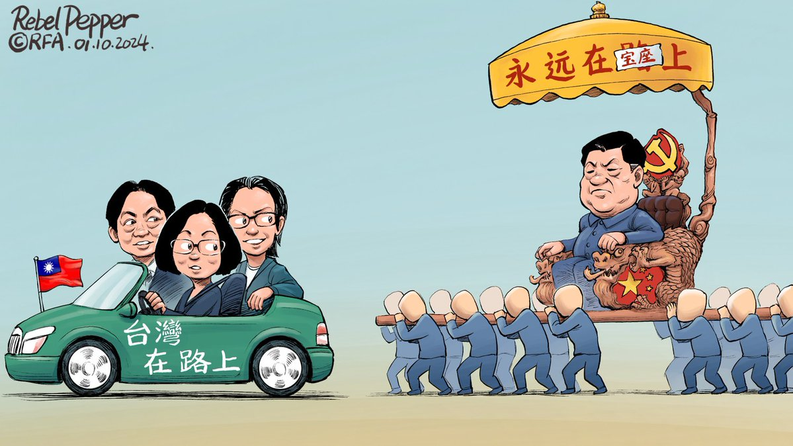
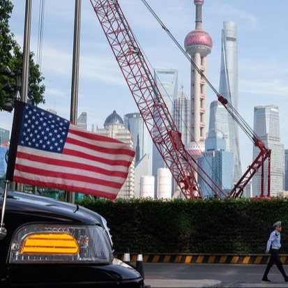

自由亚洲电台 北京时间 2024-01-13T02:43:43Z 1745879244205343005 #变态辣椒：渐行渐远的路上
在民进党发布的竞选视频《#在路上》中，坐在驾驶座的现任总统蔡英文把轿车锁匙移交给该党的正副总统候选人赖清德和萧美琴。这一镜头象征着台湾民主连贯性，在岛内引起深深共鸣。四天内视频收视达到一千万。
数日之后，中国官媒发表一篇貌合神离的文章 —《永远在路上 — 以习近平同志为核心的党中央引领全面从严治党向纵深推进》......
随着台湾大选进入白热化阶段，有分析指，这两则标题之间鲜明的差别，充分地体现了台海两边在民主道路上渐行渐远。   自由亚洲电台 北京时间 2024-01-13T03:39:26Z 1745893267219112234 RT @RFA_Chinese: 台湾总统大选三组候选人谁能胜出？#自由亚洲电台 #亚洲很想聊 全程直播报票。华文媒体最强解读阵容，由 #戴忠仁 #上官乱 主持，#公子沈、#五岳散人、#文昭、#汪浩、#任松林、#张伦、#松田康博，为观众解读结果，自由亚洲电台记者现场连线，为您带…   自由亚洲电台 北京时间 2024-01-13T04:00:37Z 1745898595294085138 彭博社通过对十四家资产超过五亿美元并投资于中资股份的 #美国养老基金 持仓报告进行分析后发现，自2020年以来，其中的大多数养老基金都减持了 #中国股票 。美国最大的养老金投资者之一的加州公务员退休系统和纽约州共同退休基金已连续第三年削减对中国市场的投资。
https://t.co/TbV0kJEyfl https://t.co/b1dpPXQ7Mh   自由亚洲电台 北京时间 2024-01-13T04:05:10Z 1745899743488917596 【“恐怖平衡” 中国在 #缅北 冲突中面临两难】
欢迎收听播客 https://t.co/q3QLYQd5Mb https://t.co/UDJfqJBUzb   自由亚洲电台 北京时间 2024-01-13T04:18:04Z 1745902986965230032 本周五，台湾民众党总统候选人 #柯文哲 在国际记者会上承诺，如果当选，他会在维护美台稳固关系基础上，愿意开始和中国沟通。柯文哲表示，未来作决策会从美国和中国的角度去衡酌，并自认三组候选人只有他是美中都可接受。
https://t.co/2V7iIMDQp7 https://t.co/TYm5EzH815   自由亚洲电台 北京时间 2024-01-13T00:33:54Z 1745846575832961317 中国去年的进出口 表现出炉，如果以美元计价录得双下滑的情况。中国海关总署表示，增速放缓是受到外围因素影响，强调 #中国进出口表现 能维持稳中有增，并且对今年 #外贸 表现向好有信心。但从数据看，是否足以支撑信心呢？
https://t.co/eNdp4M7vl6 https://t.co/jpvbypKu7y   自由亚洲电台 北京时间 2024-01-13T02:12:57Z 1745871501059047500 【天空飘来5个球，扰台在加油】
这个月，台湾的国防部连续侦获多枚 #中国空飘气球 飞越台湾，投票剩下最后不到24小时，选情紧绷时，又有5个空飘气球逾越海峡中线。
https://t.co/uGZhj3i2bg https://t.co/eiAQzjc0p1   自由亚洲电台 北京时间 2024-01-13T00:03:44Z 1745838983194845641 四年前的 #台湾大选，#香港 各界均有组织 #观选团 到台湾观摩。但时移势易，类似的观选团今年几乎见不到，有港人选择以个人身份到台湾考察。
香港选举制度已被北京强行改变，想复刻台湾已是枉然。
https://t.co/rY3HHma0JY https://t.co/7hSXOs32xD   自由亚洲电台 北京时间 2024-01-13T00:15:08Z 1745841854241808594 RT @RFA_Chinese: 【柯文哲: 维持和美国稳固关系下 展开和中国沟通】… https://t.co/9OBJH3Yb8K   