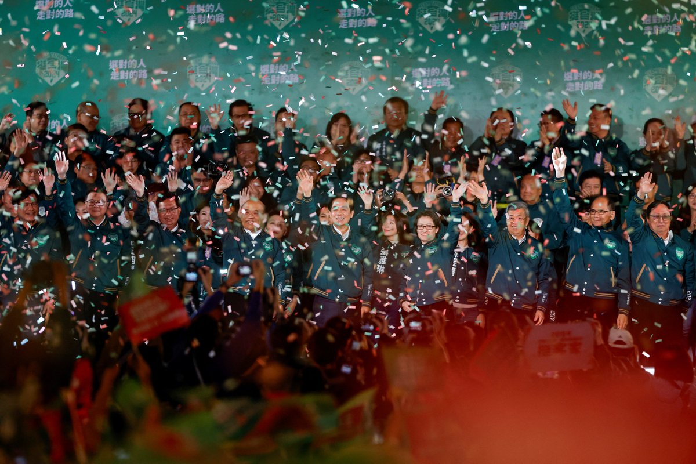
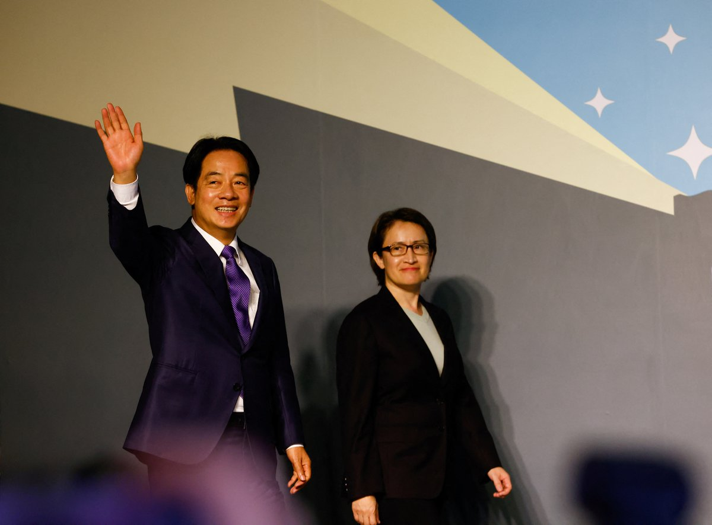
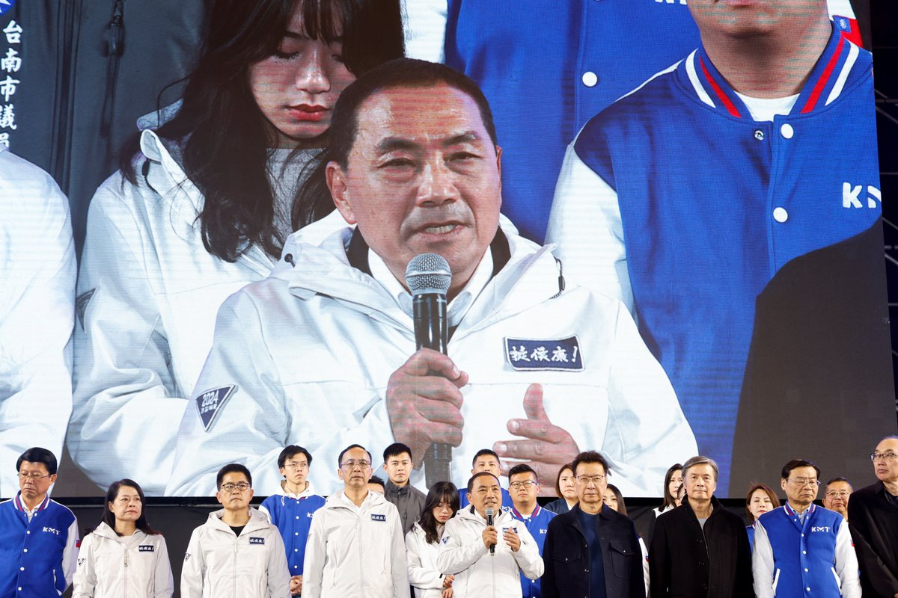
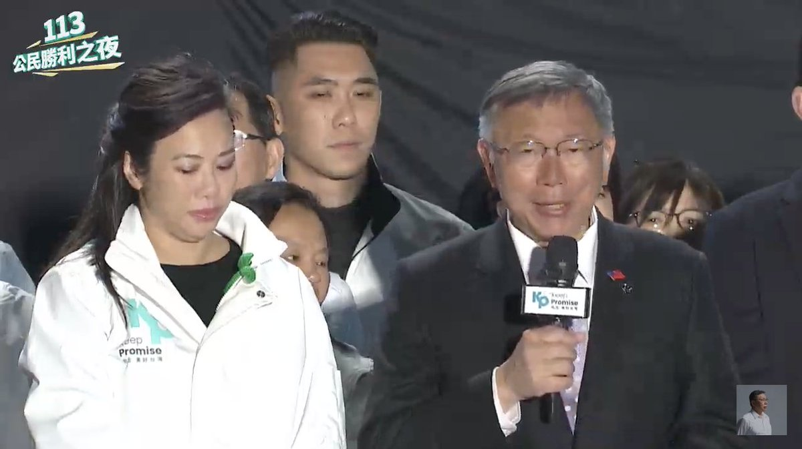
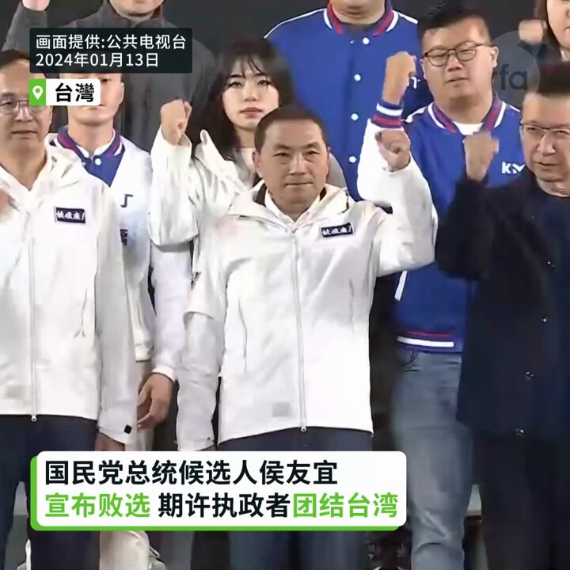
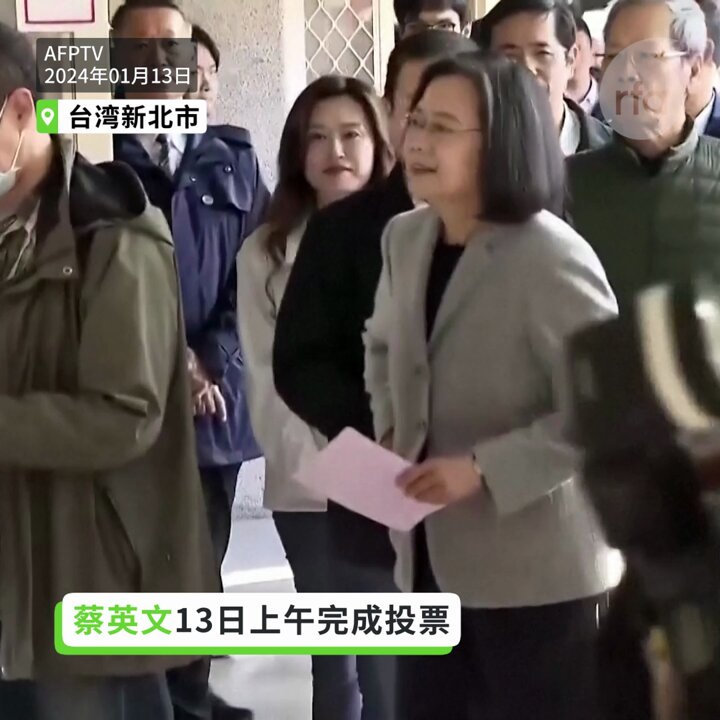

自由亚洲电台 北京时间 2024-01-13T23:10:45Z 1746188038953222197 达赖喇嘛在首届国际僧伽论坛揭幕时指出，佛教徒可以用佛法服务世界，以慈悲理念助人调伏情绪，使内心回归平和。30 个国家代表和不同 #佛教 传统的 2000 多名僧侣与会。
详情：
https://t.co/pItdvA3wgn   自由亚洲电台 北京时间 2024-01-13T23:36:04Z 1746194406967791701 【大陆网民翻墙观选：“民主选举遥遥领先”】
借台湾大选之机，有大陆网民找到1953年的中国选举宣传海报《我们有选举权和被选举权》。
另外，"满洲流亡政府”首获民进党之邀观摩大选，爱新觉罗·溥君“总统”表示，台湾选举有借鉴作用，并会合力把满洲复国运动推向新高潮。
详阅：https://t.co/8LKNTmEaT3   自由亚洲电台 北京时间 2024-01-13T23:36:55Z 1746194621896495294 【“赖萧配”逾550万票当选】
【国台办：结果不代表主流民意】
#台湾总统大选，代表 #民进党 的 #赖清德 和 #萧美琴 组合，取得超过550万票当选。#国台办 发言人陈斌华則在13号当晚表示，选举结果显示，民进党不能代表主流民意，重申台湾是 #中国 的台湾，选举不能改变两岸关系的基本格局和发展方向。
https://t.co/8VMfdUWO5Q   自由亚洲电台 北京时间 2024-01-13T23:50:32Z 1746198051276955657 【台湾大选无政党获过半票数，显示社会政治分歧深化】根据台湾中央选举委员会的数据，99% 的投票站已公布投票结果，赖清德获得了40%的选票，侯友宜获得33%选票。新创立的台湾民众党的候选人柯文哲获得了26%的选票。
详阅：https://t.co/wjcUMxqx8W   自由亚洲电台 北京时间 2024-01-13T23:56:29Z 1746199546906972190 【赖清德：依照中华民国的宪政体制】
【不卑不亢维持现状】
民进党总统副总统当选人赖清德、萧美琴以558万多票胜选，赖清德在国际记者会表示，作为2024世界大选年最瞩目的第一场大选，台湾缔造了民主阵营的第一场胜利！他将依照中华民国的宪政体制，不卑不亢维持现状，期盼两岸回到健康有序交流，他说中国也有责任促进两岸稳定发展。
#台湾总统大选 #赖清德 #萧美琴   自由亚洲电台 北京时间 2024-01-13T20:52:48Z 1746153319934939484 RT @RFA_Chinese: 侯友宜承认败选，公开道歉！   自由亚洲电台 北京时间 2024-01-13T20:57:51Z 1746154590704226733 【赖清德萧美琴获得逾550万票 发表胜选感言】
2024台湾总统大选13日晚上结果出炉，民进党正副总统候选人赖清德、萧美琴获得逾550万票宣布胜选，赖清德召开国际记者会，发表胜选感言，他表示感谢台湾人民共同写下了民主的新页，并向世界展现了对民主体制的珍惜，这是永不放弃的坚持。他并感谢两位对手，所展现的民主风度。#台湾大选 #赖清德   自由亚洲电台 北京时间 2024-01-13T21:13:59Z 1746158654326239507 【国民党总统候选人侯友宜宣布败选 期许执政者团结台湾】
台湾总统大选开票态势底定，国民党总统候选人侯友宜13日晚间8点左右提前宣布败选，他表示遗憾未能成完成政党轮替，也尊重台湾人民做出的最后选择，他期许总统和副总统当选人赖清德、萧美琴，不要辜负台湾人民对执政者的期待，听进人民的声音，同时要团结台湾，好好面对台海安全问题和美中台关系。
#台湾总统大选 #侯友宜 #赖清德 #萧美琴   自由亚洲电台 北京时间 2024-01-13T21:22:40Z 1746160837377597949 【柯文哲败选感言：明早7点半继续上班 下个4年赢回国家】
2024年总统大选落幕，民众党总统候选人柯文哲位居第三落败。柯文哲表示，要把今天当作是迈向成功的第一步，要继续努力迈向成功，他们没有难过的时间，因为国家会继续往前进，没有放弃的理由，明天早上还是7点半会来上班，他说:“明天起床后要打起精神，要为我们的未来努力，我们只有一个台湾，我们的未来，下一个4年我们一定可以执政、赢回这个国家”。#台湾总统大选 #柯文哲   自由亚洲电台 北京时间 2024-01-13T21:44:48Z 1746166407086145643 【国民党总统候选人侯友宜宣布败选 期许执政者团结台湾】
台湾总统大选开票态势底定，国民党总统候选人侯友宜13日晚间8点左右提前宣布败选，他表示遗憾未能成完成政党轮替，也尊重台湾人民做出的最后选择，他期许总统和副总统当选人赖清德、萧美琴，不要辜负台湾人民对执政者的期待，听进人民的声音，同时要团结台湾，好好面对台海安全问题和美中台关系。
#台湾总统大选 #侯友宜 #赖清德 #萧美琴   自由亚洲电台 北京时间 2024-01-13T22:07:52Z 1746172212925669883 【赖清德当选总统，感谢民众写下历史新页】
【“中华民国台湾会与国际民主盟友并肩同行”】
赖清德胜选后在国际记者会致词时透露，他已分别接获国民党与民众党的恭贺电话，向对手展现民主风度表示感谢，希望未来能一起团结合作。
详阅：
https://t.co/3oG0AtbEJS   自由亚洲电台 北京时间 2024-01-13T18:23:04Z 1746115638744264943 RT @RFA_Chinese: 台湾总统大选三组候选人谁能胜出？#自由亚洲电台 #亚洲很想聊 全程直播报票。华文媒体最强解读阵容，由 #戴忠仁 #上官乱 主持，#公子沈、#五岳散人、#文昭、#汪浩、#任松林、#张伦、#松田康博，为观众解读结果，自由亚洲电台记者现场连线，为您带…   自由亚洲电台 北京时间 2024-01-13T19:32:49Z 1746133194502451537 RT @RFA_Chinese: 【#直播中】决战2024！台湾总统立委大选开票之夜现场特别报道 （戴忠仁/上官乱/公子沈/五岳散人/文昭/汪浩/任松林/张伦/松田康博）https://t.co/lPkNajXeFK   自由亚洲电台 北京时间 2024-01-13T19:59:42Z 1746139957922586911 侯友宜承认败选，公开道歉！   自由亚洲电台 北京时间 2024-01-13T20:13:44Z 1746143491917295925 RT @RFA_Chinese: 【台湾大选三党旗鼓相当，诸派选民各有思虑】
#台湾 第八次正副总统公民直选拉开帷幕。与过往大选相比，民众投票背后的考量变得更为复杂，而不局限于政党意识形态。有选民因关注香港命运而支持 #民进党，有选民因不愿一党独大而支持 #国民党，也有年青选民…   自由亚洲电台 北京时间 2024-01-13T17:23:01Z 1746100527228662094 RT @RFA_Chinese: 台湾总统大选三组候选人谁能胜出？#自由亚洲电台 #亚洲很想聊 全程直播报票。华文媒体最强解读阵容，由 #戴忠仁 #上官乱 主持，#公子沈、#五岳散人、#文昭、#汪浩、#任松林、#张伦、#松田康博，为观众解读结果，自由亚洲电台记者现场连线，为您带…   自由亚洲电台 北京时间 2024-01-13T12:24:40Z 1746025446175613140 RT @RFA_Chinese: 台湾总统大选三组候选人谁能胜出？#自由亚洲电台 #亚洲很想聊 全程直播报票。华文媒体最强解读阵容，由 #戴忠仁 #上官乱 主持，#公子沈、#五岳散人、#文昭、#汪浩、#任松林、#张伦、#松田康博，为观众解读结果，自由亚洲电台记者现场连线，为您带…   自由亚洲电台 北京时间 2024-01-13T10:56:36Z 1746003282353348806 【蔡英文完成投票】
【呼吁民众用选票决定国家的未来】
台湾的总统蔡英文13日上午九点左右完成投票，即将卸任的她呼吁民众踊跃出门投票。投票后，她接受媒体访问表示，民主国家的每一位公民，都可以用我们手中神圣的一票，来决定国家的未来。她前一晚也在脸书贴文：明天（1月13日），全世界的关键字，一定是“台湾”。  #台湾总统大选 #蔡英文   自由亚洲电台 北京时间 2024-01-13T11:20:00Z 1746009170565071224 台湾总统大选三组候选人谁能胜出？#自由亚洲电台 #亚洲很想聊 全程直播报票。华文媒体最强解读阵容，由 #戴忠仁 #上官乱 主持，#公子沈、#五岳散人、#文昭、#汪浩、#任松林、#张伦、#松田康博，为观众解读结果，自由亚洲电台记者现场连线，为您带来最新票数和全面解读！
https://t.co/9xDYBzib9u https://t.co/Yac0LRSv5A   自由亚洲电台 北京时间 2024-01-13T11:47:43Z 1746016146447298822 【侯友宜完成投票】
【呼吁选后团结面对台湾未来】
国民党总统候选人侯友宜13日上午十点多完成投票。他对记者说，看到人民自动自发一早就出来投票，展现台湾民主在选举过程非常重要的投票行为，很开心，用民主来选出最理想的总统副总统和立委。更重要的是，选举的过程如何纷纷扰扰，选后大家都一定要团结。
#台湾总统大选 #侯友宜   自由亚洲电台 北京时间 2024-01-13T12:13:45Z 1746022699938304373 【台湾总统大选13日投票】
【蓝绿白候选人上午完成投票】
台湾总统大选13日举行投票，蓝绿白三组总统副总统候选人都在上午完成了投票。台湾的总统蔡英文也完成投票，即将卸任的她呼吁民众踊跃出门投票。投票后，她接受媒体访问表示，民主国家的每一位公民，都可以用手中神圣的一票，来决定国家的未来。报道:https://t.co/8RUzJoD7t8   自由亚洲电台 北京时间 2024-01-13T09:36:09Z 1745983037903384610 【何清涟 @HeQinglian 看 #繁花】
她眼里的 #宝总，是平民致富的窗口时期产物。
他的破茧成蝶，正逢1988-1993年中国经济改革三步曲。
他的退出，正当其时。1994年以后的上海资本市场，已经不是普通人能够畅游之地。曾经称霸一方的魏东、袁宝璟、周正毅、刘汉等，多数都以悲惨的方式谢幕。
详见 https://t.co/1RDkWcy09K   自由亚洲电台 北京时间 2024-01-13T10:22:44Z 1745994759682884010 【民进党总统候选人赖清德完成投票】
【赖清德鼓励民众踊跃投票 展现台湾民主活力】
民进党总统候选人赖清德13日上午在他的户籍地台南市投票。赖清德对媒体表示今日天气风和日丽，是投票的好天气，他鼓励父老乡亲踊跃投票，展现台湾民主活力。让台湾继续往前走。他说，每一次投票机会他都很珍惜，是台湾得来不易的民主，希望大家也能够珍惜民主，踊跃投票。
#台湾总统大选 #赖清德   自由亚洲电台 北京时间 2024-01-13T06:27:55Z 1745935667488526657 【台湾大选三党旗鼓相当，诸派选民各有思虑】
#台湾 第八次正副总统公民直选拉开帷幕。与过往大选相比，民众投票背后的考量变得更为复杂，而不局限于政党意识形态。有选民因关注香港命运而支持 #民进党，有选民因不愿一党独大而支持 #国民党，也有年青选民为解脱蓝绿僵局而支持 #民众党。大选结果，您预测何如？   自由亚洲电台 北京时间 2024-01-13T06:28:43Z 1745935867099959646 1月12日，美国国务卿 #布林肯（Antony Blinken）在华盛顿会晤了到访的中共中央对外联络部部长 #刘建超。由于正值 #台湾大选 的前夜，这次会面受到各方瞩目。

https://t.co/5wYXKfwUFz https://t.co/2VELVK9qGT   自由亚洲电台 北京时间 2024-01-13T06:31:14Z 1745936502557970709 欢迎收听和订阅播客【＃亚太报道】 https://t.co/MjLNSvVMqc
广东异议人士 #肖育辉 抵达台湾; 海内外华人关注 #台湾大选; 中国 #介选 台湾手段曝光；#中国进出口 双双下跌。 https://t.co/vIhKAQGzyK   自由亚洲电台 北京时间 2024-01-13T07:29:17Z 1745951110425141292 RT @RFA_Chinese: 《华盛顿邮报》本周四披露，中国试图通过四种手段干预 #台湾大选，推进其“统一”议程:
1.制造信息混乱
2.拉拢官员
3.经济软硬兼施
4.强化军事恐吓。
详见  https://t.co/3JMUTpn6oP https://t.co/qqq…   自由亚洲电台 北京时间 2024-01-13T07:30:16Z 1745951359289946138 RT @RFA_Chinese: 台湾总统大选三组候选人谁能胜出？#自由亚洲电台 #亚洲很想聊 全程直播报票。华文媒体最强解读阵容，由 #戴忠仁 #上官乱 主持，#公子沈、#五岳散人、#文昭、#汪浩、#任松林、#张伦、#松田康博，为观众解读结果，自由亚洲电台记者现场连线，为您带…   自由亚洲电台 北京时间 2024-01-13T08:11:09Z 1745961647989235817 据彭博社报道，#中国人民银行 周三发表一份官方声明，披露了去年12月的一次三小时闭门会议。会议上，中国人民银行副行长 #鲁磊 表示，央行对反馈持有开放态度，对政策持务实立场。
https://t.co/6J9yKPyapV https://t.co/PmMuTWyEhB   自由亚洲电台 北京时间 2024-01-13T08:34:02Z 1745967404562419733 【台湾总统大选13日投票】
【台湾民众党总统候选人柯文哲完成投票】
台湾总统大选今天13日投票，台湾民众党总统候选人柯文哲早上八点多和夫人一起前往台北市的投票所完成了投票。 #台湾总统大选 #柯文哲 https://t.co/DF5hONoJZU   自由亚洲电台 北京时间 2024-01-13T09:13:54Z 1745977437882605729 【细思极恐：非必要不连坐 就是有必要可随便连坐？】
最高法日前一份调研报告建议，应规范犯罪附随后果在犯罪人入学、就业及社会活动中的限制，“特别是严格控制对犯罪人亲属的限制和影响，非必要不对犯罪人亲属作出上学、入伍、就业等方面的限制”。
中共党媒纷纷报道，网民热议：#非必要不连坐，就是有必要可随便连坐？这是要将连坐合法化？谁来界定是否”必要“？
#您怎么看？   自由亚洲电台 北京时间 2024-01-13T09:16:29Z 1745978085747642481 【台湾总统大选13日投票】
【台湾民众党总统候选人柯文哲完成投票】
台湾总统大选今天13日投票，台湾民众党总统候选人柯文哲早上八点多和夫人一起前往台北市的投票所完成了投票。他回答记者询问说平常心，昨晚睡得很好，并说每天把该做的事情做完，每一个阶段再计划下一个阶段。 #台湾总统大选 #柯文哲 https://t.co/NNxPHnM7Aa   自由亚洲电台 北京时间 2024-01-13T04:33:08Z 1745906779039662560 《华盛顿邮报》本周四披露，中国试图通过四种手段干预 #台湾大选，推进其“统一”议程:
1.制造信息混乱
2.拉拢官员
3.经济软硬兼施
4.强化军事恐吓。
详见  https://t.co/3JMUTpn6oP https://t.co/qqqUkfpQgZ   自由亚洲电台 北京时间 2024-01-13T05:46:47Z 1745925313643897006 专栏 | #夜话中南海：#习近平 对"毛错"的轻描淡写为何仍不能令毛左们满意？
https://t.co/tCmFDraBiI https://t.co/9E9UrSsJ61   自由亚洲电台 北京时间 2024-01-13T06:03:01Z 1745929398493257759 【2024预言家】2024年，世界将会发生什么大事？据《每日邮报》报道，一位被称为“末日先知”的通灵者与他的妻子一起正确预测了新冠大流行、英国脱欧、特朗普成为总统，甚至英国女王伊丽莎白二世的去世。他对2024年的年预测则包括中俄联盟和全球网络攻击。
2024年，您希望发生什么，预测会发生什么？ https://t.co/pLiHU8djik   自由亚洲电台 北京时间 2024-01-13T02:43:43Z 1745879244205343005 #变态辣椒：渐行渐远的路上
在民进党发布的竞选视频《#在路上》中，坐在驾驶座的现任总统蔡英文把轿车锁匙移交给该党的正副总统候选人赖清德和萧美琴。这一镜头象征着台湾民主连贯性，在岛内引起深深共鸣。四天内视频收视达到一千万。
数日之后，中国官媒发表一篇貌合神离的文章 —《永远在路上 — 以习近平同志为核心的党中央引领全面从严治党向纵深推进》......
随着台湾大选进入白热化阶段，有分析指，这两则标题之间鲜明的差别，充分地体现了台海两边在民主道路上渐行渐远。   自由亚洲电台 北京时间 2024-01-13T03:39:26Z 1745893267219112234 RT @RFA_Chinese: 台湾总统大选三组候选人谁能胜出？#自由亚洲电台 #亚洲很想聊 全程直播报票。华文媒体最强解读阵容，由 #戴忠仁 #上官乱 主持，#公子沈、#五岳散人、#文昭、#汪浩、#任松林、#张伦、#松田康博，为观众解读结果，自由亚洲电台记者现场连线，为您带…   自由亚洲电台 北京时间 2024-01-13T04:00:37Z 1745898595294085138 彭博社通过对十四家资产超过五亿美元并投资于中资股份的 #美国养老基金 持仓报告进行分析后发现，自2020年以来，其中的大多数养老基金都减持了 #中国股票 。美国最大的养老金投资者之一的加州公务员退休系统和纽约州共同退休基金已连续第三年削减对中国市场的投资。
https://t.co/TbV0kJEyfl https://t.co/b1dpPXQ7Mh   自由亚洲电台 北京时间 2024-01-13T04:05:10Z 1745899743488917596 【“恐怖平衡” 中国在 #缅北 冲突中面临两难】
欢迎收听播客 https://t.co/q3QLYQd5Mb https://t.co/UDJfqJBUzb   自由亚洲电台 北京时间 2024-01-13T04:18:04Z 1745902986965230032 本周五，台湾民众党总统候选人 #柯文哲 在国际记者会上承诺，如果当选，他会在维护美台稳固关系基础上，愿意开始和中国沟通。柯文哲表示，未来作决策会从美国和中国的角度去衡酌，并自认三组候选人只有他是美中都可接受。
https://t.co/2V7iIMDQp7 https://t.co/TYm5EzH815   自由亚洲电台 北京时间 2024-01-13T00:33:54Z 1745846575832961317 中国去年的进出口 表现出炉，如果以美元计价录得双下滑的情况。中国海关总署表示，增速放缓是受到外围因素影响，强调 #中国进出口表现 能维持稳中有增，并且对今年 #外贸 表现向好有信心。但从数据看，是否足以支撑信心呢？
https://t.co/eNdp4M7vl6 https://t.co/jpvbypKu7y   自由亚洲电台 北京时间 2024-01-13T02:12:57Z 1745871501059047500 【天空飘来5个球，扰台在加油】
这个月，台湾的国防部连续侦获多枚 #中国空飘气球 飞越台湾，投票剩下最后不到24小时，选情紧绷时，又有5个空飘气球逾越海峡中线。
https://t.co/uGZhj3i2bg https://t.co/eiAQzjc0p1   自由亚洲电台 北京时间 2024-01-13T00:03:44Z 1745838983194845641 四年前的 #台湾大选，#香港 各界均有组织 #观选团 到台湾观摩。但时移势易，类似的观选团今年几乎见不到，有港人选择以个人身份到台湾考察。
香港选举制度已被北京强行改变，想复刻台湾已是枉然。
https://t.co/rY3HHma0JY https://t.co/7hSXOs32xD   自由亚洲电台 北京时间 2024-01-13T00:15:08Z 1745841854241808594 RT @RFA_Chinese: 【柯文哲: 维持和美国稳固关系下 展开和中国沟通】… https://t.co/9OBJH3Yb8K   