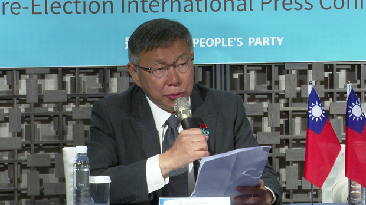
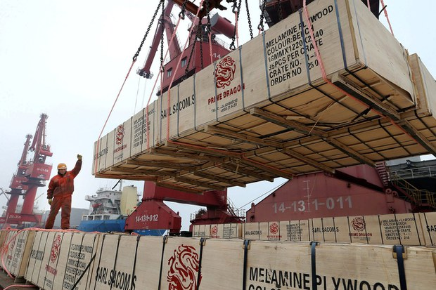
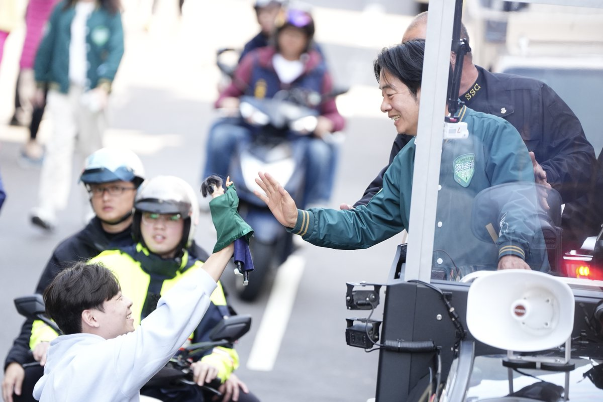
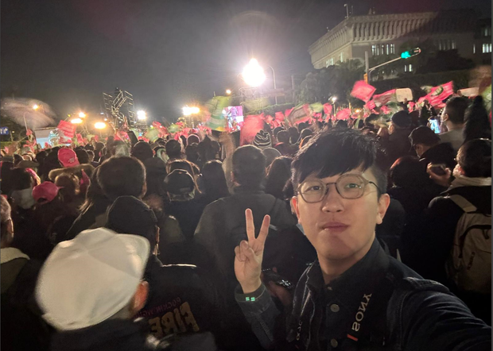
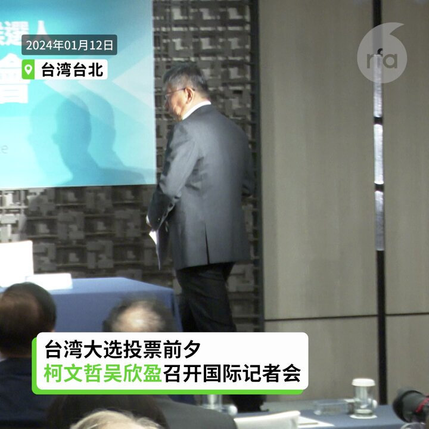

自由亚洲电台 北京时间 2024-01-13T04:18:04Z 1745902986965230032 本周五，台湾民众党总统候选人 #柯文哲 在国际记者会上承诺，如果当选，他会在维护美台稳固关系基础上，愿意开始和中国沟通。柯文哲表示，未来作决策会从美国和中国的角度去衡酌，并自认三组候选人只有他是美中都可接受。
https://t.co/2V7iIMDQp7 https://t.co/TYm5EzH815   自由亚洲电台 北京时间 2024-01-13T00:33:54Z 1745846575832961317 中国去年的进出口 表现出炉，如果以美元计价录得双下滑的情况。中国海关总署表示，增速放缓是受到外围因素影响，强调 #中国进出口表现 能维持稳中有增，并且对今年 #外贸 表现向好有信心。但从数据看，是否足以支撑信心呢？
https://t.co/eNdp4M7vl6 https://t.co/jpvbypKu7y   自由亚洲电台 北京时间 2024-01-13T02:12:57Z 1745871501059047500 【天空飘来5个球，扰台在加油】
这个月，台湾的国防部连续侦获多枚 #中国空飘气球 飞越台湾，投票剩下最后不到24小时，选情紧绷时，又有5个空飘气球逾越海峡中线。
https://t.co/uGZhj3i2bg https://t.co/eiAQzjc0p1   自由亚洲电台 北京时间 2024-01-13T00:03:44Z 1745838983194845641 四年前的 #台湾大选，#香港 各界均有组织 #观选团 到台湾观摩。但时移势易，类似的观选团今年几乎见不到，有港人选择以个人身份到台湾考察。
香港选举制度已被北京强行改变，想复刻台湾已是枉然。
https://t.co/rY3HHma0JY https://t.co/7hSXOs32xD   自由亚洲电台 北京时间 2024-01-13T00:15:08Z 1745841854241808594 RT @RFA_Chinese: 【柯文哲: 维持和美国稳固关系下 展开和中国沟通】… https://t.co/9OBJH3Yb8K   