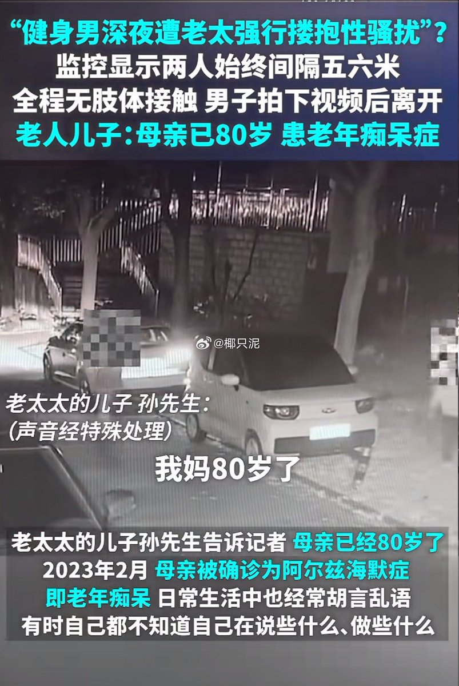
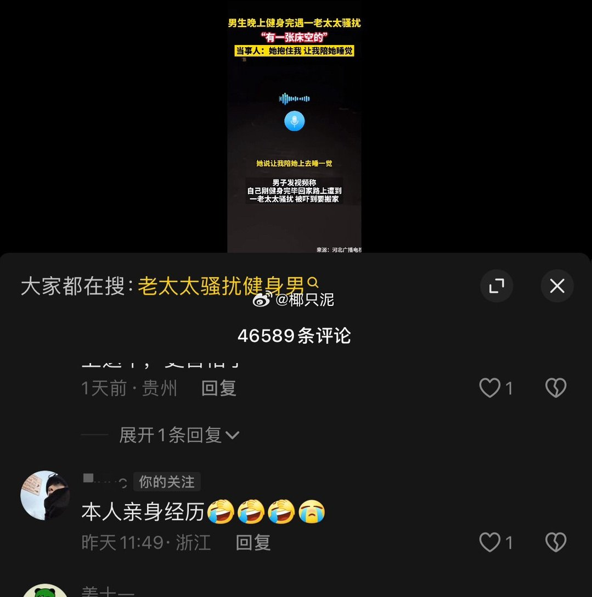
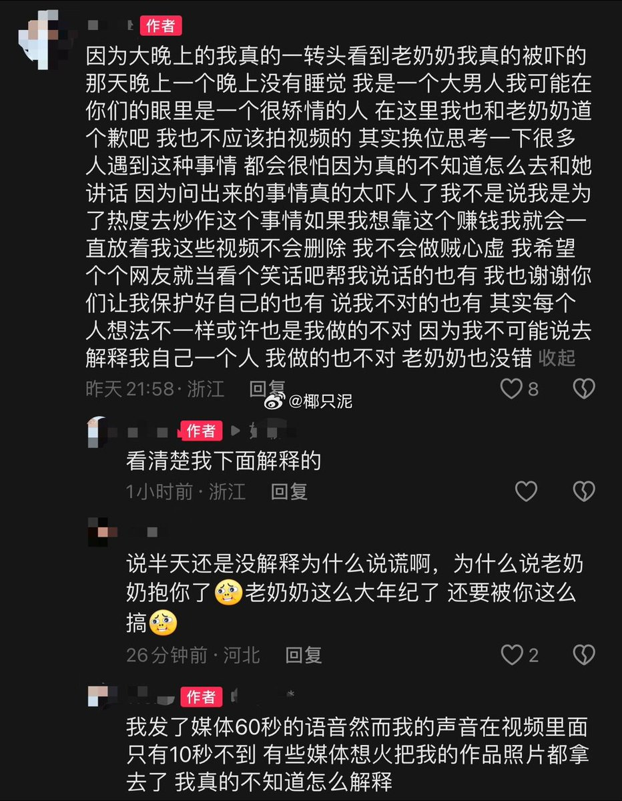

谁将十万横扫三江 北京时间 2024-01-13T23:01:00Z 1746185586216464611 男子发视频并且投稿给媒体，说60岁老太深夜强行搂抱他，老人儿子调监控澄清：两人根本没有肢体接触。

他本人在事情真相大白以后把所有责任都推给媒体，说媒体断章取义。

图二是我在热度较高的媒体视频下面找到的他的评论，该视频里他亲口说：“她直接冲上来抱着我，让我陪她睡觉。”他在评论区没有反驳，也就是认同媒体发布的内容的，那为什么现在要说是媒体断章取义？

图三是他本人洗白发言。

“被老人吓到一晚上没有睡。”一个正常人遇到一件能吓得自己晚上睡不着的事，第一反应是逃跑还是录视频？

“不是为了热度炒作”，那在媒体评论区认领自己本人身份的行为是什么？

【网评】谣螂是这样的，下至8岁上至80岁的女性都要被他们造谣

【网评】建议老奶奶家属走法律程序

【网评】80岁阿尔茨海默症老人的黄谣都有男的要造，绝了但是毫不意外。就算老人行为有异，你一个健身男怕个屁？这力量对比是常见的（）能比的吗？   谁将十万横扫三江 北京时间 2024-01-13T17:54:46Z 1746108517067485505 在台湾总统选举进行时，中国还想检验一下愚民成果放开实时讨论，在看到大规模言论质疑后光速关闭了台湾选举词条，目前搜索台湾选举只能看到一些蓝V号发一些不明就里的消息，热搜置顶也变成了 把老一辈革命家开创的伟大事业继续推向前进。什么事业？每年一次不顾广大人民和一切民主党派的要求，一意孤行地召开一个由反人民集团一手包办的所谓“人民代表大会”，在这个会上通过一个实际上维持独裁反对民主的所谓“宪法”，使那个仅仅由几十个共产党人私自委任的、完全没有民意基础的、强安在人民头上的、不合法的所谓中央政府，披上合法的外衣，装模作样地“全过程民主”，实际上，依然是“还政”于党内的反人民集团。谁要不赞成，就说他是破坏“民主”，破坏“统一”，就有“理由”向他宣布讨伐令。这是一个分裂的方针，中国人民是坚决反对这个方针的。   谁将十万横扫三江 北京时间 2024-01-13T10:52:52Z 1746002343970344969 RT @Zuki_chiyuki: 论中国问题

民主自由强调个体，专制集权强调集体

强调个体则倡导独立意识独立精神；强调集体则扼杀独立意识独立精神

中国的体制长久以来是扼杀人的独立性的，而正因如此，中国人丧失了去拥有独立思考独立判断这些品质的能力

“人云亦云”是正道，“…   谁将十万横扫三江 北京时间 2024-01-13T08:41:12Z 1745969207119118494 RT @starlightcaesar: “来吧宝贝儿，赶紧从了老娘！”
——女流氓萨耳玛西斯强行推到美少年赫马弗洛狄忒未遂，向诸神祈求和美少年合为一体，于是天空一声巨响，俩人合成了一个雌雄同体的阴阳人。

个人觉得这是奥维德《变形记》里最脑洞大开的变形了。卢浮宫里那尊赫马弗洛…   