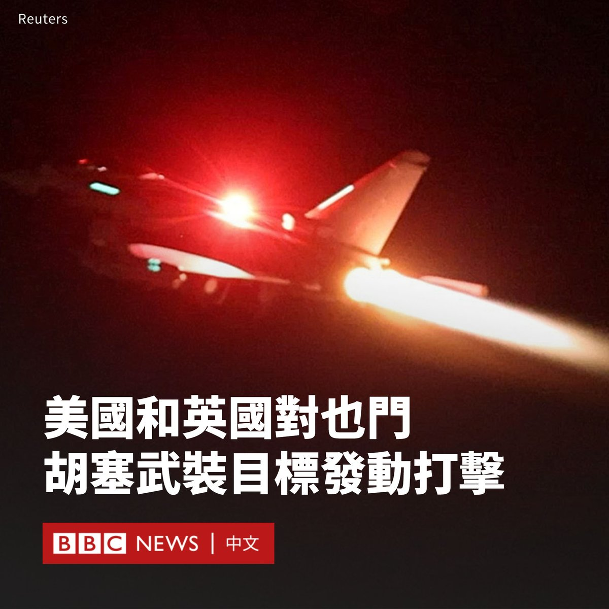

D英国广播公司BBC 北京时间 2024-01-12T12:08:48Z 1745659063160172888 美国和英国军队已对也门境内胡塞叛军的目标发动空袭。

美国总统拜登（Joe Biden）证实了该行动，并称此举是为了回应伊朗支持的胡塞武装自11月以来对红海船只的袭击。

他在一份声明中表示：“今天，在我的指示下，美国军队与英国一道，并在澳大利亚、巴林、加拿大和荷兰的支持下，成功地打击了胡塞叛军用来在世界最重要水道之一危害航行自由的一些目标。”

胡塞武装官员证实了袭击，并警告美国和英国将为这种“公然侵略”的行为“付出沉重代价”。

美国官员表示，美军通过“战斧”（Tomahawk）巡航导弹和战机打击了超过12个地点，包括首都萨那和胡塞武装在红海港口的据点荷台达（Hudaydah）。

四架英国皇家空军“台风”（Typhoon）战斗机从塞浦路斯的阿克罗蒂里（Akrotiri）基地起飞，轰炸了两个胡塞武装目标。

英国首相苏纳克（Rishi Sunak）表示，英国皇家空军（RAF）战机协助对军事设施进行了“定点打击”。他称，这次空袭是“有限、必要和适当的自卫行动”。

澳大利亚、巴林、加拿大、丹麦、德国、荷兰、新西兰、韩国、英国和美国政府发表了一份联合声明，指联合国安理会上个月的一项决议呼吁胡赛武装停止在红海袭击船只。

声明称，打击行动是“根据个人和集体自卫的固有权利”进行的。

与此同时，沙特阿拉伯要求美国及其盟友保持克制，以“避免事态升级”。

在2014年也门内战后，胡塞武装控制着也门西部的大片地区，包括首都萨那和红海沿岸地区。

在以色列与哈马斯冲突爆发后，胡塞武装多次用导弹和无人机袭击红海航线上的船只，以示对哈马斯的支持。

胡塞武装的袭击阻碍了天然气、石油和货物通过曼德海峡，迫使一些航运公司将船只绕道南非好望角。   D英国广播公司BBC 北京时间 2024-01-12T07:56:37Z 1745595599632969973 【最新消息】美国官员表示，美国和英国军队已开始对也门胡塞武装目标进行空袭。 https://t.co/m2DroVkB8e   D英国广播公司BBC 北京时间 2024-01-12T09:22:43Z 1745617268212416920 在台湾，蒋介石雕像的数字曾一度超过四万座，但如今，随着越来越多的雕像被移除，这位昔日统治者的容身之地越来越少。

这种变化似乎也是台湾与中国大陆有着共同归属感的那个时代逝去的缩影。对许多年轻人来说，他们希望两岸和平相处，与中国贸易，但并不想成为中国的一部分。
https://t.co/w1j94oUNdu   