拆墙运动公号 北京时间 2024-01-12T21:56:17Z 1745806908353585272 https://t.co/56f8UY0Xs4   拆墙运动公号 北京时间 2024-01-12T21:59:33Z 1745807731879985222 #拆墙运动 议题会议，
会议时间： 本周六的北京时间晚上10点，
  欧洲时间下午3点， 
 纽约时间上午9点， 
 温哥华时间早上6点，
 韩国时间晚上11点
 会议规则：
按照举手顺序文明发言
1、有人发言时不准抢麦，有发言者发言完毕按照举手的先后顺序发言，  
2、文明发言，不得人身攻击。
 3、围绕拆墙主题发言、不得偏离主题。   拆墙运动公号 北京时间 2024-01-12T10:01:15Z 1745626966055673979 RT @RFA_Chinese: 【中国科兴新冠疫苗已全面停产】
【网民吐槽疫苗后遗症及其伤害】
北京科兴新冠疫苗已全部停产。该公司日前宣布停发新冠疫苗项目绩效工资。科兴控股生物技术有限公司工作人员也已证实停止生产新冠疫苗。中国众多网民抱怨科兴疫苗副作用给他们带来烦恼和伤害。报…   拆墙运动公号 北京时间 2024-01-12T05:42:44Z 1745561906511827398 RT @LinShengliang: #惡人榜 308號
 姓名: #孫穎菲/#孙颖菲 
性別: 女
職務：北京市人民檢察院第二分院檢察官
單位地址：北京市豐台區方莊紫芳路18號
郵編：100078
單位電話：
ID:
        北京市石景山區
手機：暫缺

#上榜理由：…   拆墙运动公号 北京时间 2024-01-12T05:44:15Z 1745562289082716278 RT @LinShengliang: #惡人榜 307號
姓名：#位魯剛/#位鲁刚 
性別：男
職務：北京市檢察院第二分院第二檢察部主任
單位地址：北京市豐台區方莊紫芳路18號
郵編：100078
單位電話：
ID:
      山東省青島市市南區 
手機: 
郵箱: 

#上…   拆墙运动公号 北京时间 2024-01-12T02:44:51Z 1745517142949109949 删了26条推文终于登录成功了 https://t.co/BB1D8ZH25H   拆墙运动公号 北京时间 2024-01-12T03:02:09Z 1745521496414355572 【 #2259专案组 互联网防火墙第090号嫌犯 #锁延锋】  性别：男 
生日：1977年
ID：
学历：博士
1、手机/微信/支付宝:
邮编: 010 100000
2、手机/微信/支付宝: 
用户淑华（X淑华）
住址：北京市海淀区遗光寺1号院东区3号楼101号
地址: 北京海淀区五环到六环之间农大南路1号硅谷亮城2C座
 地区/省 全国 证书编号 10000381110890418 
级别 ：高级测评师
职务：中国电子科技集团公司第十五研究所 (信息产业信息安全测评中心)总工程师

所在机构 中国电子科技集团公司第十五研究所(信息产业信息安全测评中心) 测评师

擅长网络加密和监控控制
#拆墙运动 #BanGFW #反人类罪 

锁延锋，博士，国家信息技术安全研究中心 科研业务部 副部长 参与多项国家发改委信息安全专项、国家863网络安全课题研究工作，长期从事信息安全风险评估、系统安全检测技术、信息安全风险处置技术研究工作。
完成国家金融、电力、电信、海关和电子政务等领域数千个基础网络和重要信息系统的风险评估与安全保障工作，积累了丰富的实践经验；曾担任北京奥运会、上海世博会等信息安全专家。

中国电子科技集团公司第十五研究所(信息产业信息安全测评中心) 
地址 ：北京市海淀区北四环中路211号
联系人： 霍珊珊 
性别：女
联系电话 ：
手机/微信/支付宝/QQ:

详细资料见: #BanGFW拆墙运动（建墙罪犯录）（#ban_great.wall）:https://t.co/VyYsE3FpwB

合作伙伴：#zhinawiki 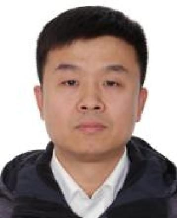  拆墙运动公号 北京时间 2024-01-12T03:09:41Z 1745523393007325634 【 #2259专案组 互联网防火墙第091号嫌犯 #张朋越】  性别：男 
 生日：1976年
ID:
籍贯：辽宁省抚顺市新抚区
学历：博士
毕业院校：燕山大学、浙江大学
国 籍：中国
职 称：教授
手机号码/微信/支付宝/QQ:
办公电话：
Email：zhang_pengyue@cjlu.edu.cn
地址: 浙江省杭州市江干区白杨街道杭州市下沙高教园区学源街道258号中国计量学院
职务：中国计量大学标准化学院院长
专业方向：材料科学与工程
中国计量大学教授
男，博士，中国计量大学教授，1976年10月生。主要从事纳米复合磁性材料、超高矫顽力烧结钕铁硼永磁体、光功能陶瓷材料的研究工作。

人物经历
1995.9 - 1999.7燕山大学 材料学 本科；
1999.9 - 2002.1燕山大学 材料学 硕士研究生；
2002.3 - 2006.5浙江大学 材料学 博士研究生；
2006.6 - 2011.07 中国计量学院材料物理与化学教师；
2011.07至今 中国计量大学 标准化学院 副院长/总支副书记。

研究方向
纳米复合磁性材料、烧结钕铁硼永磁体及磁检测技术、
一级学科材料科学与工程二级学院材料科学与工程学院 二级学科 材料物理与化学。

详细资料见: #BanGFW拆墙运动（建墙罪犯录）（#ban_great.wall）:https://t.co/3i0PFtSU5T

 合作伙伴：#zhinawiki   拆墙运动公号 北京时间 2024-01-12T03:15:16Z 1745524795674882516 【 #2259专案组 互联网防火墙第092号嫌犯 #赵泽良】  性别：男   
汉族，中共党员
出生日期:1961年5月出生
籍贯：河南商城人
学历：理学博士
职务：中央网络安全和信息化委员会办公室副主任
职称：总工程师

赵泽良（1961年5月—），
男，汉族，河南商城人，中华人民共和国政治人物，现任中央网络安全和信息化委员会办公室副主任、国家互联网信息办公室副主任、总工程师。

专业删稿数十年；

负责专业范围为网络安全。

擅长专业为网络安全标准化。

人物履历

1976年9月，作为知青下乡到湖北省麻城县。

1978年后在国防科工委工作了20年，历任战士、排长、技术员、技术室主任、高级工程师。1998年12月，调入总装备部，任司令部技术室主任、高级工程师，获大校军衔。

2004年7月，任国务院信息化工作办公室网络与信息安全组副司级干部、副巡视员、副组长。2007年4月，任国家网络与信息安全协调小组办公室副主任。

2008年7月，任工信部信息安全协调司副司长，后升任司长。

2014年5月，任中央网信办网络安全协调局局长[1]。2018年4月，兼任中央网信办总工程师。

2020年2月，升任中央网信办及国家网信办副主任。

中央网络安全和信息化委员会办公室副主任、国家互联网信息办公室副主任。男，汉族，1961年5月生，中共党员，在职研究生学历，理学博士，高级工程师。

详细资料见: #BanGFW拆墙运动（建墙罪犯录）（#ban_great.wall）https://t.co/XZSCJda7c9
合作伙伴：#zhinawiki 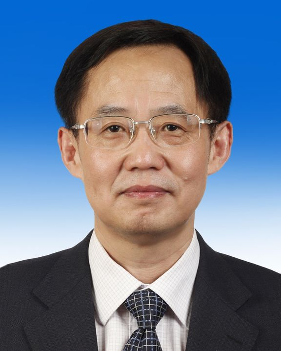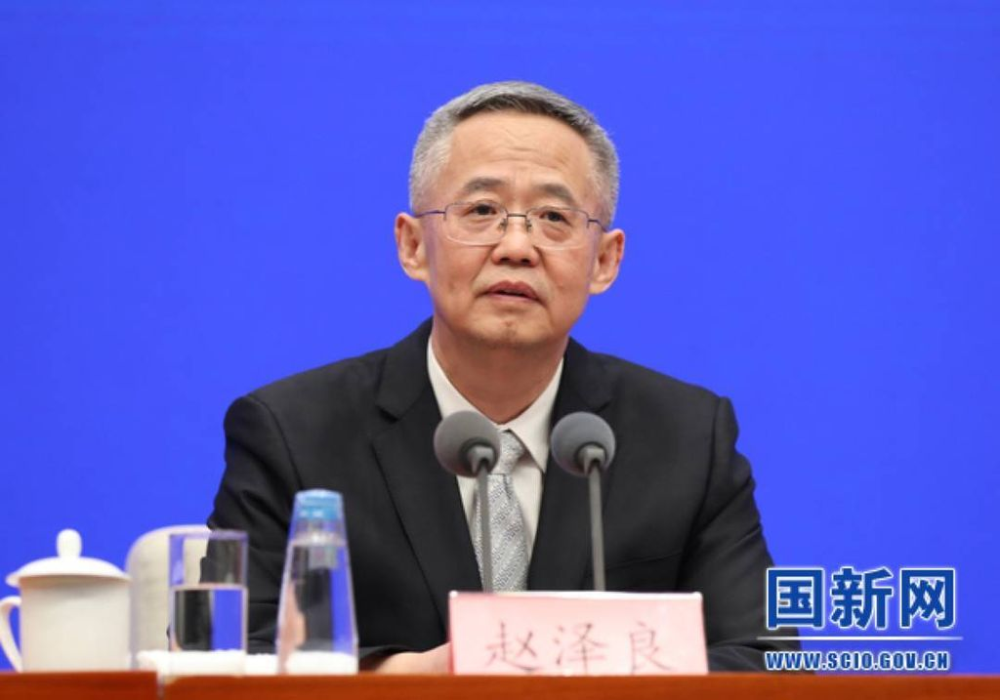  拆墙运动公号 北京时间 2024-01-12T03:19:29Z 1745525856758374859 【 #2259专案组 互联网防火墙第093号嫌犯 #李克】  性别：男
出生日期：1978年
ID：
北京市宣武区
手机/微信/支付宝/QQ: 
学历：硕士
地址: 北京市海淀区西三环中路17号迪信通旗舰店3层
邮编:100036
职务：航天物联网技术有限公司副总经理 

物联网研究院物联网研究院
主持工作，系统集成项目负责人，研发管理，市场前期，部门事务
时代民芯时代

消费类电子方案设计及批量生产，集成电路测试

擅长网络加密和监控控制
#拆墙运动 #BanGFW #反人类罪 

中国科学院大学
Master of Business Administration (MBA)，工商管理
年2013年 - 2015年
活动与社团: 资本运营，公司治理，公司理财，会计

技能
高级工程师
可制造设计
消费类电子批量生产

北京理工大学 ，硕士，检测技术与自动化装置硕士，检测技术与自动化装置
2004年 - 2006年
GIS分析师，汉语翻译，地理硕士，地理信息系统硕士，数据挖掘, 汉语硕士

工作经历
部门主管
物联网研究院
2012年4月 - 至今 · 11 年 6 个月
主持工作，系统集成项目负责人，研发管理，市场前期，部门事务主持工作，系统集成项目负责人，研发管理，市场前期，部门事务
项目经理
时代民芯
2006年7月 - 2012年4月 · 5 年 10 个月
消费类电子方案设计及批量生产，集成电路测试消费类电子方案设计及批量生产，集成电路测试
教育经历

李克 (ke li)
物联网研究院 - 部门主管
物联网研究院
中国科学院大学
中国 北京市 海淀区 

企业法定代表人：赵书伦 主管会计工作负责人：李克 会计机构负责人：姜艳
航天物联网技术有限公司

详细资料见: #BanGFW拆墙运动（建墙罪犯录）（#ban_great.wall）:https://t.co/9AYdUBDc66… 
合作伙伴：#zhinawiki 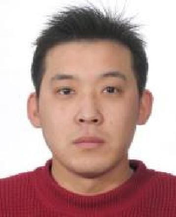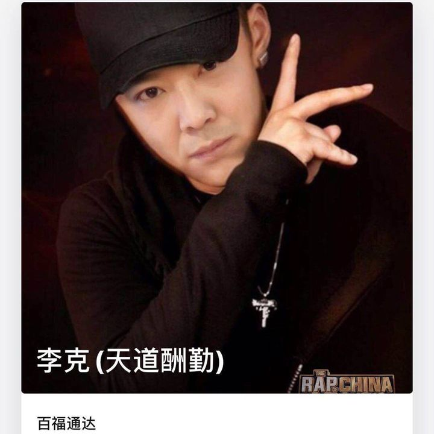  拆墙运动公号 北京时间 2024-01-12T03:31:16Z 1745528822059917640 【 #2259专案组 互联网防火墙第094号嫌犯 #王瑛玮】  性别：男 
出生日期：1969年
ID：
北京市市辖区海淀区
学历：北京大学数学系博士
职务：公安部网络安全保卫局局长
单位：公安部
地址：北京市海淀区燕西台嘉苑64号楼5单元

官网：https://t.co/LZ1NK8udKm
详细资料见: #BanGFW拆墙运动（建墙罪犯录）:https://t.co/DyLGUUZAEv

简历： 1987年至1997年就读于北京大学本科、硕士、博士。毕业后长期在公安部刑事侦察局工作， 历任刑侦基础工作指导处、犯罪情报信息工作处处长，2010年5月至2018年历任贵州省公安厅厅长助理、副厅长、常务副厅长。2019年1月调任中共公安部网安局党委书记、局长。

 王瑛玮1987年至1991年在北京大学计算机系读书，之后又在北京大学信息科学中心读硕士，1994年至1997年他在北京大学数学学院应用数学专业读博士。
 博士毕业后，王瑛玮前往公安部工作，最早在公安部第二研究所担任助理研究员。2000年5月他调往公安部刑侦局，历任刑侦基础工作指导处处长、刑事犯罪情报信息工作处处长。
 他于2010年5月至2012年11月挂任贵州省公安厅党委委员、厅长助理。
 挂职两年半后，2012年12月，王瑛玮正式出任贵州省公安厅党委委员、副厅长。
 2017年8月，王瑛玮职务再次调整，出任贵州省公安厅党委副书记、常务副厅长。

擅长网络加密和监控控制
#拆墙运动 #BanGFW #反人类罪 

1987.09--1991.07 北京大学计算机系学生
1991.07--1994.09 北京大学信息科学中心硕士研究生
1994.09--1997.07 北京大学数学学院应用数学专业博士研究生
1997.07--2000.05 公安部第二研究所助理研究员
2000.05--2001.04 公安部刑事侦察局刑侦基础工作指导处助理研究员
2001.04--2005.09 公安部刑事侦察局刑侦基础工作指导处副处长
2005.09--2009.12 公安部刑事侦察局刑侦基础工作指导处处长
2009.12--2011.09 公安部刑事侦察局刑事犯罪情报信息工作处处长
2011.09--2012.04 公安部刑事侦察局正处级干部
2012.04--2012.12 公安部刑事侦察局副局级干部（其间：2010.05-2012.11 挂任贵州省公安厅党委委员、厅长助理）
2012.12--2017.08 贵州省公安厅党委委员、副厅长
2017.08-- 贵州省公安厅党委副书记、常务副厅长

战略合作伙伴：#ccpevils
#zhinawiki 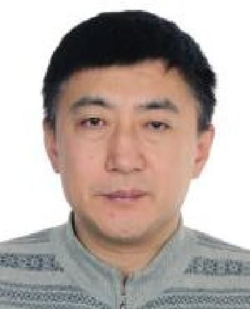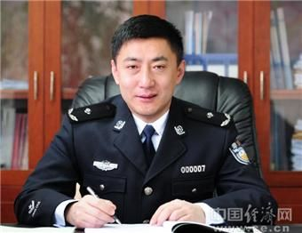  拆墙运动公号 北京时间 2024-01-12T03:38:13Z 1745530571499933769 【 #2259专案组 互联网防火墙第095号嫌犯 #张嘉欢】  
性别:女,
出生日期：1992年
ID：
手机:微信/支付宝/QQ：
籍贯:上海市南汇县
证书编号：2059321110110113
测评师级别：初级
职务：中国软件评测中心网安中心部门副总经理
职称:助理工程师

网：https://t.co/LZ1NK8udKm
详细资料见: #BanGFW拆墙运动（建墙罪犯录）:https://t.co/727RMOaUiQ

擅长网络加密和监控控制
#拆墙运动 #BanGFW #反人类罪 

中国软件评测中心（工业和信息化部软件与集成电路促进中心）是中国电子信息产业发展研究院（赛迪研究院）的核心成员，是工业和信息化部直属事业单位，创立于1990年，是中国最早从事民口和国家质量基础设施建设的第三方权威机构，承担国家软件与集成电路等产业公共服务平台建设，国家重大科技专项支撑保障，软件与集成电路等领域技术研发，软硬件产品及系统评测等工作。（首家通过中国合格评定国家认可委员会（CNAS）认可并取得国家计量认证的计算机软硬件产品质量检测机构。）

战略合作伙伴：#ccpevils 
#zhinawiki 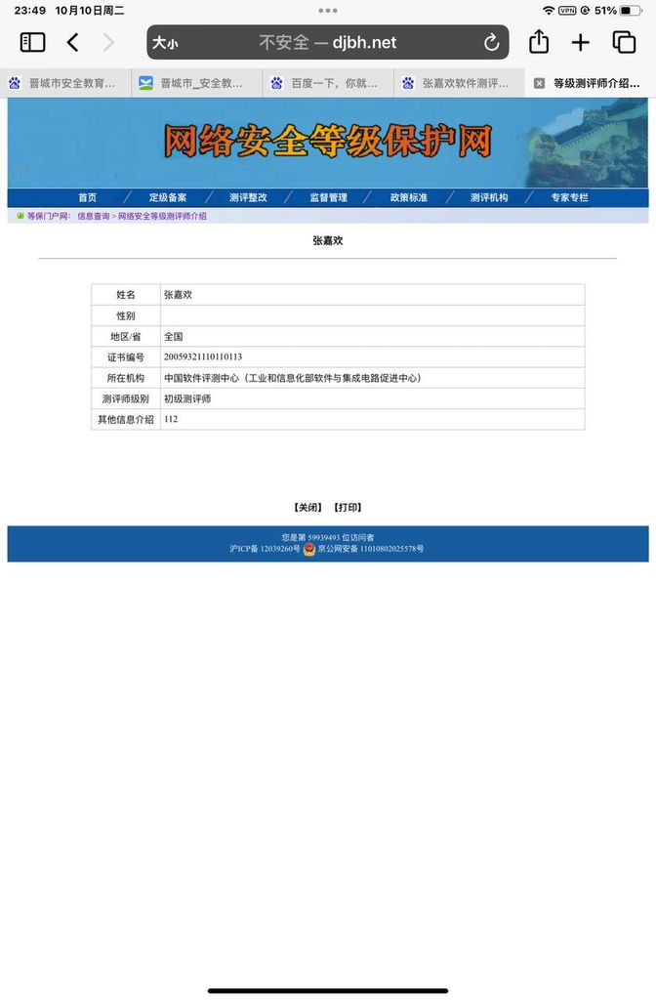  拆墙运动公号 北京时间 2024-01-12T03:42:58Z 1745531766490734773 【 #2259专案组 互联网防火墙第096号嫌犯 #谢江】   性别:男, 
出生日期：1972年
ID：
北京市海淀区
手机号码/支付宝/QQ: 
地址：北京市海淀区大有庄坡上村12号15号楼2单元211号
职务：上海观安信息技术股份有限公司战略规划首席顾问

官网：https://t.co/LZ1NK8udKm详细资料见: #BanGFW拆墙运动（建墙罪犯录）:https://t.co/87Wp4Mz1WK

安全咨询和安全标准专家。曾任国际著名咨询机构IT风控、信息安全咨询经理、国内大型安全厂商担任安全技术专家。具有丰富的大型企业，银行、央企等大客户的信息安全体系咨询和运营管理经验积累，具备应用系统开发安全、安全运维、业务架构安全、云安全、数据安全（商业秘密保护、数据防泄漏咨询）等领域技术和咨询经验。目前担任国家、行业、团体安全标准和白皮书编写工作和国内大型行业的安全顶规、行业解决方案和企业安全架构设计，熟悉国内和国际诸多风控、审计和安全技术与管理安全标准。

擅长网络加密和监控控制
#拆墙运动 #BanGFW #反人类罪

战略合作伙伴：#ccpevils
 #zhinawiki 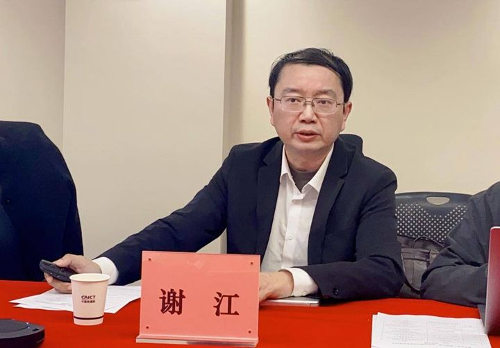  拆墙运动公号 北京时间 2024-01-12T03:48:24Z 1745533133531881662 【 #2259专案组 互联网防火墙第097号嫌犯 #韩斐】   性别:男,  
职务：北京安盟信息技术股份有限公司商用密码发展中心总经理
地址: 杭州市下城区王马巷21-2-703

官网：https://t.co/LZ1NK8udKm详细资料见: #BanGFW拆墙运动（建墙罪犯录）:https://t.co/C8il3KwKWm

擅长网络加密和监控控制
#拆墙运动 #BanGFW #反人类罪 

北京安盟信息技术股份有限公司
 • 总部地址：北京市海淀区邓庄南路万家盛景大厦B座3A层
 • 服务热线：400-001-1101
 • 技术支持：support@anmit.com
 • 邮政编码：100089
战略合作伙伴：#ccpevils
 #zhinawiki   拆墙运动公号 北京时间 2024-01-12T03:55:12Z 1745534846447808931 【 #2259专案组 互联网防火墙第098号嫌犯 #宋铮】   性别:男,   
职务：
地址: 沈阳市铁西区兴顺街沈阳市铁西区兴顺街110000
职务：蚂蚁科技集团股份有限公司高级安全合规专家

官网：https://t.co/LZ1NK8udKm
详细资料见: #BanGFW拆墙运动（建墙罪犯录）:https://t.co/Or3xOoE9qQ

手机 /微信/支付宝
姓名: 乔灵肖
地址：河北省石家庄市王家庄新村4号楼

擅长网络加密和监控控制
#拆墙运动 #BanGFW #反人类罪 

工作经历
家高级安全专家
蚂蚁金服蚂蚁金服2017年3月 - 至今

电子政务测试部总经理
工业和信息化部计算机与微电子发展研究中心（中国软件评测中心）2009年7月 - 2017年2月 · 7 年 8 个月
教育经历
北京理工大学
硕士，光学工程：2007年 - 2009年
北京理工大学
学士，电子科学与技术2003年 - 2007年

宋铮，蚂蚁集团高级安全合规专家，负责蚂蚁集团技术合规保障和数据安全基线运营管理工作，长期从事数据安全合规研究和安全管理实践
战略合作伙伴：#ccpevils
 #zhinawiki   拆墙运动公号 北京时间 2024-01-12T03:59:32Z 1745535937499521466 【 #2259专案组 互联网防火墙第099号嫌犯 #范媛】   性别:女
 职务：云宏信息科技股份有限公司副总裁

官网：https://t.co/LZ1NK8udKm
详细资料见: #BanGFW拆墙运动（建墙罪犯录）:https://t.co/4d1bSmsE8l

擅长网络加密和监控控制
#拆墙运动 #BanGFW #反人类罪 

云宏信息科技股份有限公司成立于2010年 ，是国内专注于云计算大数据关键技术研究的企业，作为中国虚拟化软件领航者，坚持国产、自主、可控的发展道路，拥有自主研发知识产权，安全可控的服务器虚拟化软件及虚拟化云平台、云管理平台、超融合一体机、安全文档云等系列产品。产品以积木式架构、全面兼容国产主流软硬件的技术优势，构建信创生态，助力金融、党政、国防军工及企业用户数字化转型，推动国家信息技术应用创新发展。 
公司亮点：
统一管理：计算、存储、网络、安全、备份、容灾一体化，实现数据中心基础架构的全生命周期管理
随需建设：积木式架构，灵活弹性扩展，支撑业务成长
态势感知：智能状态感知、智能云监控，精准分析系统状态，体系化帮助用户深度洞察系统运行情况
开放集成：衔接云计算产业链上下游，开放整合生态伙伴，极力拥抱信创生态圈
内生安全：内网防DDoS，虚拟机防火墙，无代理杀毒功能提供全方面保障，
融合云WAF、进程管理等功能形成立体化保护体系 
CNBox安全文档云

战略合作伙伴：#ccpevils
 #zhinawiki 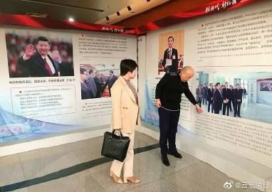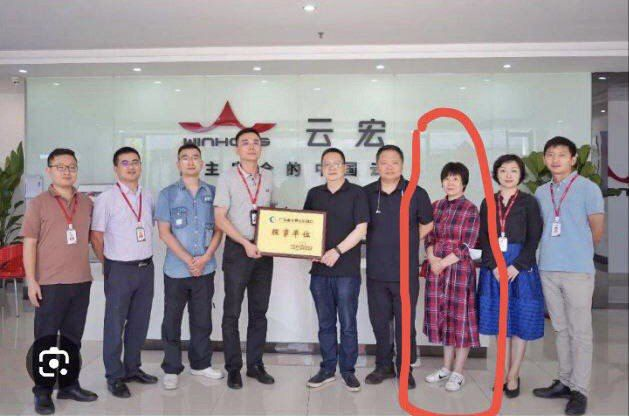  拆墙运动公号 北京时间 2024-01-12T04:03:24Z 1745536909986689071 【 #2259专案组 互联网防火墙第100号嫌犯 #桑戟南】   性别:
职务：北京智游网安科技有限公司行业专家

官网：https://t.co/LZ1NK8udKm
详细资料见: #BanGFW拆墙运动（建墙罪犯录）:https://t.co/uh9BSNIAxd

擅长网络加密和监控控制
#拆墙运动 #BanGFW #反人类罪 

北京智游网安科技有限公司
公司简介
爱加密成立于2013年，总部位于北京，研发及运营中心位于深圳，同时在广州、上海、福州、贵阳、成都、西安、郑州、沈阳等地设立了12个分公司/服务机构，拥有员工400多人。爱加密是专业的移动信息安全服务提供商，拥有安全防护、安全检测、安全管理、业务运营、威胁感知、安全监管、安全服务七大产品体系。

战略合作伙伴：#ccpevils 
#zhinawiki 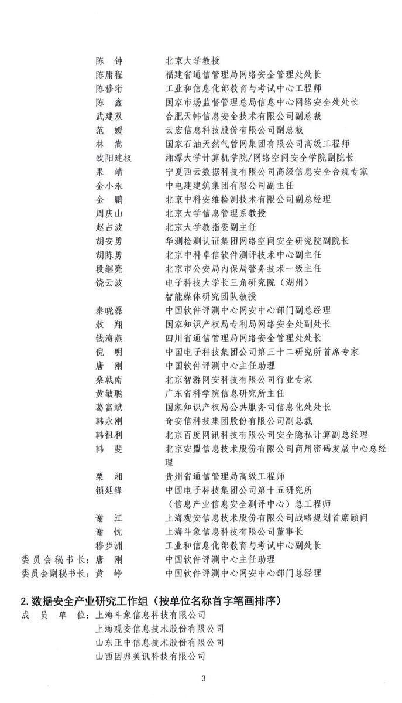  拆墙运动公号 北京时间 2024-01-12T04:08:17Z 1745538138842243456 【 #2259专案组 互联网防火墙第101号嫌犯 #钱海燕】   性别：女，
出生日期：1984年
ID:
江苏省靖江市
职务：四川省通信管理局网络安全管理处处长

官网：https://t.co/LZ1NK8udKm
详细资料见: #BanGFW拆墙运动（建墙罪犯录）:https://t.co/C1qtavuEll

四川省通信管理局
根据《国务院办公厅关于印发工业和信息化部主要职责内设机构和人员编制规定的通知》（国办发〔2008〕72号）、《中央机构编制委员会办公室关于进一步明确工业和信息化部派驻地方通信管理局主要职责有关事宜的批复》（中央编办复字〔2012〕17号）等有关规定，四川省通信管理局（正司局级）为工业和信息化部派驻四川省的通信管理部门，实行垂直管理。

战略合作伙伴：#ccpevils
 #zhinawiki 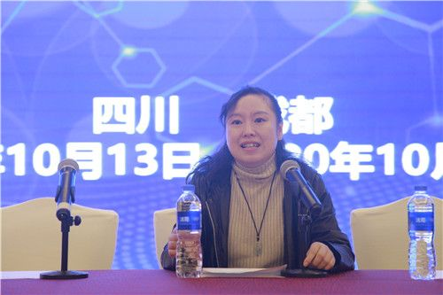  拆墙运动公号 北京时间 2024-01-12T04:12:56Z 1745539309321510993 【 #2259专案组 互联网防火墙第102号嫌犯 #粟湘】   性别：女，
 出生日期：1974年
ID: 
 四川省重庆市九龙坡区 
手机/微信/支付宝/QQ: 
职务：贵州省通信管理局高级工程师

官网：https://t.co/LZ1NK8udKm
详细资料见: #BanGFW拆墙运动（建墙罪犯录）:https://t.co/AEDgNnurz5

擅长网络加密和监控控制
#拆墙运动 #BanGFW #反人类罪 

贵州省通信管理局
贵州省通信管理局为工业和信息化部派驻贵州省的通信管理部门，实行垂直管理。

战略合作伙伴：#ccpevils 
#zhinawiki 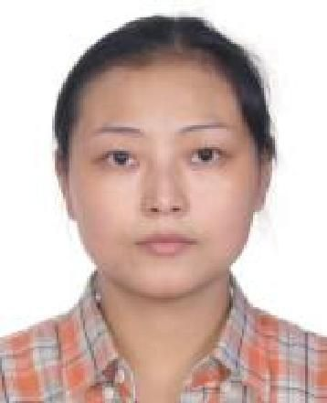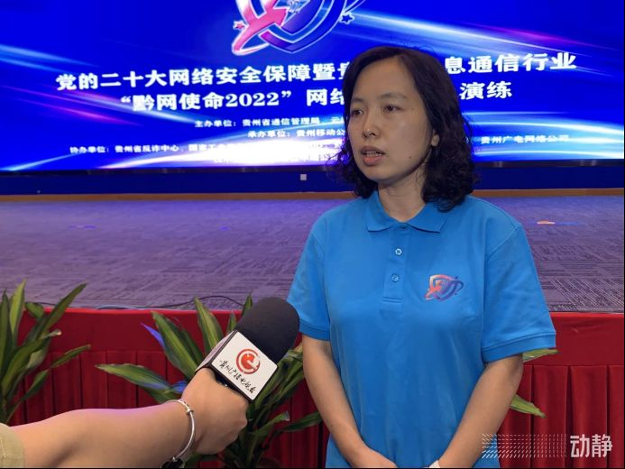  拆墙运动公号 北京时间 2024-01-12T04:18:32Z 1745540717173260682 【 #2259专案组 互联网防火墙第103号嫌犯 #韩祖利】   
性别：男,
出生日期：1983年
ID: 
山东省德州市夏津县
地址: 朝阳区慧忠北里106楼203
手机/微信/支付宝/QQ:
手機/微信/支付宝/QQ: 
邮箱: dzter@huxiu.com
职位：安全产品部总经理
职务：北京百度网讯科技有限公司安全隐私计算副总经理

官网：https://t.co/LZ1NK8udKm
详细资料见: #BanGFW拆墙运动（建墙罪犯录）:https://t.co/Xoa5p0OGev

韩祖利，百度安全产品部总经理、前虎嗅联合创始人兼 CTO、TGO 鲲鹏会（北京）董事会成员。
韩祖利
简介： 韩祖利，担任汉森供应链管理集团有限公司、 杭州我们不一样商业管理合伙企业（有限合伙）等公司股东，担任 北京虎嗅科技有。

战略合作伙伴：#ccpevils 
#zhinawiki 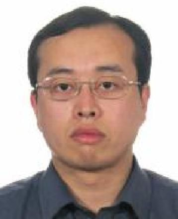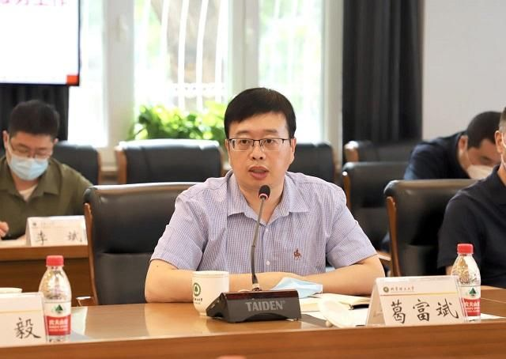  