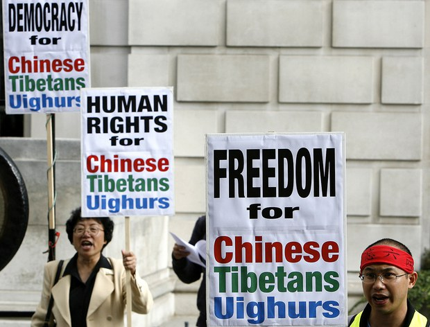
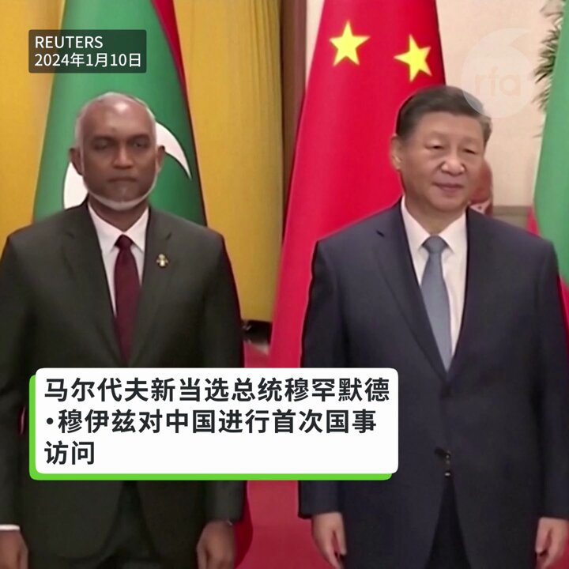
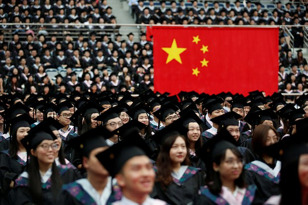
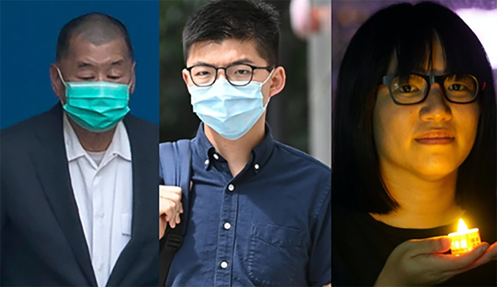
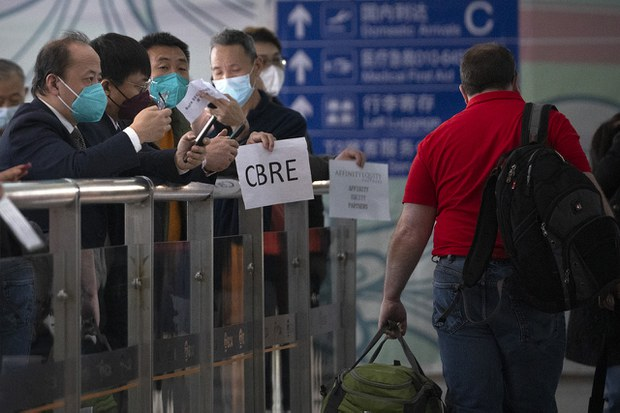
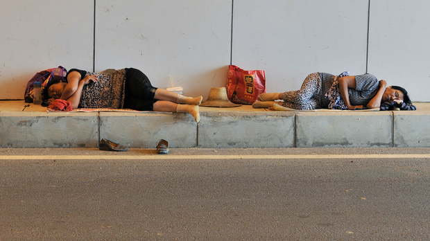
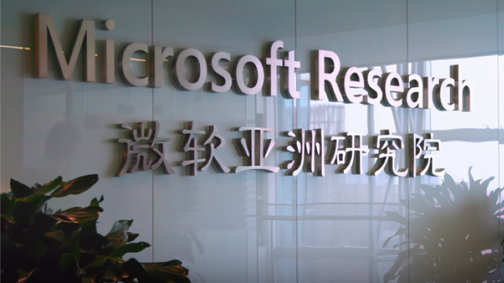
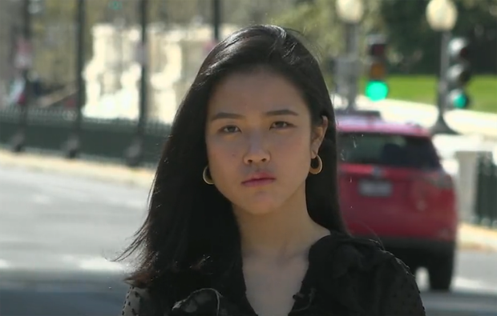
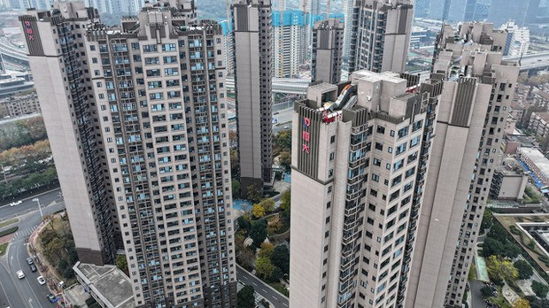

自由亚洲电台 北京时间 2024-01-12T09:21:07Z 1745616866645606505 RT @RFA_Chinese: 中国网易新闻推出纪录短片《#如此打工30年》9日遭全网封杀后，媒体“#第一财经”10日接力发表《#凌晨路边等活的农民工》，随后也被下架。
 https://t.co/nzMQvBhWVT https://t.co/MIxzuyUAOf   自由亚洲电台 北京时间 2024-01-12T09:23:22Z 1745617433434505355 RT @RFA_Chinese: 台湾大选周六登场　海内外中国人隔海观战有话说
https://t.co/ynJldtP9Pm https://t.co/0Y3T9F8Kbs   自由亚洲电台 北京时间 2024-01-12T04:28:36Z 1745543252009525531 1月11日，“人权观察”发布《#2024世界人权报告》指出，官方数据显示，中国因新冠疫情死亡的人数为6万人。不过，据美国学术机构估计，中国因 #新冠疫情 所造成的实际“超额死亡”人数，可能高达187万人，具体的数据则因为中国当局严厉的言论审查而不得而知。
https://t.co/mXB9HsOnpW https://t.co/m3cwT0da1O   自由亚洲电台 北京时间 2024-01-12T04:51:18Z 1745548963019915287 【中国新添“老朋友”  马尔代夫总统访华】
马尔代夫总统穆罕默德·穆伊兹（Mohamed Muizzu）访华，中国和马尔代夫将两国关系升级 https://t.co/JbPtTSSvCd   自由亚洲电台 北京时间 2024-01-12T04:56:24Z 1745550248888639807 台湾大选周六登场　海内外中国人隔海观战有话说
https://t.co/ynJldtP9Pm https://t.co/0Y3T9F8Kbs   自由亚洲电台 北京时间 2024-01-12T05:36:57Z 1745560454053888009 上海 #复旦大学 去年 #本科应届毕业生 的直接就业率不足20%，选择继续深造的学生超过了70%。
复旦学长说：对年轻人“没有什么合适的建议”...
https://t.co/jKlMC533s1 https://t.co/4nMwdnlUx7   自由亚洲电台 北京时间 2024-01-12T05:53:50Z 1745564702313415099 #联合国人权理事会 将于本月底对中、港人权情况进行审议。近日，美国国会及行政当局中国委员会发布一份政治犯名单，促请美国政府联同其他盟友在会议上，关注包括 #彭立发、#卢思位、#黎智英 及 #黄之锋 等人的处境。
https://t.co/B9SEWzPfGW https://t.co/4j27H0qgB4   自由亚洲电台 北京时间 2024-01-12T06:05:51Z 1745567723768463384 为吸引外籍人员来华，中国宣布5项便利措施
#行走的50万 会多起来吗？
https://t.co/80QSebkzqx https://t.co/RRD5hPrqo4   自由亚洲电台 北京时间 2024-01-12T06:07:41Z 1745568188581240845 中国网易新闻推出纪录短片《#如此打工30年》9日遭全网封杀后，媒体“#第一财经”10日接力发表《#凌晨路边等活的农民工》，随后也被下架。
 https://t.co/nzMQvBhWVT https://t.co/MIxzuyUAOf   自由亚洲电台 北京时间 2024-01-12T06:16:52Z 1745570499311349871 据美国《纽约时报》11日报道，伴随美中科技战加剧，美国官员质疑科技巨头微软在中国维持一个800人规模的先进技术研究院是否合理。知情人士则说，关闭或转移北京的 #微软亚洲研究院 的想法已经出现，但微软领导层依然支持将该研究机构留在中国。
https://t.co/gOeDVqbKLV https://t.co/bdxbnZX0qc   自由亚洲电台 北京时间 2024-01-12T02:49:03Z 1745518200845164785 一名消息人士向本台透露，港警国安处上月向　＃许颖婷　等5名海外港人发出通缉令后数天，就把许颖婷在香港的母亲带到警署问话并搜查其住所，但其母亲并未被捕。本台周三（10日）向身在华盛顿的许颖婷查询，对方未有回应。
https://t.co/lW3aSebNXP https://t.co/2PvWEZKDLM   自由亚洲电台 北京时间 2024-01-12T04:04:16Z 1745537128455712975 有统计显示，目前七成以上的中国大中城市 #首购房贷利率 已下调至"三字头"，达到有相关市场监测资料以来的最低利率水平。但学者认为，中国部分一线城市的首购房贷利率还有调整空间，但对于不少购房者来说，目前还不是买房的适当时机。
https://t.co/8o1s4cGa6E https://t.co/GJY4AlKPfF   自由亚洲电台 北京时间 2024-01-12T04:09:00Z 1745538320631799909 RT @RFA_Chinese: 【诚征受访人】
2024年，医保领域成为中国医药反腐的重点。您还相信中国的 #医保 制度吗？您有参加过中国的医保而后选择退出吗？如果您愿意就此接受本台采访发表看法，请电邮fankui@rfa.org，与我们联络。
期待听到您的声音！ https…   自由亚洲电台 北京时间 2024-01-12T01:04:19Z 1745491843692028232 ＃台湾选举政治 为何寄生在 ＃宫庙 事务？| 【两岸的 ＃妈祖 台湾的政治 - 3】
请听播客 https://t.co/q3QLYQd5Mb https://t.co/57CncBQ8x6   自由亚洲电台 北京时间 2024-01-12T01:17:03Z 1745495045023916451 ＃侯友宜 在国际记者会上保证　任内不触及 ＃统一
https://t.co/2x4tvwSis3 https://t.co/Dv0ouvDPEU   自由亚洲电台 北京时间 2024-01-12T02:06:10Z 1745507405251928318 一项调查指出，＃台湾年轻人 普遍"天然独"、"不亲中"，但表态票投给不标榜反共、喊出"两岸一家亲"的民众党总统候选人 ＃柯文哲 的比例却高于支持"抗中保台"的民进党总统候选人 ＃赖清德。上次选举获得年轻人支持的民进党，这次为何流失大批的年轻族群？
https://t.co/jUG7pC81IG https://t.co/IWXpUXyhT8   