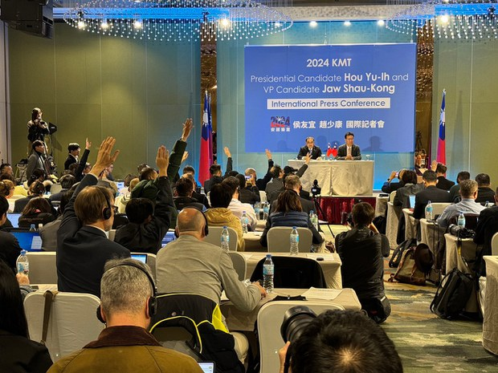
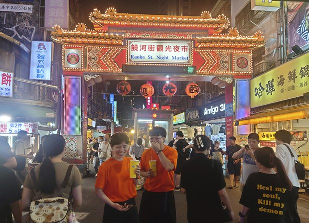

自由亚洲电台 北京时间 2024-01-12T01:04:19Z 1745491843692028232 ＃台湾选举政治 为何寄生在 ＃宫庙 事务？| 【两岸的 ＃妈祖 台湾的政治 - 3】
请听播客 https://t.co/q3QLYQd5Mb https://t.co/57CncBQ8x6   自由亚洲电台 北京时间 2024-01-12T01:17:03Z 1745495045023916451 ＃侯友宜 在国际记者会上保证　任内不触及 ＃统一
https://t.co/2x4tvwSis3 https://t.co/Dv0ouvDPEU   自由亚洲电台 北京时间 2024-01-12T02:06:10Z 1745507405251928318 一项调查指出，＃台湾年轻人 普遍"天然独"、"不亲中"，但表态票投给不标榜反共、喊出"两岸一家亲"的民众党总统候选人 ＃柯文哲 的比例却高于支持"抗中保台"的民进党总统候选人 ＃赖清德。上次选举获得年轻人支持的民进党，这次为何流失大批的年轻族群？
https://t.co/jUG7pC81IG https://t.co/IWXpUXyhT8   