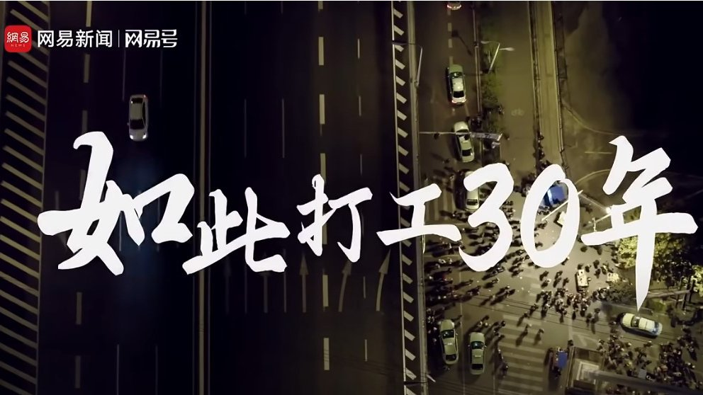
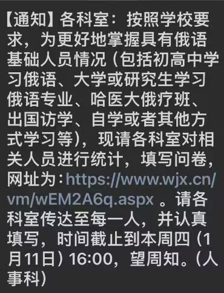
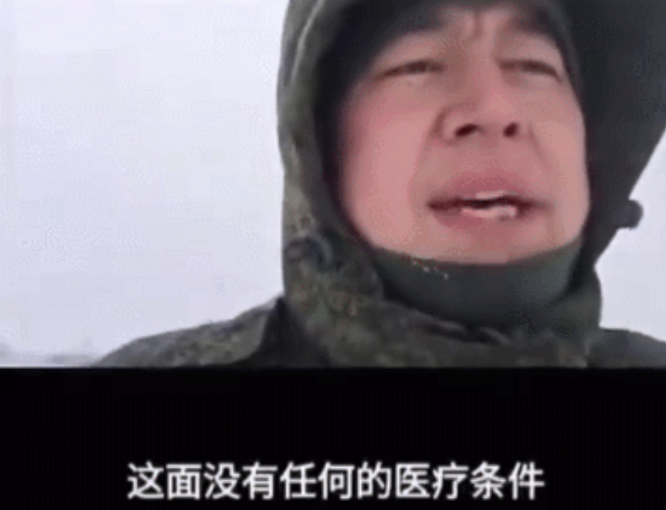
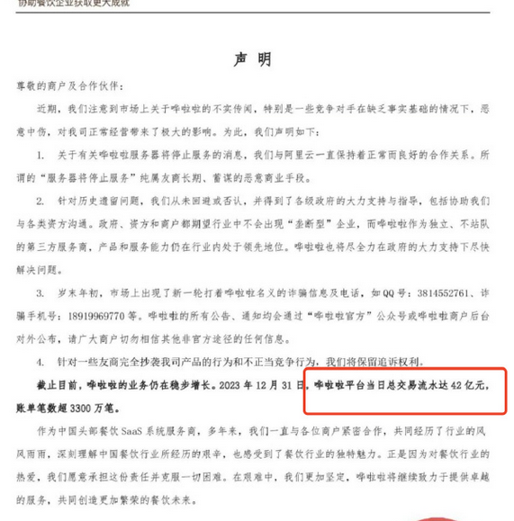

谁将十万横扫三江 北京时间 2024-01-12T16:31:31Z 1745725180738249212 RT @weiquanwang: 维权网: 维权评论：反映真实状况短片被删，农民工何以成敏感话题？ https://t.co/TKY1U8Llzr https://t.co/jl13KfaslW   谁将十万横扫三江 北京时间 2024-01-12T14:45:25Z 1745698478490304804 网友投稿：哈尔滨医科大学附属医院下发通知要求各科室摸底有俄语基础的医护人员。网友认为这和最近一段时间一名赵姓男子在俄乌战场阵亡，多位在俄服役的中国人发声陈述了自己的服役状况，阐述的俄乌前线俄方医疗困难的相关情况有关

罗斯，尔滨来了🥶   谁将十万横扫三江 北京时间 2024-01-12T15:13:49Z 1745705624372175033 北京多来点信息技术有限公司（哗啦啦）拖欠工资已经跨年，拖欠工资，拖欠餐饮商户资金一直不给解决
企业拖欠员工工资很久，申请执行三个月，法院人员联系不上，哗啦啦公众号还可笑发出当日流水42个亿，但是面对讨薪则说没钱 https://t.co/inSjseVH5b   谁将十万横扫三江 北京时间 2024-01-12T15:38:04Z 1745711728690975179 RT @CDTChinese: 那一年冬天，北京大兴新建村火灾，随后开始安全隐患排查以及清理整治行动，皮村也在排查之列。子津是过程的经历者和目击者。她很快就发起高烧。惊吓。紧张。恐惧。很多场景她都是第一次经历，很多事情也超出了她的想象，只能回学校住了一段时间。不过春节之后，她又…   谁将十万横扫三江 北京时间 2024-01-12T09:32:38Z 1745619762485621164 RT @woyongdehuawei: 户晨风：我对支持哈马斯的人感到厌恶！随后被警告！ https://t.co/OPqcnJbd8M   谁将十万横扫三江 北京时间 2024-01-12T09:51:37Z 1745624542092128570 RT @cskun1989: 第一财经此前发表过一篇社论，标题是“最好的承诺是放手和放权”，接着又发表了新的社论，“法治经济才是最好的市场经济”，在日趋严酷的政治高压下，财经媒体围绕着经济话题发出的哀鸣，并不可能改变经济颓势和人心涣散。一财颇费心思遣词造句说起了法治，所谓法治就…   