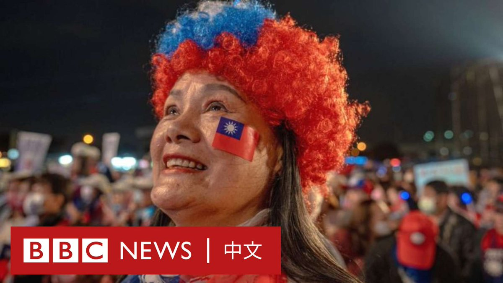
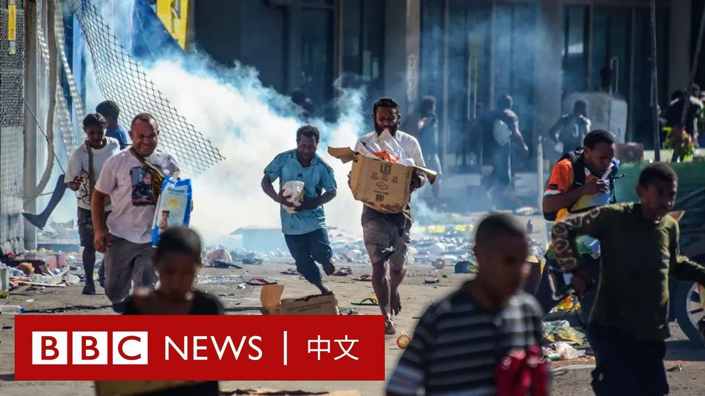
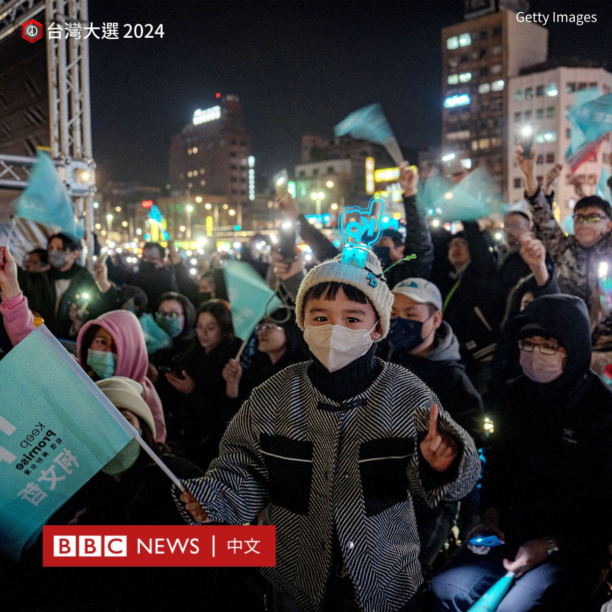
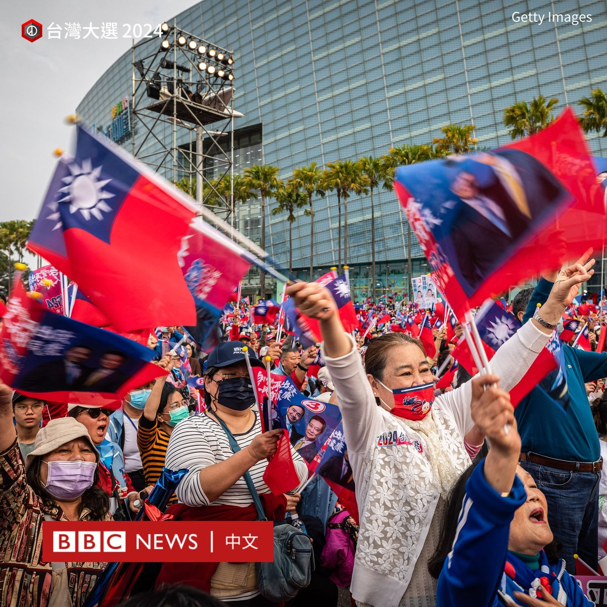
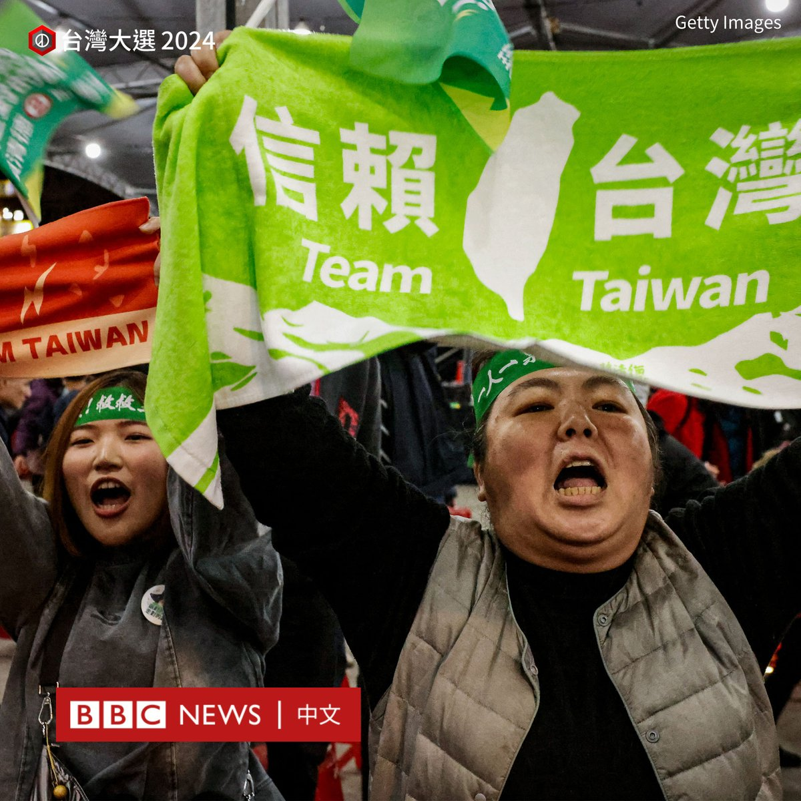
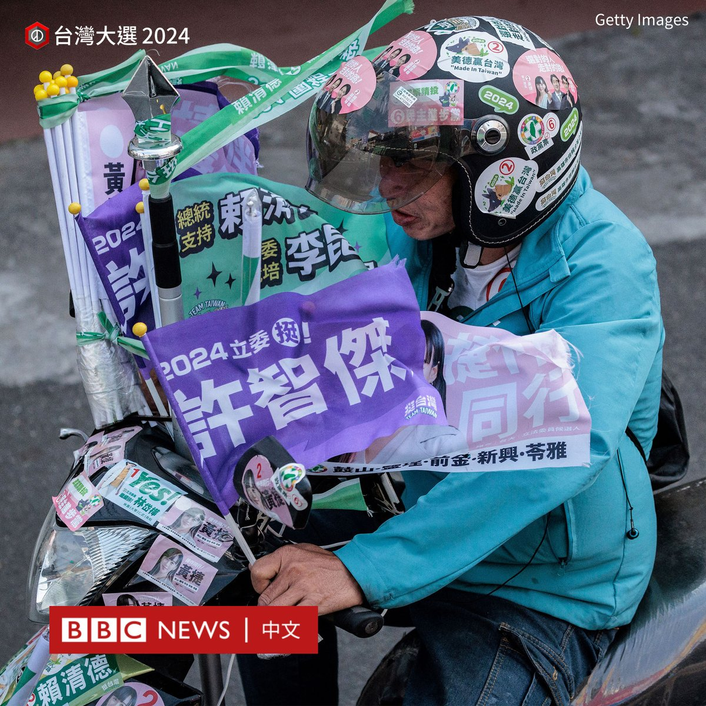
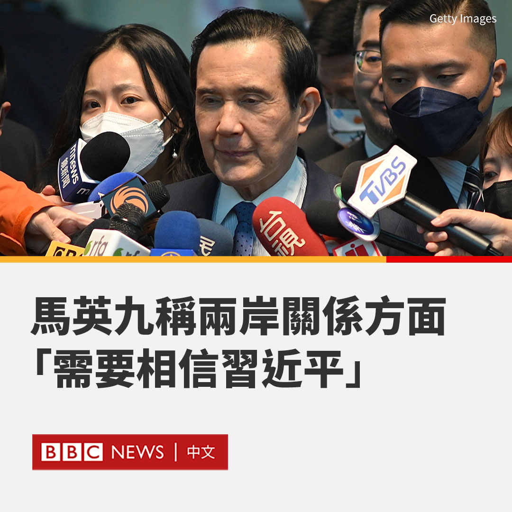

D英国广播公司BBC 北京时间 2024-01-11T20:37:32Z 1745424702561251643 台湾将在本周六迎来四年一次的总统大选投票，而这场选举如何将成为一场对两岸关系的“大考”？ https://t.co/4FWVGm8t9q   D英国广播公司BBC 北京时间 2024-01-11T19:04:53Z 1745401388182409685 在距离台湾大选投票日仅几天之际，一颗飞越台湾上空的的中国卫星，意外引起了一场政治风波。台湾国防部发送简讯的时机与动机，包含英文版简讯将“卫星”错译为“飞弹”，引发民众批评。https://t.co/7idQrYh2k3   D英国广播公司BBC 北京时间 2024-01-11T17:55:12Z 1745383853014081996 巴布亚新几内亚首都莫尔兹比港周三（1月10日）发生骚乱，造成至少八人死亡。

该国警察和公务员近日因薪资问题进行罢工，一些人随即开始洗劫商店，并纵火焚烧房屋和汽车。

中国外交部表示，有两名中国公民受轻伤，多家华商店铺遭到抢劫和破坏。 https://t.co/fWdbuZcDkV   D英国广播公司BBC 北京时间 2024-01-11T16:12:32Z 1745358013165416747 【图辑：进入大选倒计时的台湾】

台湾总统大选投票进入倒计时。在台湾，选前一周的周末常被称为“黄金周末”或“超级周末”，各个阵营都拼场向尚未拿定主意的中间选民喊话，进行最后的拉票冲刺。

此次角逐总统之位的较量将在蓝（国民党）、绿（民进党）和白（民众党）三方之间展开。由于台湾选制采用一轮回的多数决，即由最多票数的候选人胜出，在三强鼎立的情况下选民中可能出现“弃保效应”，让选情更加多变。

台湾选举拉票又为分“空战”和“陆战”，“空战”指的是网络、媒体宣传，“陆战”则是通过在多地举办造势集会、扫街拜票甚至参拜庙宇搏人气。

过去几天，三名总统候选人赖清德、侯友宜及柯文哲在台湾北、中、南各地展开“陆战”行程。例如，在上周日的“超级星期天”，三党候选人都冲刺到南部重镇高雄举办造势晚会，同城打擂台。

国民党举行“南台湾的怒吼，高雄团结胜利大会”，总统候选人侯友宜、前总统马英九、国民党主席朱立伦、前高雄市长韩国瑜、台北市长蒋万安等人一齐出席，展现大团结的气势。侯友宜现场致词全程以台语演说，誓言“我们一定赢”。

“选对的人，走对的路。”在另一处场地，民进党候选人赖清德、副手萧美琴，以及即将卸任的总统蔡英文也加入造势大会，希望支持者不仅能支持赖清德当选总统，还能支持该党的立法委员候选人。

柯文哲则先是在市区进行车队扫街，随后举行封街造势晚会，现场主持人带领支持者高喊“义无反顾拼一次”、“弃蓝绿、保台湾”。

与此同时，此次选举也将决定台湾立法院下一届立法委员的格局。国民党及民进党都在力拼获得主导权。曾在上一届总统大选中折戟的韩国瑜现名列国民党不分区排名第一，成为角逐立院龙头的热门人选之一。   D英国广播公司BBC 北京时间 2024-01-11T12:15:50Z 1745298448017178992 台湾前总统马英九近日被媒体问到是否信任中国领导人习近平时，他称“就两岸关系而言，你需要相信他”。

德国媒体《德国之声》（DW）周三（1月10日）播出专访片段，马英九还表示，他认为习近平是可以与台湾合作的人。

“无论台湾如何自我防卫，都永远无法抵御与大陆的战争，也永远无法获胜。他们太大了，也比我们强太多了，所以我们不应该使用武力的方式，来缓和紧张关系。”马英九说。

在台湾本周六即将迎来总统大选之际，该片随即引发争论。国民党总统候选人侯友宜回应称，马英九的想法跟他“有些不同”。

侯友宜表示，他在两岸关系上“坚守台湾的民主、自由制度，反对一国两制，更重要是要保有台湾人民的生活方式”。

他称：“我对大陆的意图从来没有存在不切实际的想法。”

侯友宜的副手赵少康也回应称，马英九是前总统，其言论“不代表侯友宜的讲法”。他称，“信任对方也要看对方是否有诚意，观察对方做的事情是否对台湾有害。”

民进党则抨击马英九的言论“非常恶劣”，是在“操弄”外界对于台湾人民对两岸关系的看法。   D英国广播公司BBC 北京时间 2024-01-11T09:54:44Z 1745262938209022160 自新冠疫情封锁结束以来，泰国的一位僧侣一直在照顾被遗弃在寺庙里的猫狗。它们中的许多来自疫情后关闭的宠物繁育店铺，还有一些则是因为主人无力继续饲养而被遗弃。 https://t.co/2cFaZQLO5Y   D英国广播公司BBC 北京时间 2024-01-11T00:10:00Z 1745115786279018989 金门是由台湾管辖的距中国大陆最近的岛屿。当美中两个大国对抗加剧，两岸关系剑拔弩张，金门也笼罩了一层紧张的气氛。在台湾大选到来之际，不少年轻人对未来表示担忧。

BBC探索大选前的“冷战前线”金门，带你了解金门年轻世代如何在挣扎中寻求改变。https://t.co/O3CwuANrgm   