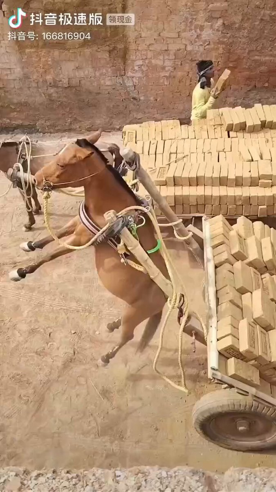
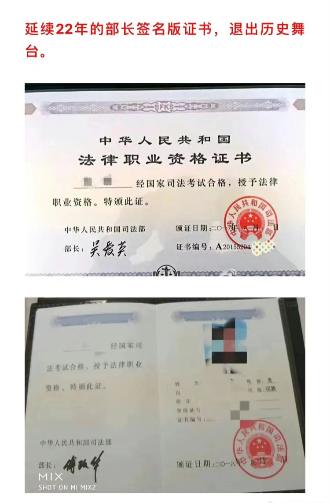

Petrichor 北京时间 2024-01-11T07:48:04Z 1745231062161043467 不堪承重。让我想起建筑工地那些劳苦的农民工，大街上捡垃圾的大爷，山区背柴的小姑娘…. https://t.co/vUpEshrZo4   Petrichor 北京时间 2024-01-11T08:18:47Z 1745238791135097213 以前，中国的法律职业资格证由司法部长签发的。吴爱英和傅政华都曾任过司法部长，签发了大批法律职业资格证。因严重腐败，他们相继进大牢，广大司法工作者再拿腐败部长签发的证书，很尴尬。

为了避免类似情况发生，司法部决定今后法律职业资格证书不再由司法部长签名，给今后司法部长继续腐败留下空间。   Petrichor 北京时间 2024-01-11T02:57:51Z 1745158024748990539 中国官媒1月10日报道说习近平最近在一封给美国友人萨拉·兰蒂女士的信中说，“这个星球的前途命运需要中美关系稳下来、好起来”。习近平在信中宣布“今后5年邀请5万名美国青少年来华交流学习”。

平心而论，西方民主法制国家的人对习近平这样语气感觉不舒服。好像离开中共，我们这个地球就不存在了。没有客观地评价自己，也没有客观的评价别人。这个地球离开谁，照转。

第二，如果习近平用他自己的钱邀请美国人访华，没问题。用中国百姓纳税人的钱邀请5万美国人访华，就让西方人惊讶了。你征求中国纳税人的意见吗？你为什么用别人的钱邀请自己的客人。美国总统没有这个权力。中国独裁者对西方国家了解太少，总是不经意地暴露自己不顾百姓死活的独裁本性。   