自由亚洲电台 北京时间 2024-01-11T08:18:45Z 1745238782868091340 RT @RFA_Chinese: 据彭博社1月8日报道，台湾战争的代价之大，不仅是血与财富的损失，彭博经济学估计这个价格标签约为10万亿美元，约占全球GDP的10%——远超乌克兰战争、新冠疫情和全球金融危机的影响。 https://t.co/h2hb2A6e5d   自由亚洲电台 北京时间 2024-01-11T08:19:33Z 1745238984274374828 RT @RFA_Chinese: “#隔空投送”的技术屏障被突破的消息传出来后，身在西部某省的“路青”很快就在微信朋友圈里转发了。他写道:“我说如果注册的是淘宝上十块钱买的海外邮箱，并且是用不插卡的苹果手机，隔空投送不就查不到了吗？”他的朋友提醒他，为什么要这么去提醒“党国”，…   自由亚洲电台 北京时间 2024-01-11T08:30:00Z 1745241615869063199 专栏 | #中国透视：新年开局 隔岸观火
https://t.co/ZoQ1TlXvZw https://t.co/FiWzCR8bgN 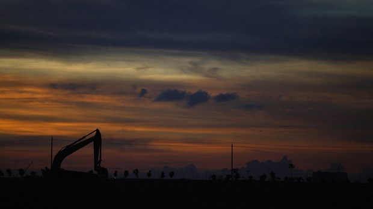  自由亚洲电台 北京时间 2024-01-11T09:12:32Z 1745252320009752675 本周二，第一财经的社论提到"#法治经济 才是最好的市场经济"，北京当局正在采取行动进行改革、立法保障民企的产权及人格名誉。这是否能重振中国民企的信心，中国的民营企业家又如何看待法治经济？ 
https://t.co/4BzBraqbKL https://t.co/DjZmcBAinO 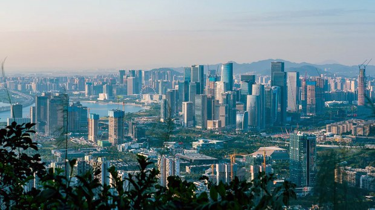  自由亚洲电台 北京时间 2024-01-11T02:30:44Z 1745151202365747545 新年伊始，凛冬已至，近年来势头正劲的中国 #光伏产业 频频传出项目延期、大量裁员的消息，引外界关注。外界担忧，随着延期潮兴起，中国光伏产业会不会出现大量烂尾？

https://t.co/smJkATd7mZ https://t.co/LmLTK6DstK 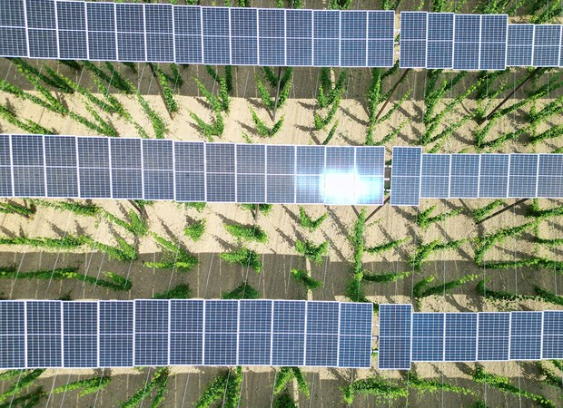  自由亚洲电台 北京时间 2024-01-11T03:04:26Z 1745159682715758727 英国外相 #卡梅伦 接受下议院外委会质询，作为英中关系"黄金时代"的开拓者，他在会上反驳"亲中"指控，并批评中国现在变得更具侵略性和专断。他又再次呼吁港府释放香港传媒大亨 #黎智英 及废除《#港区国安法》。

https://t.co/5uFpjx254t https://t.co/dZJzwoSX86   自由亚洲电台 北京时间 2024-01-11T03:53:25Z 1745172011146777069 港警国安上月再悬红一百万港元通缉五名海外港人，包括前英国驻港领事馆职员 #郑文杰。港媒报道指，他的在港家人周三（10日）被带到警署协助调查。人权组织谴责港府再次滋扰流亡港人家属，促请英国政府回应。

https://t.co/ghcORjXZ89 https://t.co/3Bj8rZGGG7 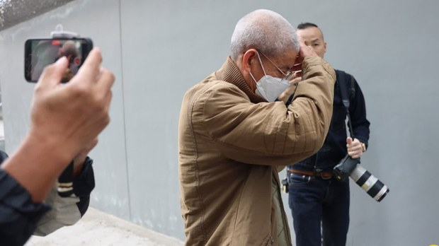  自由亚洲电台 北京时间 2024-01-11T05:14:02Z 1745192297531400632 “#隔空投送”的技术屏障被突破的消息传出来后，身在西部某省的“路青”很快就在微信朋友圈里转发了。他写道:“我说如果注册的是淘宝上十块钱买的海外邮箱，并且是用不插卡的苹果手机，隔空投送不就查不到了吗？”他的朋友提醒他，为什么要这么去提醒“党国”，让使用者更不安全？
https://t.co/BmzPjpfS5W https://t.co/0XvGavuD7G 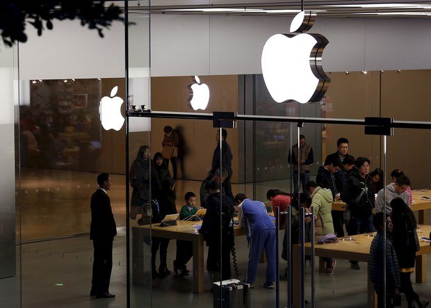  自由亚洲电台 北京时间 2024-01-11T05:44:56Z 1745200072210645220 英伟达第二季度起将量产专供中国市场AI芯片 https://t.co/VFx3AmHZgk 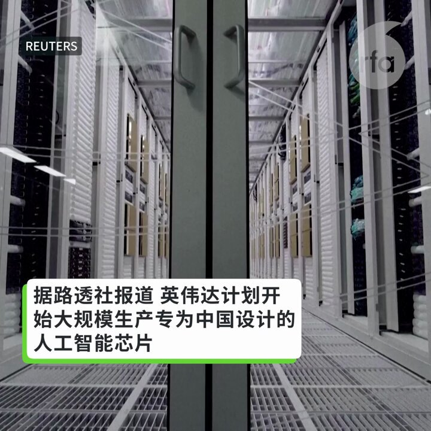  自由亚洲电台 北京时间 2024-01-11T05:45:05Z 1745200112484405687 据彭博社1月8日报道，台湾战争的代价之大，不仅是血与财富的损失，彭博经济学估计这个价格标签约为10万亿美元，约占全球GDP的10%——远超乌克兰战争、新冠疫情和全球金融危机的影响。 https://t.co/h2hb2A6e5d 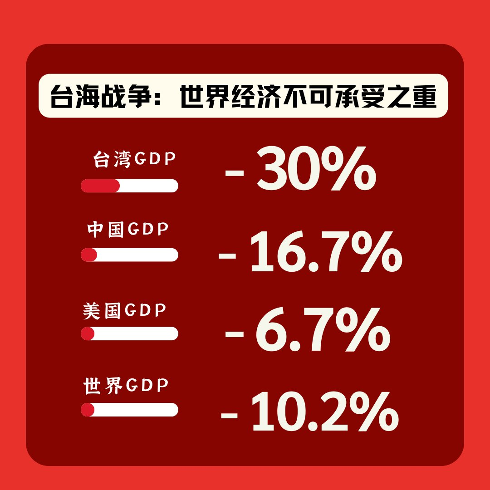  自由亚洲电台 北京时间 2024-01-11T05:46:42Z 1745200517377339512 【中国不再是美国的第一大进口国】
据日经中文网10日报道，在美国的进口国排名中，中国17年来首度不再位居第一，由于美国在2023年1至11月从中国的进口额比前年同期下降了至少20%，因此中国作为美国主要进口国的位子在2023年很可能由墨西哥取代。
https://t.co/jJfdu7mhH8 https://t.co/tZjNR1AEIG 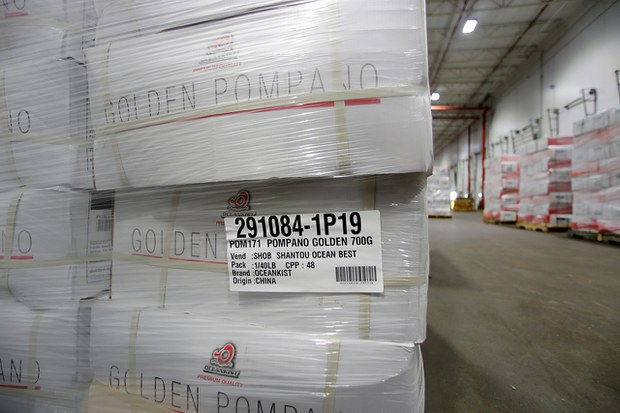  自由亚洲电台 北京时间 2024-01-11T06:06:40Z 1745205544552706347 #事实查核 | 支持 #赖清德、#萧美琴 可获现金、礼物和餐叙？
https://t.co/qPxf39uhkm https://t.co/goJdJYQa5p 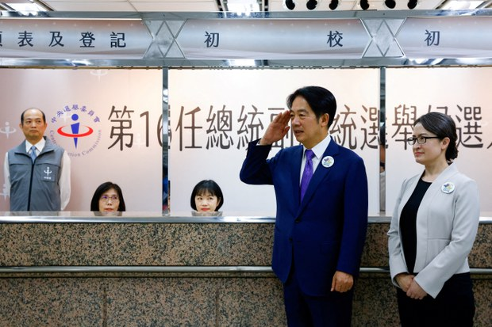  自由亚洲电台 北京时间 2024-01-11T00:48:04Z 1745125363976712693 #马英九 刷屏了！#侯友宜 忙切割
https://t.co/I2ZnV3ORSw
马英九被媒体问到是否信任习近平时说，就两岸关系而言，你必须相信他。
马英九表示，习近平是"可以合作"的人，而且台湾无论如何防卫，都永远无法抵御与大陆的战争。 https://t.co/bhakZ8mLUW 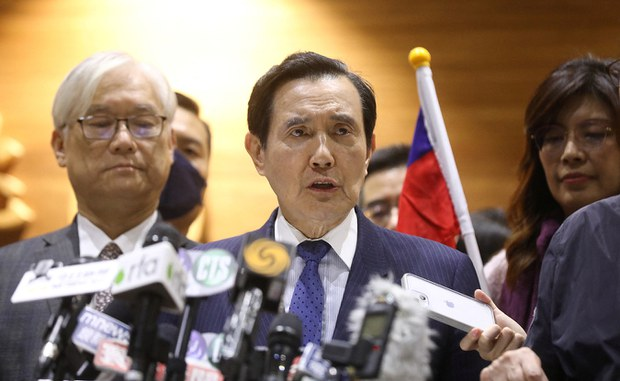  自由亚洲电台 北京时间 2024-01-11T01:19:50Z 1745133360887050312 在上次台湾的总统选举中，#国民党 被贴上"亲中"标签而败选。国民党国际事务部主任黄介正在接受本台《#亚洲很想聊》节目专访时强调，国民党成立初衷是推翻帝制，反对共产党是他们的DNA，在台湾绝对没有所谓亲中问题，只有捍卫台海和平稳定的问题。
https://t.co/boHgOhRbhl https://t.co/NwWqv4qGXa 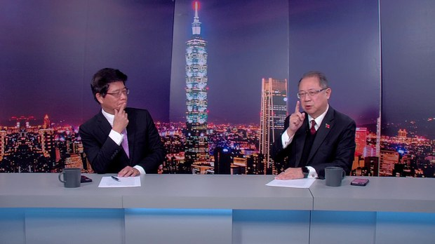  自由亚洲电台 北京时间 2024-01-11T01:22:04Z 1745133919513817390 共产党型塑下的妈祖 从海边女巫成为多变女神 | 【两岸的妈祖 台湾的政治 - 2】
欢迎收听播客 https://t.co/q3QLYQd5Mb https://t.co/eAtNU89uSU   自由亚洲电台 北京时间 2024-01-11T01:37:36Z 1745137831297843211 #李稻葵 称"#中国经济处于青春期"
网民：别侮辱青春
https://t.co/DU6dJ1KcN9 https://t.co/zbExSJgxZ2 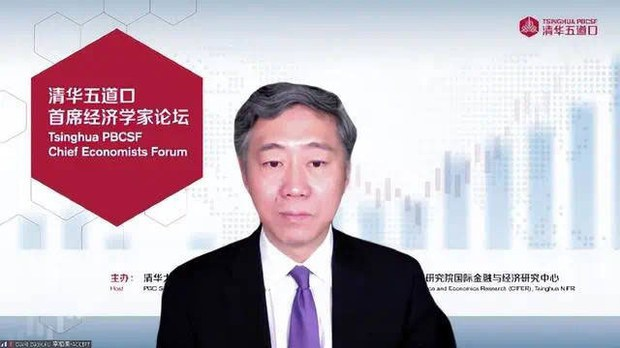  