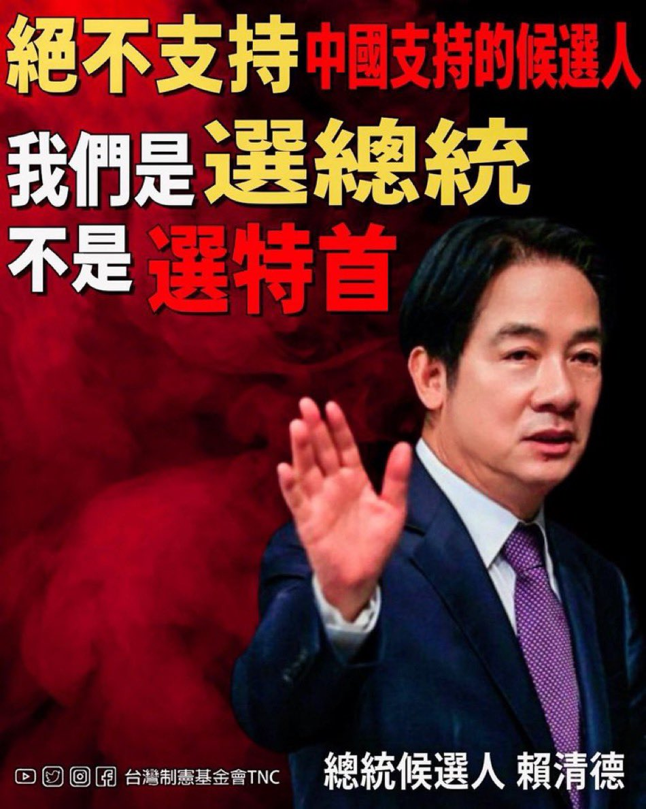
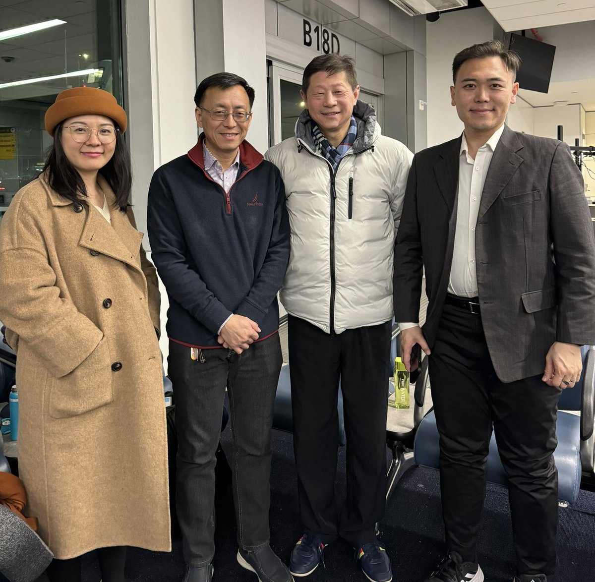
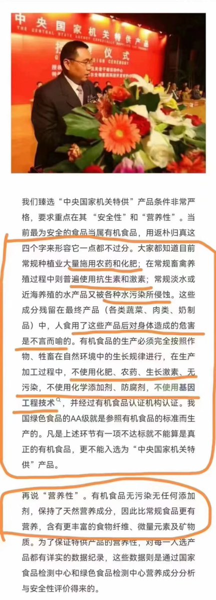
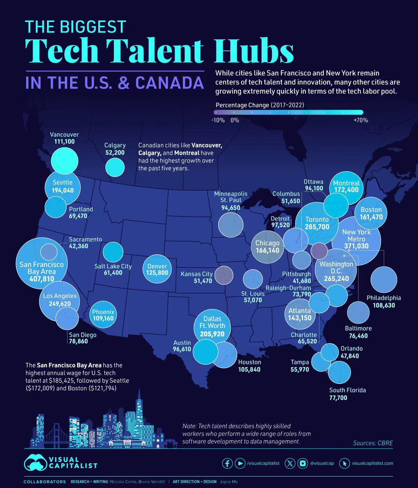

Petrichor 北京时间 2024-01-10T11:10:49Z 1744919696309194864 那个时候的国民党比现在的共产党强 https://t.co/cbwuBsssAE   Petrichor 北京时间 2024-01-10T12:18:50Z 1744936812320067609 离中华民国大选投票还有几天了，我想再次提醒各位朋友：我们是选我们自己国家的总统，不是选特首（由中央任命的）。

这几天油管上几个中文自媒体“大V”被商人邀请来台湾观选。一朋友来电问我是否感兴趣参加活动，见他们一行。我说我最近工作忙，抽不出时间，也需要照顾孩子。再说我与他们往日里也没有联系过，不是朋友。我还是隐身做个自由发言的推主吧。   Petrichor 北京时间 2024-01-10T06:29:04Z 1744848793969820130 转：

坏人在哪里
在穿着制服的军警里
执行命令却践踏法律

坏人在哪里
在公务员的队伍里
贪污受贿谋私利
心里只有人民币

坏人在哪里
在吃特供
住高干病房的领导里
享受特权庸无为 https://t.co/yRJYcAApdW   Petrichor 北京时间 2024-01-10T09:11:42Z 1744889719329059134 转：
一图读懂北美技术人才中心大趋势。旧金山和纽约依然冠列全球第一、第二。平均年收入最高的是旧金山，18万多美元。西雅图第二，17万多美元。但过去五年，人数增长最快的加拿大的温哥华、蒙特利尔、卡尔加里。 https://t.co/cFGaYrm1kp   Petrichor 北京时间 2024-01-10T02:33:43Z 1744789563128660108 说话越来越没逻辑了。“台湾选举是中国的内部事务”，你中共想干涉就干涉、想操纵就操纵？

毛发炎人大概忘了，台湾选举的是中华民国的总统，中华民国从1912年建立以来一直存在，迄今已经111年了。毛发炎人见过选举两个总统的国家吗？中华民国和中共国宪法不同、制度不同。台湾选举是中华民国的内部事务，而不是中共国的事务，中共国没有民主选举，只有独裁统治。这是全世界的共识。

不讲道理，让中共国孤立和不得人心，在国际上不被人尊重。   