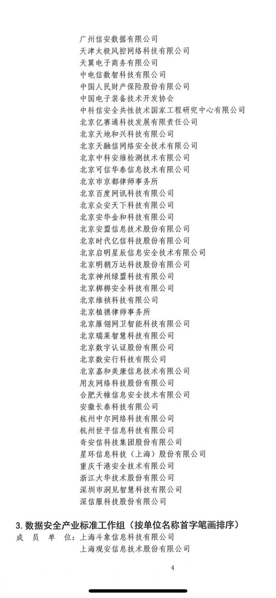
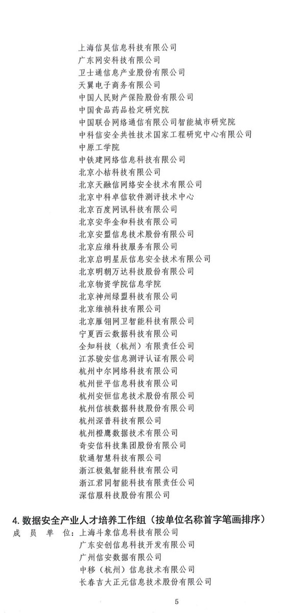
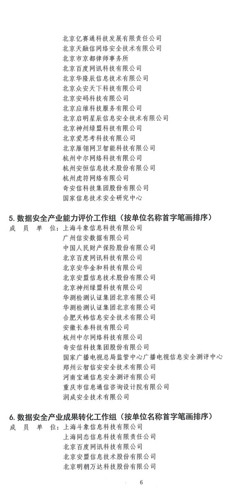

拆墙运动公号 北京时间 2024-01-10T04:54:57Z 1744825106197627161 RT @jinrizhiyi: 网络防火墙：保护还是压制？——从厦门高校事件看中国政府的网络审查政策

近日，有网友在推特上爆料，福建省厦门市的几所高校发生了一起事件，涉及到学生因为使用翻墙软件浏览境外网站而被学校当局处罚的情况。

#一人一推 #长城防火墙 #网络审查  #今…   拆墙运动公号 北京时间 2024-01-10T05:01:31Z 1744826758090690739 RT @peace86774949: 华尔街在中共国的野心遭遇了不断筑起的防火墙。😂
华尔街最大的银行之一停止向其中共国大陆子公司通报敏感的公司战略，这样中共政府就无法窃听或事后要求提供细节。 https://t.co/z5ssBwzCx6   拆墙运动公号 北京时间 2024-01-10T06:05:20Z 1744842821280866783 网友投稿：中国大陆一个网民在网上发声：这个社会没救了！老百姓醒悟吧！这个社会病入膏荒了！官官勾结病入膏荒了！
没救了！老百姓醒醒吧！起来吧！觉悟吧！觉醒吧！
#拆墙运动 关注中国大陆的抗争者！ https://t.co/teY0l4YMau   拆墙运动公号 北京时间 2024-01-10T03:33:53Z 1744804705916649923 公布的建立 #防火墙 与补  #防火墙 漏洞的 #恶人 以及单位名单的来源（2） ：
 中国计算机行业协会数据安全专业委员会第一次会议https://t.co/OLpGxfqtgi https://t.co/NhkeapZuTl   