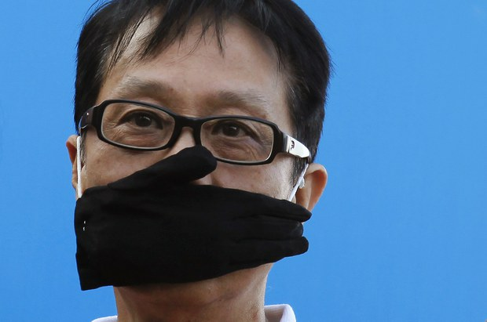
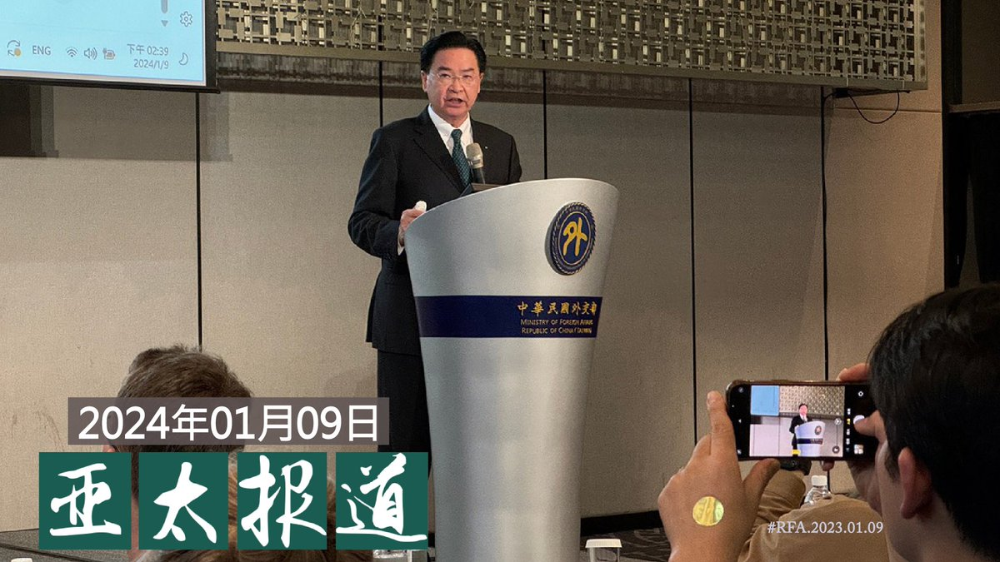
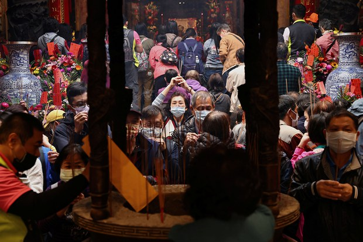
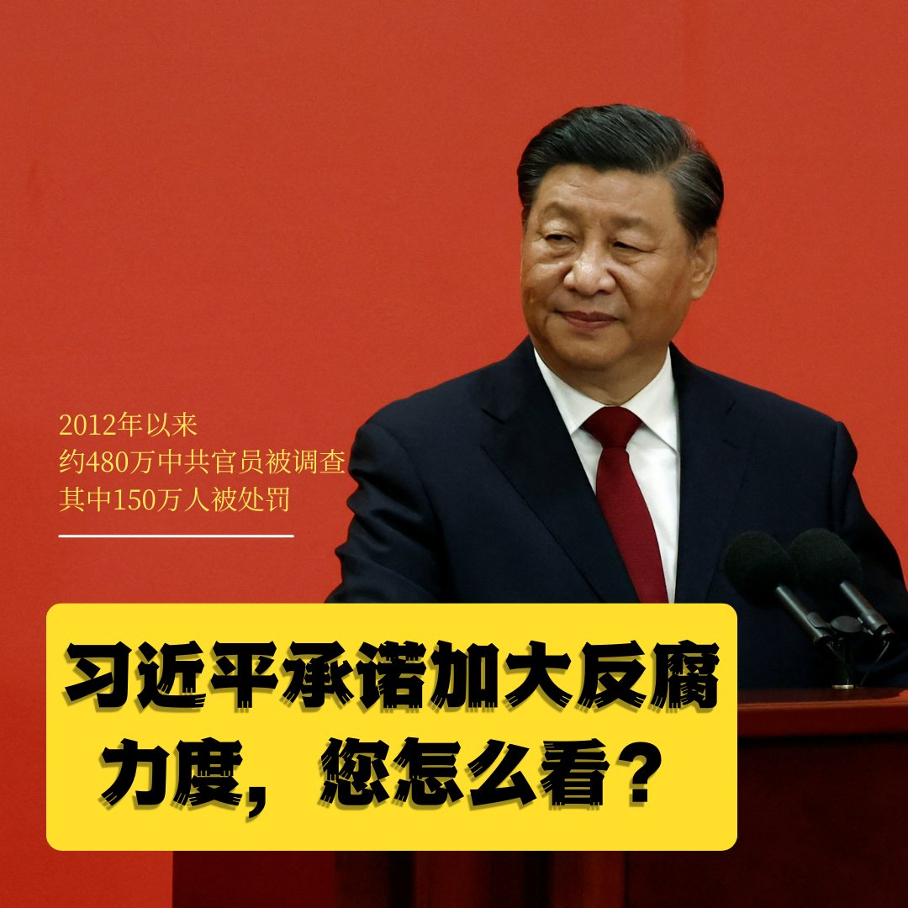
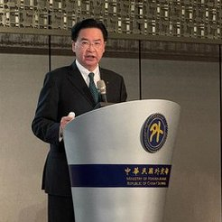
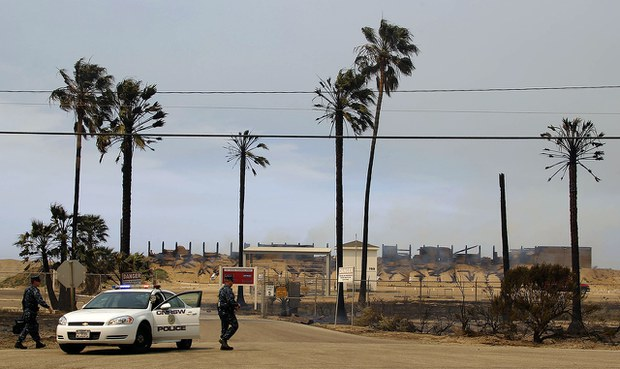
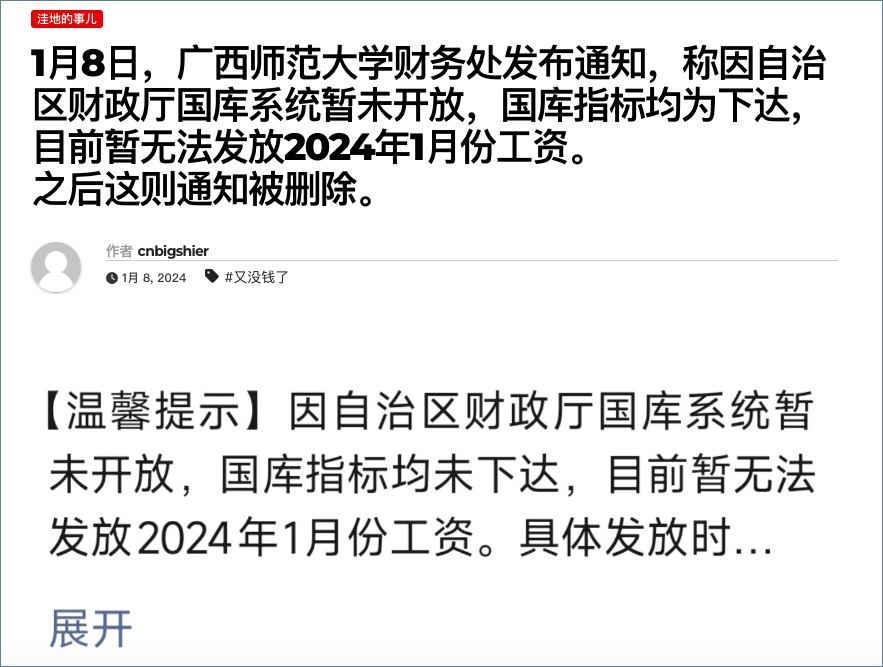
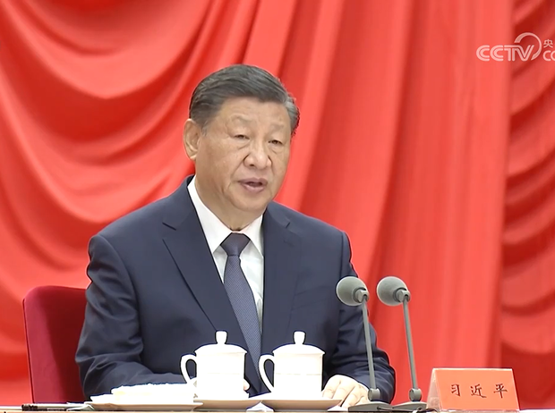

自由亚洲电台 北京时间 2024-01-10T07:00:08Z 1744856608872817028 【#读者广场 | #中共话术考】
中共为抢占话语权的制高点，有一套钳制民众言论的“吉祥三宝”：骗人、整人、杀人。
详见
https://t.co/0Gp5ty0FcI https://t.co/OPwZ1Veuwm   自由亚洲电台 北京时间 2024-01-10T08:00:08Z 1744871709847773398 欢迎收听和订阅播客【＃亚太报道】 https://t.co/MjLNSvVMqc
#习近平 警告严惩 #政商勾连；湖南异议人士 #欧彪峰 遭酷刑；#广西师范大学 停发工资；#美中关系 何去何从？；台湾外长公开中国 #介选 内幕 https://t.co/bzyXXQZ8eF   自由亚洲电台 北京时间 2024-01-10T05:00:08Z 1744826410584457593 #台湾选举 政治为何寄生在 #宫庙 事务？| 【两岸的妈祖 台湾的政治 - 3】
https://t.co/M7LgXhQDcv https://t.co/3idn87s41s   自由亚洲电台 北京时间 2024-01-10T05:17:07Z 1744830686719324284 台湾大选前 中国大陆 #妈祖 赴台争议多 |【两岸的妈祖 台湾的政治 - 1】
请听播客 https://t.co/q3QLYQd5Mb https://t.co/QQ3RLnEqmV   自由亚洲电台 北京时间 2024-01-10T05:18:41Z 1744831078890881082 2024年是中国所谓"#全功能接入互联网" 的三十周年。三十年来，中国不仅拥有了全球最多的网民数量，电商经济也发展亮丽。然而，在涉及公民言论自由、隐私、公众知情权等 #网络自由度方面， 中国高度发达的互联网空间是否与其成正比呢？
https://t.co/76tcxXCu2s https://t.co/6LjNOoJGbR   自由亚洲电台 北京时间 2024-01-10T05:19:17Z 1744831229046763845 1月8日的二十届中央纪委三次全会上，习近平在发表的讲话中强调，要“深化整治金融、国企、能源、医药和基建工程等权力集中、资金密集、资源富集领域的腐败”。对此，您如何评价？据法新社报道，自2012年以来，中国约有 480 万名党内官员受到调查。其中，超过150万人被判处长期徒刑、开除公职、降级、开除党籍等处罚。习近平承诺加大反腐力度，传递出什么信息？   自由亚洲电台 北京时间 2024-01-10T05:33:08Z 1744834716891824152 近日，来自 #缅甸 北方武装冲突的炮弹落入云南边界，中国对 #缅北冲突 的立场再次成为舆论焦点。缅甸于去年十月爆发武装冲突以来，中国官方就表达过高度关注，并对相关冲突威胁中方民众安全提出了抗议。那么，中国政府究竟对这场邻国武装冲突发挥着怎样的影响力呢？
https://t.co/uS3YcLlHLf https://t.co/lfhAoaFtxO   自由亚洲电台 北京时间 2024-01-10T05:42:11Z 1744836993954218063 #事实查核 @asiafactcheckcn｜#日本 内阁成员在 #地震 后"灾区都没去"，却访问乌克兰？
https://t.co/aIJoR2ThOd https://t.co/GeENDQ0LOF   自由亚洲电台 北京时间 2024-01-10T06:00:11Z 1744841523974533179 英首相挺 #黎智英： 黎智英案是本届政府优先事项
https://t.co/WMGrS7AIPE https://t.co/nNDp4kTeQw   自由亚洲电台 北京时间 2024-01-10T02:23:40Z 1744787033875218755 #吴钊燮：若中国成功左右 #台湾大选 #介选 之手将遍布全球 https://t.co/LtFtwvipaW https://t.co/UIaSE9JJha   自由亚洲电台 北京时间 2024-01-10T02:51:26Z 1744794023746023801 【独家】#缅北叛军 重新控制 #果敢  #习近平思想 是制胜法宝？
https://t.co/b7JHyyLfCF https://t.co/PQKcHpPRUv   自由亚洲电台 北京时间 2024-01-10T03:26:35Z 1744802870950793503 【吃美国饭砸美国锅 赵文恒将面临最高 20 年监禁并罚款】
据路透社8日报道，26 岁的美国海军中士 #赵文恒 承认向中国的上级情报人员发送了美国在印太地区军事演习的计划、作战命令以及日本冲绳美军基地雷达系统蓝图和电气图等。犯下共谋和受贿罪。 
https://t.co/cyZvmSN0kX https://t.co/A7uz5uVCwH   自由亚洲电台 北京时间 2024-01-10T04:13:39Z 1744814715401044088 被外界视为专职党务外交工作的中共中央对外联络部部长 #刘建超 正在美国进行访问。本周二，刘建超对话美国智库，重申中方致力于推进 #美中关系 发展，但在 #台湾 议题上，中方的立场"坚定、未变"。
https://t.co/iChiLMk32R https://t.co/FkOngeh3L3   自由亚洲电台 北京时间 2024-01-10T00:32:57Z 1744759173290832124 唱红歌 拜韶山 抓汉奸 南征北战 — 一个毛粉的战斗
请听播客 https://t.co/q3QLYQd5Mb https://t.co/65bnuU11lZ   自由亚洲电台 北京时间 2024-01-10T00:41:40Z 1744761368077795688 #广西师范大学 财务处本周一通知员工，因国库资金未到位，停发一月份工资，相关信息上网后又被移除。
河南省建筑科学研究院发文，要求员工主动休无薪长假。
南京一民企更要员工用积分兑换薪水...
https://t.co/izdzrr4yoT https://t.co/wqOJ2Bhz7t   自由亚洲电台 北京时间 2024-01-10T00:59:31Z 1744765860227781086 湖南异议人士 #欧彪峰 被移送到 #赤山监狱 接近一年后，首次披露，自己在入狱前曾遭受 #酷刑，导致出现精神创伤，至今仍未康复。欧彪峰也证实，在指定居所监视居住期间，被当局强制拍下多条视频。
https://t.co/t0qDJAQXQi https://t.co/0NUxh6lc6L   自由亚洲电台 北京时间 2024-01-10T01:06:50Z 1744767698117308671 【#您怎么看？】
2023年，中国的海外汽车销量飙升至创纪录水平，有望超过日本成为全球最大出口国，这标志着全球汽车行业格局发生重大变化。详见 https://t.co/BpzQcjiCBq
您是否看好中国车的未来？您会购买中国品牌的汽车吗？ https://t.co/hCs0U0dGPE   自由亚洲电台 北京时间 2024-01-10T01:46:57Z 1744777796277444676 习近平又要 #反腐 了，他说要以“#永远在路上”的坚韧和执着，打赢反腐败斗争攻坚战、持久战。
中国学者严力耕说：“所谓反腐在路上，实际上是反腐败在没有政治体制改革的情况下的一种推辞。正因为没有体制的改革，所以反腐败才一直存在、一直需要。”https://t.co/A1xU1rdPet
#您怎么看？ https://t.co/OpHmF5ixH6   