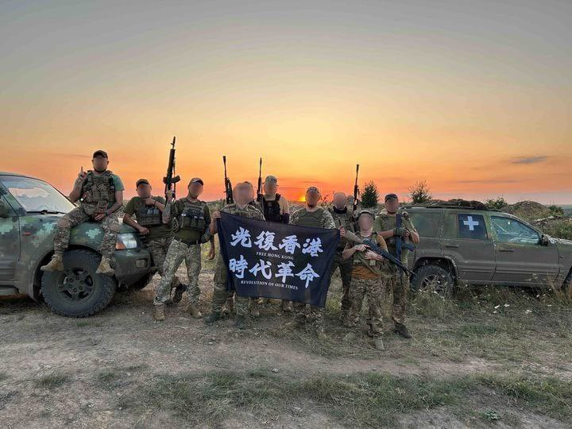

谁将十万横扫三江 北京时间 2024-01-10T12:45:51Z 1744943611916255433 #记一个学生# 我在隔壁班刚上完课推开教室门，我们班一个一米七的女生提溜着一个矮矮瘦瘦的男生出现在我面前，女生和我说：“老师，他对我开黄腔。”

其实我早就发现，班里的男生开始在课堂上出现一些字眼的时候对视一笑，开始学会查找一些刺激的小网站，开始“内部交流”。正好想找个机会和学生们谈谈，就发生了这件事。

男生问女生：“你家有银子吗？”女生回答“有”，男生的下一个问题是：“那你卖yin吗？”

女生在办公室复述了整个对话过程，且强调男生曾经多次对她说过这种恶心的话。当我质问男生时，他的反应是：“我之前也对其他女生来过这种玩笑，她挺高兴的，还笑呢。”

他白白瘦瘦的，个子不高，说起话来甚至还带着娃娃音，语气还带着点委屈的蛮横。被我一顿输出之后，他接着狡辩说：“我之前跟你说的时候你只是用笔戳了戳我，我也没觉得你生气呀。”

这一连串信息让我怀疑自己身处微博某新闻评论区，还没等我反应过来，女生便说：“我那是不生气吗？我那是还当你是同学，觉得没必要撕破脸，你觉得怎么样算生气呢？”接着女生对我说：“老师，我需要找她家长谈一谈，我觉得这件事必须让他父母知道，这太过分了。”

我说好，我会先和他父母谈，然后让他父母联系你家长。给男生家长讲了这个事之后，他妈妈的一连串反应非常有趣：

“啊？他知道卖yin什么意思吗？”

“啊？那个女生也知道这是什么意思吗？”

“啊？我儿子现在晚上洗澡的时候还会听小时候的故事书呢！怎么会这样！”

“啊，那我让孩子爸爸和对方爸爸沟通吧！”（她大概是觉得男人和男人对话更方便，最后还是她自己去沟通的，大概是孩子爸爸丢不起这个人吧）

女生的爸爸的回复非常教科书：

“首先感谢您旗帜鲜明的态度。孩子一见我就把事情说了，我为她的应对感到自豪，她自己也是。有些话您夹在中间不方便，一 我会要求对方家长约束好孩子（让他爸妈引起重视）；二 这个男生要在全班同学面前道歉（杀鸡儆猴）；三再有下次我会报警处理(怎么也得吓唬吓唬)。需要我配合您做什么吗？”

我想了想，这件事情太典型了：

1.男性对女性开黄腔

2.男性以其他女性的纵容当挡箭牌

3.男性主观推测“你没不高兴”

4.男生的家长对他的思想变化毫不知情，还以为他是乖宝宝

5.男生的爸爸在整件事情的处理中完全隐身

6.女生的一系列处理办法都是教科书级别的

7.女生家长坚决地站在了孩子这边，没有pua孩子“是不是你哪里有问题”

于是，我决定借此机会在班里开一场班会，就叫“关于开黄腔这件事”。

首先用几个情景选择题导入话题，学生在每一个选择中已经有表达的冲动，会发现大多数同学都有本能的正义感。选择题之后就是我要讨论的几个问题：

一、为什么开黄腔本身不得体

二、为什么不应该跟女生开黄腔

三、为什么女生不应该鼓励开黄腔

四、揣测“她没生气”是一种愚蠢和自大

最后，我再次强调，在以上情景题里，我们班的女生每一步都做了最正确的选择，希望大家每一个人在被冒犯的时候都可以勇敢说不。做得体的人，做勇敢的人。   谁将十万横扫三江 北京时间 2024-01-10T10:34:14Z 1744910492462887321 RT @22HomoPoliticus: 期待香港志愿军手足在乌克兰多多消灭黄俄罗斯肥料。不要留俘虏！拜托了！ https://t.co/DIH3YKXVYr   谁将十万横扫三江 北京时间 2024-01-10T10:43:36Z 1744912847749148752 RT @Hitsuji_Kawawa: 我有一说个十，其实“保卫现代生活”这玩意在你国绝对是极端激进的进步革命
你说他中道那是因为资本主义民主早就在西方固化了200来年，你再保卫现代生活那确实是太逆天老保了
然而你国和西方不一样因为你国甚至时刻面临封建主义和宗族的全面复辟，我讲…   谁将十万横扫三江 北京时间 2024-01-10T11:10:24Z 1744919590805917783 一则旧闻
【青岛：幼儿园教师因同性恋倾向被解雇，告上劳动仲裁】中国青岛市的一名幼儿男教师因为同性恋倾向被知晓而遭到工作单位解雇，雇佣单位被指歧视，这名教师正通过法律途径争取权益。据@同志平等权益促进会 ，这名幼儿教师（化名明珏）针对用人单位的解雇行为，向青岛某区劳动人事争议仲裁委员会提起劳动仲裁，仲裁委在9月27日确认受理此案并决定于11月13日开庭审理。本案被认为是中国教师因为性倾向而遭就业歧视之后诉诸法律维护权益的第一案。路透社等外媒也报道了这一案件。

https://t.co/cxNtnd4K2Q   