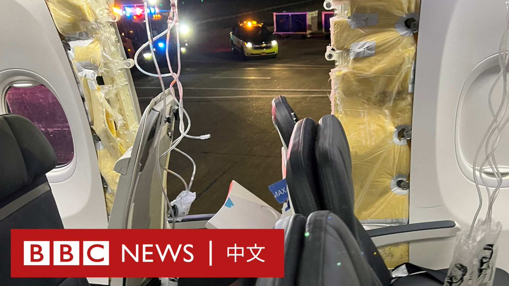
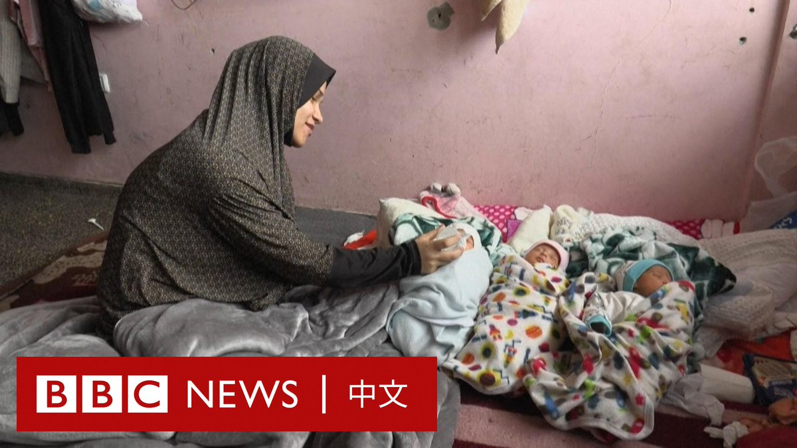

D英国广播公司BBC 北京时间 2024-01-09T13:43:42Z 1744595783419072914 “金门之于中台，就像台湾之于中美，所有政策的决定权都不在自己手中。就像两只大象在吵架，我们是下面的小蚂蚁，” 金门县议员董森堡说。

在美中两个大国对抗加剧之时，台湾成为亚洲地缘政治的焦点，而前线岛屿金门则是牵动局势变化最为敏感的地方。
https://t.co/QELsVE5xZL   D英国广播公司BBC 北京时间 2024-01-09T09:16:11Z 1744528462713590001 阿拉斯加航空公司一架波音737 Max 9型飞机在飞行途中发生舱门脱落事故，美国航空监管机构已下令停飞171架波音737 Max 9飞机。 https://t.co/lNSMjBUnrV   D英国广播公司BBC 北京时间 2024-01-09T11:10:39Z 1744557268325253454 随着加沙战火持续，当地人的生活面临窘境。当地一位流离失所的母亲最近产下了四胞胎，一家人躲在一间教室里。她说，食物的匮乏让她很难哺育孩子们。 https://t.co/p0A33deNWf   