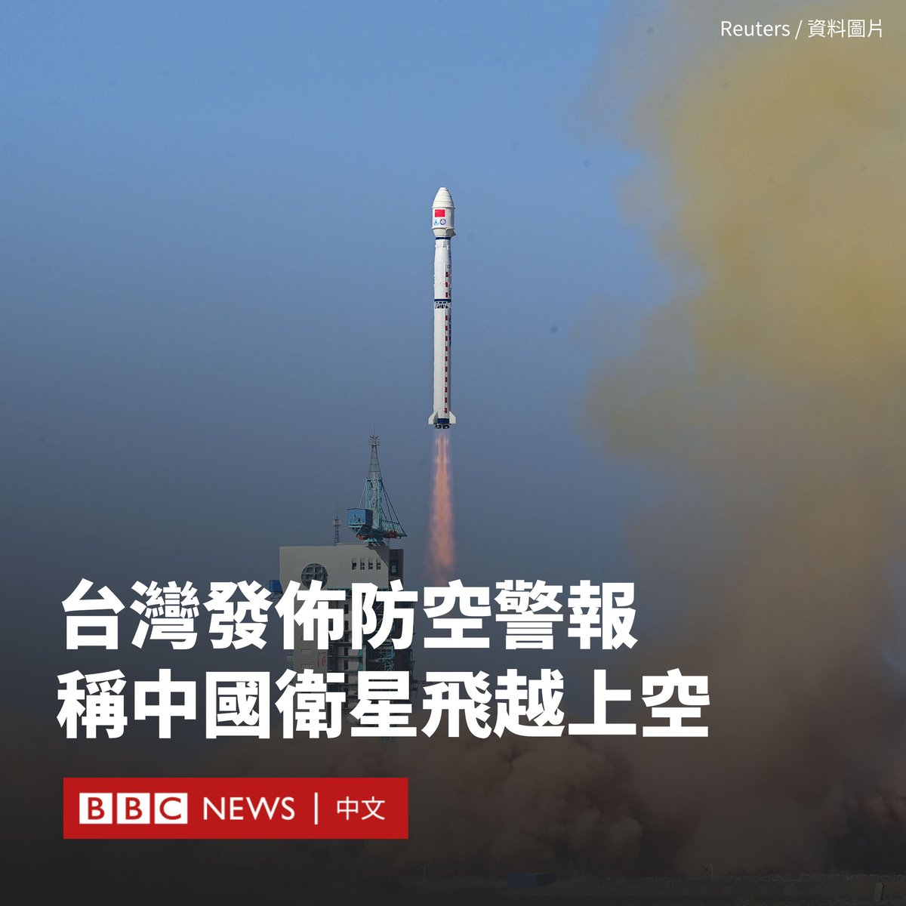

D英国广播公司BBC 北京时间 2024-01-09T20:02:58Z 1744691228044599757 马尔代夫总统穆伊祖的中国行被视为一次“打破传统”的访问，因为上任三个月的他是首位在上任后先访问中国而非邻国印度的马尔代夫总统。https://t.co/WQG1UQhGmz   D英国广播公司BBC 北京时间 2024-01-09T16:03:09Z 1744630876070453671 韩国国会周二（1月9日）通过新法律，在2027年后禁止宰杀和出售狗肉的行为。这项法律将结束该国数百年来食用狗肉的习俗。

根据新法律，以食用为目的饲养、屠宰犬只或出售狗肉将被禁止。违者可能需承担刑事责任。

宰杀狗的人将面临最高三年监禁，而以食用目的繁殖犬只或卖狗肉的人可被处以两年有期徒刑。不过，食用狗肉本身并不违法。

新的立法将在三年的宽限期后生效，以让饲主和餐馆老板有时间寻找其他就业和收入来源，他们需向地方当局提交一份逐步关停业务的计划。

政府承诺将支持失去工作的肉狗养殖户、屠夫和餐馆老板，但赔偿细节尚未确定。

据官方统计，截至2023年，韩国约有1600家狗肉餐厅和1150家养狗场。不过，在过去几十年里，狗肉已经不再受到韩国食客的青睐，尤其是年轻人开始反对这一行为。

根据盖洛普（Gallup）去年进行的一项民意调查，只有8%的人表示他们在过去12个月里食用过狗肉，低于2015年的27%。不到五分之一的受访者表示支持食用狗肉。

早在1980年代韩国政府就曾试图禁止狗肉，但未能取得进展。现任总统尹锡悦的夫人金建希是动物爱好者，也是拒绝食用狗肉的倡导者。

动物权利组织对这一结果表示赞赏，称这是动物福利保护上的进步。但一些养殖户对失去生计感到担忧，并指这“侵犯了人们吃自己喜欢的食物的自由”。   D英国广播公司BBC 北京时间 2024-01-09T17:33:41Z 1744653659533980079 台湾国防部周二（1月9日）罕见发布“国家级警报”，称有中国卫星飞越台湾南部领空。

台湾各地的民众在手机上收到了“防空警报”的推送，提醒他们“注意安全”。

“中国于15:04发射卫星，已飞越南部上空，请民众注意安全。若发现不明物体，通报警消人员处理。”警报写道。

台湾媒体称，这是台湾政府首次在全岛范围内发布此类性质的警报。

中国中央电视台证实，当天下午该国在西昌卫星发射中心使用长征二号丙运载火箭，将爱因斯坦探针卫星发射升空。

报道称，卫星“已顺利进入预定轨道”。

台湾将在本周六（1月13日）迎来关键的总统大选。据路透社报道，台湾外长吴钊燮表示，在这一时间发射卫星是一项“灰色地带”活动。

但是，台湾主要反对党国民党主席朱立伦指责民进党政府散布恐慌，尤其是在英文版警报中使用“missile”（导弹/飞弹）一词，要求当局进行说明。

该党总统候选人侯友宜也批评称，中国此前也有发射卫星，但没有发布国家警报，质疑民进党“是不是又要说中国介选”。

台湾国防部在一份新声明中承认英文警报用词错误，表示是“因疏忽未同步更新原系统用字”所致，为此向民众致歉。

据欧洲空间局（European Space Agency）称，爱因斯坦探针卫星是该机构、中国科学院和马克斯·普朗克地外物理研究所（Max Planck Institute for Extraterrestrial Physics）之间的合作项目。

中国新华社报道称，这颗卫星将“有望捕捉超新星爆发出的第一缕光，帮助搜寻和精确定位引力波源，发现宇宙中更遥远、更暗弱的天体和转瞬即逝的神秘现象。”   D英国广播公司BBC 北京时间 2024-01-09T13:43:42Z 1744595783419072914 “金门之于中台，就像台湾之于中美，所有政策的决定权都不在自己手中。就像两只大象在吵架，我们是下面的小蚂蚁，” 金门县议员董森堡说。

在美中两个大国对抗加剧之时，台湾成为亚洲地缘政治的焦点，而前线岛屿金门则是牵动局势变化最为敏感的地方。
https://t.co/QELsVE5xZL   D英国广播公司BBC 北京时间 2024-01-09T09:16:11Z 1744528462713590001 阿拉斯加航空公司一架波音737 Max 9型飞机在飞行途中发生舱门脱落事故，美国航空监管机构已下令停飞171架波音737 Max 9飞机。 https://t.co/lNSMjBUnrV   D英国广播公司BBC 北京时间 2024-01-09T11:10:39Z 1744557268325253454 随着加沙战火持续，当地人的生活面临窘境。当地一位流离失所的母亲最近产下了四胞胎，一家人躲在一间教室里。她说，食物的匮乏让她很难哺育孩子们。 https://t.co/p0A33deNWf   