自由亚洲电台 北京时间 2024-01-09T06:21:38Z 1744484531904934003 专栏 | #夜话中南海：#习近平 如何令 #毛左 们从满怀希望到极度失望
https://t.co/uch7TWiEGF https://t.co/ala3mOFwHY 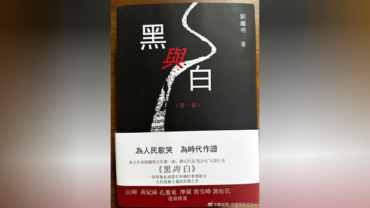  自由亚洲电台 北京时间 2024-01-09T06:34:30Z 1744487771685749162 RT @RFA_Chinese: 【欢迎加入自由亚洲电台电报群】https://t.co/UkKZmFSRkG https://t.co/Qid2LNZxJn   自由亚洲电台 北京时间 2024-01-09T07:00:07Z 1744494219174260794 据路透社报道，中国海事局8日发表声明称，从1月8日到9日的上午10点到下午3点，在 #东海 部份区域进行 #实弹演习，任何船只不得进入指定区域。声明指出，这项演习将在宁波和舟山沿海海域外进行。
https://t.co/QoTK4UlXgA https://t.co/Xq6aQkEBAL   自由亚洲电台 北京时间 2024-01-09T08:00:07Z 1744509319067074981 欢迎收听和订阅播客【＃亚太报道】 https://t.co/MjLNSvVMqc

中国为何不满美国 “禁止 #腐败分子 及家属入境”？；彭博社披露 #中国军方贪腐 内幕；#谢阳 律师被控“煽动颠覆”案开审无期；山西 #平遥 要求旅拍店下架“非汉族服饰”；台湾各政党在“#超级星期天” 造势拉票 https://t.co/GMRN4GlL9O 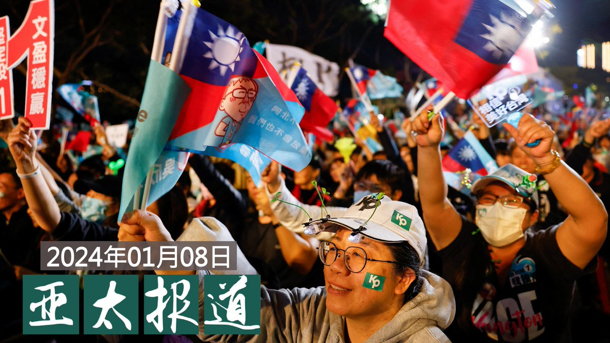  自由亚洲电台 北京时间 2024-01-09T08:27:19Z 1744516161382007263 #中国国家足球队 赴卡塔尔征战亚洲杯之际，队员们还被要求集体观看央视的 #反腐 专题大片《持续发力 纵深推进》。
https://t.co/m4botd1Fnu https://t.co/96ZOUdU4mC 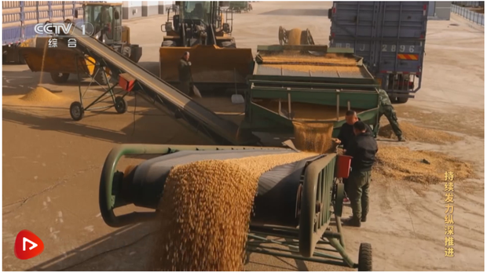  自由亚洲电台 北京时间 2024-01-09T11:18:18Z 1744559193346969963 RT @RFA_Chinese: 【林浊水：在中国眼中 中华民国也是分裂国家】
【廖达琪：中华民国让中共对统一没有绝望】
 https://t.co/KTKHYbBwdN
台湾中山大学政治系荣誉教授 #廖达琪，前立法委员 #林浊水，在 #亚洲很想聊 节目中激烈交锋。是 #中华民…   自由亚洲电台 北京时间 2024-01-09T11:18:37Z 1744559270736064798 RT @RFA_Chinese: 欢迎收听和订阅播客【＃亚太报道】 https://t.co/MjLNSvVMqc

中国为何不满美国 “禁止 #腐败分子 及家属入境”？；彭博社披露 #中国军方贪腐 内幕；#谢阳 律师被控“煽动颠覆”案开审无期；山西 #平遥 要求旅拍店下架“非…   自由亚洲电台 北京时间 2024-01-09T00:10:41Z 1744391180312510598 #台湾大选 进入最后倒数，美英日等数以百计的记者已抵达台湾，大篇幅报道这次大选的相关新闻，但在选举现场，却不见 #港媒 的踪影。港媒冷处理在《国安法》后的首次台湾大选，如何反映现在的 #中港台关系？
https://t.co/pvoVGzMUTt https://t.co/Y7MYO9ui8C 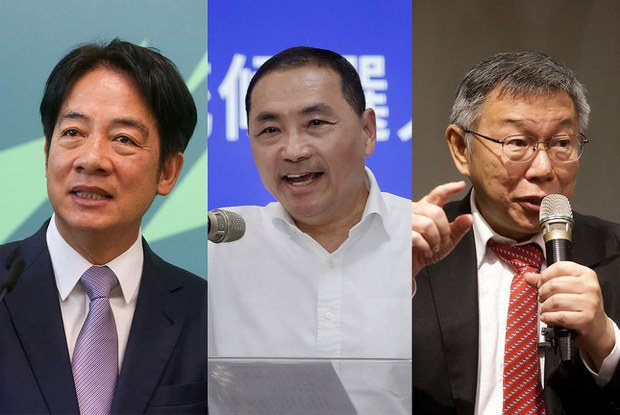  自由亚洲电台 北京时间 2024-01-09T00:28:07Z 1744395570624807294 湖南维权律师 #谢阳 遭当局指控涉嫌煽动颠覆国家政权被刑事拘留已接近两年。近期他获准与律师会面，并透过信件分析案件延期开庭的内情以及自己面对的处境，也不排除用生命捍卫尊严的可能。
https://t.co/Aax3RJ8erz https://t.co/9cGym96tva 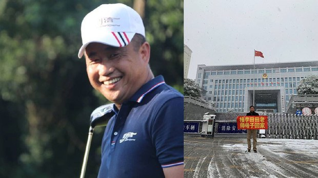  自由亚洲电台 北京时间 2024-01-09T01:43:08Z 1744414448327283107 #台湾大选 前最后一个黄金周日，三党都在高雄举办 #造势 晚会。除以实体造势的"陆战"搏人气外，各阵营还借助网红、自媒体合作、上脱口秀等打拼网络上的"空战"舆论。

https://t.co/tFB0eYTjdT https://t.co/HtxqAjhm8k 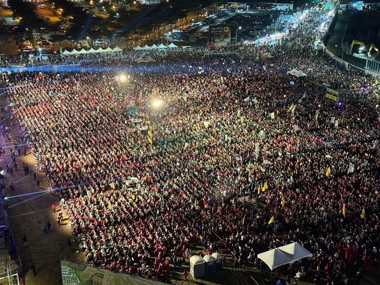  自由亚洲电台 北京时间 2024-01-09T02:49:28Z 1744431142500257969 近日，具有台湾民众党籍、但以无党籍人士身份参选立委的 #马治薇 因涉及收受中国资助百万虚拟货币遭检调收押禁见。有法律界人士告诉自由亚洲电台，这是台湾《反渗透法》实施后第一个候选人遭收押，以及首宗中国透过虚拟货币介入台湾选举的案例。
https://t.co/gaIkJ2HQnS https://t.co/p1fnNjHTOZ 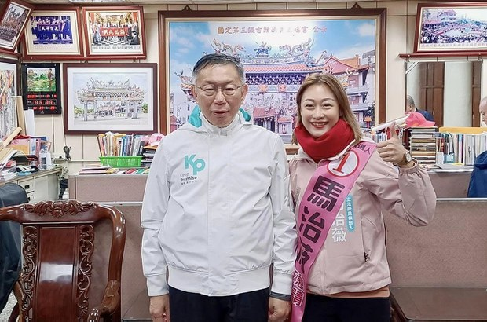  自由亚洲电台 北京时间 2024-01-09T03:16:53Z 1744438039580131558 #加拿大香港社区 持续关注 #黎智英 案，上周末温哥华举办《香港人：#黎智英为自由奋战》电影放映会，同时，港人组织呼吁加拿大前最高法院首席大法官麦嘉琳（Beverley McLachlin）辞去香港终审法院非常任法官，为黎智英发声，不要再当香港司法系统的花瓶。
https://t.co/iCtJQUXvhy https://t.co/mHQ3I0pMT0 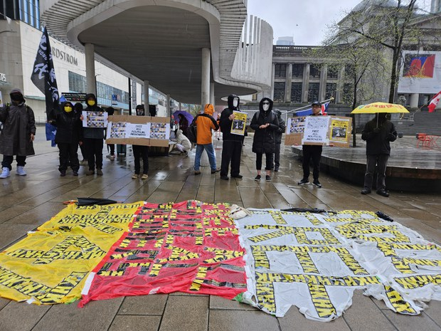  自由亚洲电台 北京时间 2024-01-09T04:29:07Z 1744456217282638016 #中国国安部 声称侦破一宗英国间谍案，指控英国 #军情六处 利用一名第三国籍的"境外咨询机构负责人"在中国搜集情报，向英方提供共十七份不同级别的国家秘密及情报。
中国国安部周日在微信公众号发布国安题材连载漫画，第一章就描绘一名金发“#洋间谍”。详见
https://t.co/w5vYBhDOLe https://t.co/BQFRpn9QUp 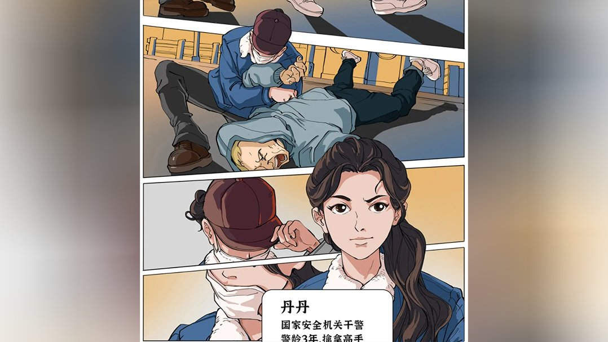  自由亚洲电台 北京时间 2024-01-09T04:52:52Z 1744462195000525271 【诚征受访者】台湾大选13日登场，海内外大陆人怎么看?
你是位于中国境内、台湾或美国的大陆民众吗？自由亚洲电台邀你分享对此次台湾大选的看法。
欢迎评论区回复，联系记者徐薇婷 @stacyhsu_dc ，或电邮 fankui@rfa.org，谢谢！ https://t.co/5qywIIohnX 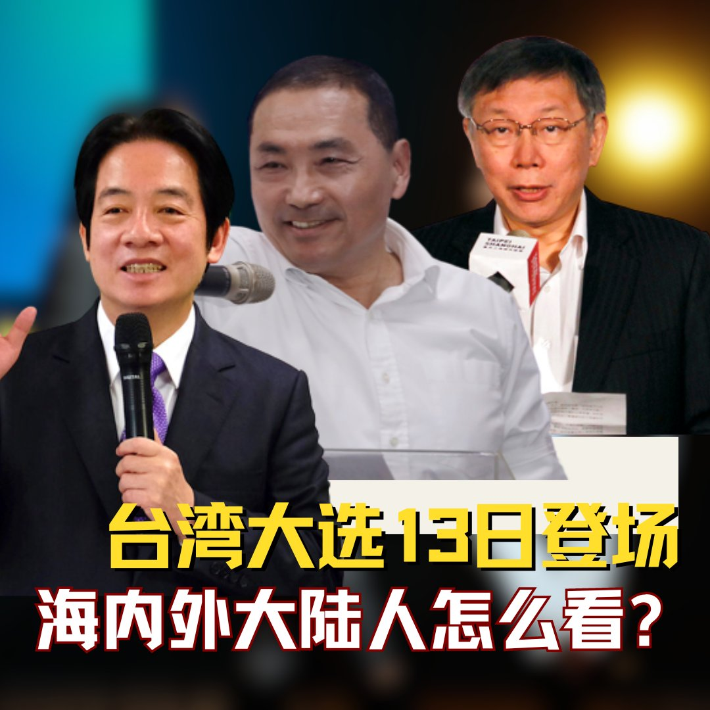  自由亚洲电台 北京时间 2024-01-09T05:19:18Z 1744468846604636334 #妈祖 是台湾最兴盛的民间信仰之一。但在台湾大选前，#中国妈祖赴台巡安 的申请引发两岸官民政治角力。妈祖染上政治尘埃后，会成为中国 #介选 的工具吗？
https://t.co/W3jNuCvxWN https://t.co/oMeglNbj68   自由亚洲电台 北京时间 2024-01-09T05:45:31Z 1744475443917709464 共产党型塑下的 #妈祖　从海边女巫成为多变女神 | 【两岸的妈祖 台湾的政治 - 2】
https://t.co/ir2Np2cKF4 https://t.co/FsFwSffB1B 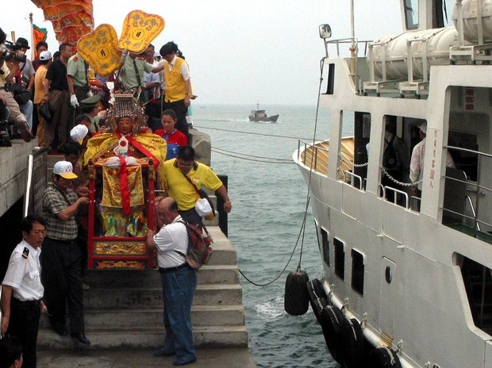  自由亚洲电台 北京时间 2024-01-09T06:07:19Z 1744480931560493445 美国总统拜登近日发布总统公告，进一步扩大跨部门合作，通过签证限制、#反洗钱 等措施打击全球腐败行为。
然而，美国此举引来中方强烈反弹。中共内部的反腐行动如火如荼，为何对美国打击全球腐败却不高兴呢？

https://t.co/KbFZimDgq5 https://t.co/yCDZI8WUog 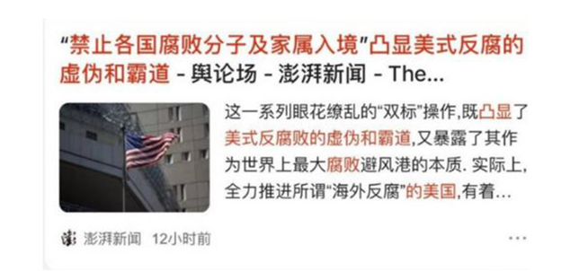  