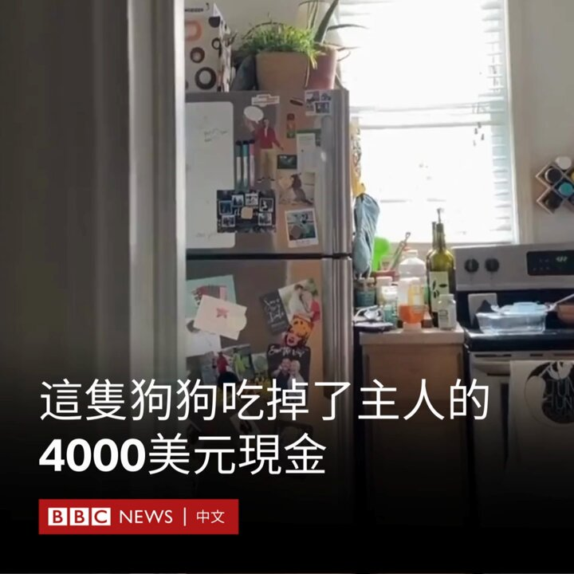
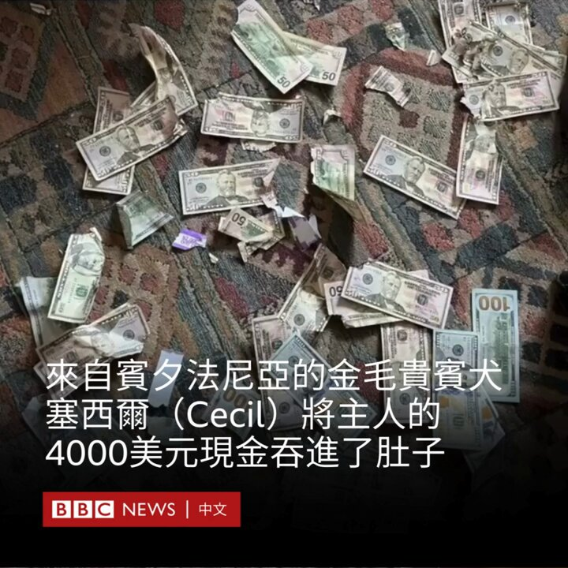
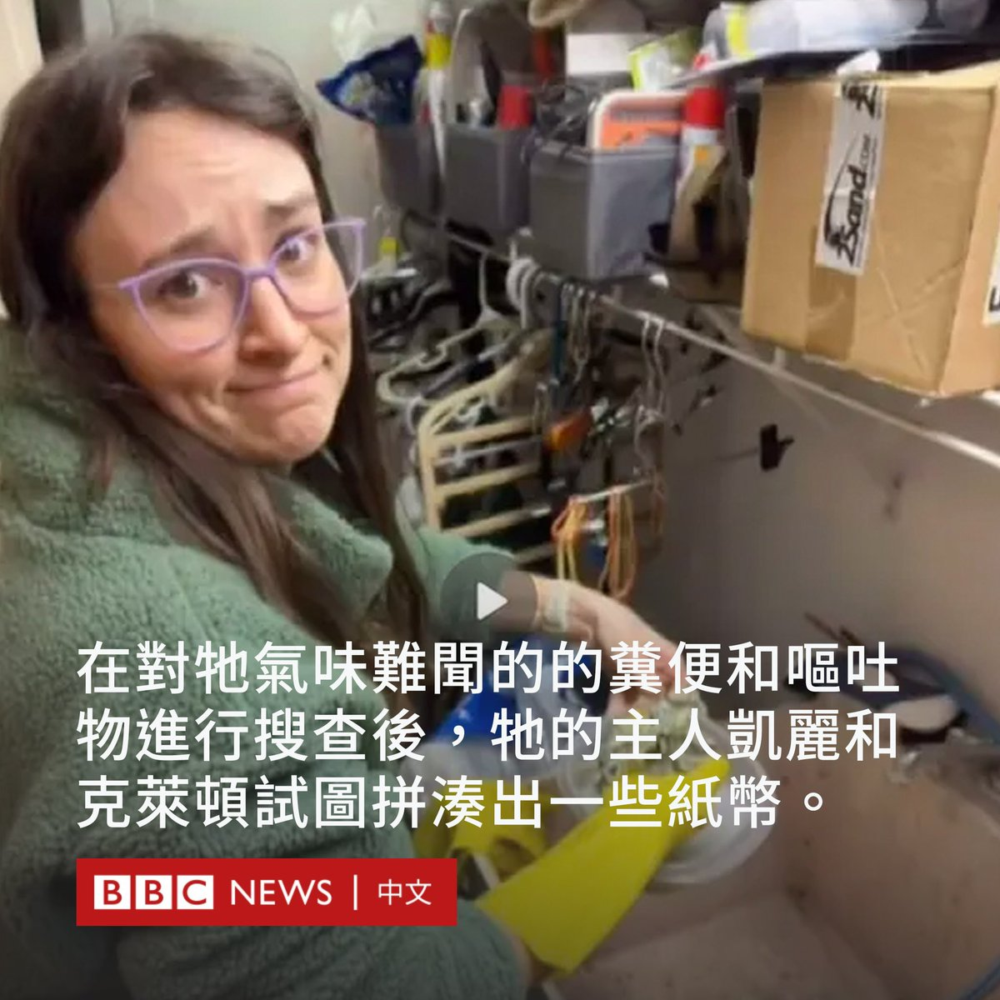
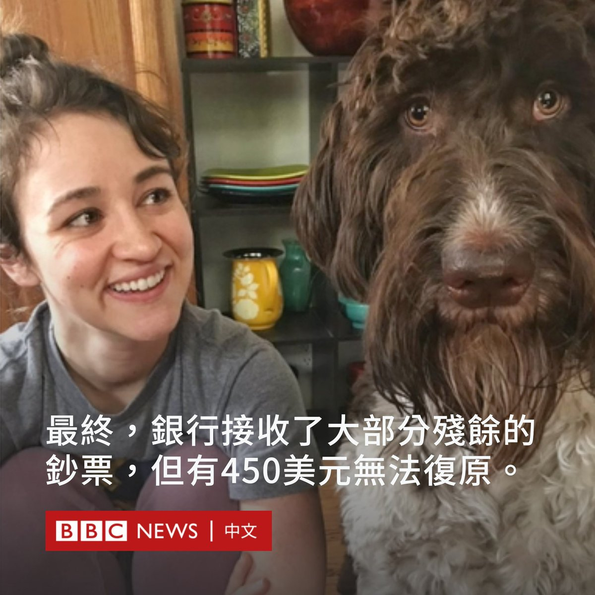

D英国广播公司BBC 北京时间 2024-01-08T19:32:48Z 1744321250086834503 阿拉斯加航空公司的一架波音737 Max 9客机在飞行时，一扇未使用的紧急出口舱门突然破裂脱落，导致机身一侧出现一个大洞。该事故令波音公司面临更多质疑。https://t.co/jTQ3Z8jh97   D英国广播公司BBC 北京时间 2024-01-08T10:49:41Z 1744189602876055669 台湾即将在本周六（1月13日）迎来总统大选投票。BBC中文推出系列报导，从多个角度带你了解此次选举的看点，以及其将如何影响台湾政坛。

· 《台湾大选2024：一文了解三位候选人及他们的两岸政策》 https://t.co/4FEU3eVKV3

· 《从“斜杠青年”到“青贫族”，台湾大选年轻选民会如何回击低薪困境》 https://t.co/p6ldpYV26x

· 《观察: “两强争霸”笼罩下的“三雄演义”》 https://t.co/vun6Qmi45U

· 《台湾大选2024：被卷入政治角力的宫庙和信众》 https://t.co/fCx5uv3ZZq

· 《被忽略的声音：台湾原住民族如何看待两岸政治及认同》 https://t.co/xQEpT4muUN

· 《北京如何加大施压台湾总统大选》 https://t.co/j5RsFjbKbo   D英国广播公司BBC 北京时间 2024-01-08T12:34:19Z 1744215933697380825 来自宾夕法尼亚的金毛贵宾犬塞西尔（Cecil）因将主人的4000美元现金吞进了肚子而走红网络。

12月初，它的主人克莱顿·罗（Clayton Law）在匹兹堡家中的餐桌上放了一个装有4000美元的信封，准备用其支付安装围栏的费用。

但在大约半小时后，他和妻子凯丽（Carrie）发现，钱不见了。而塞西尔正在享受它一生中最昂贵的一顿饭。房间里到处都是被扯碎的纸条和散落的现金。

在对塞西尔气味难闻的的粪便和呕吐物进行搜查后，夫妇俩试图拼凑出一些纸币，用胶水将它们一点一点地粘在一起。

最终，银行接收了大部分残余的钞票，但有450美元无法复原。   