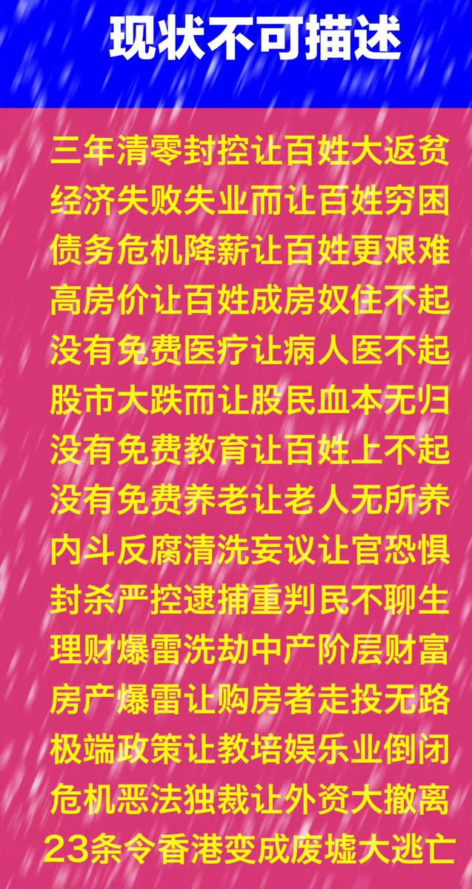
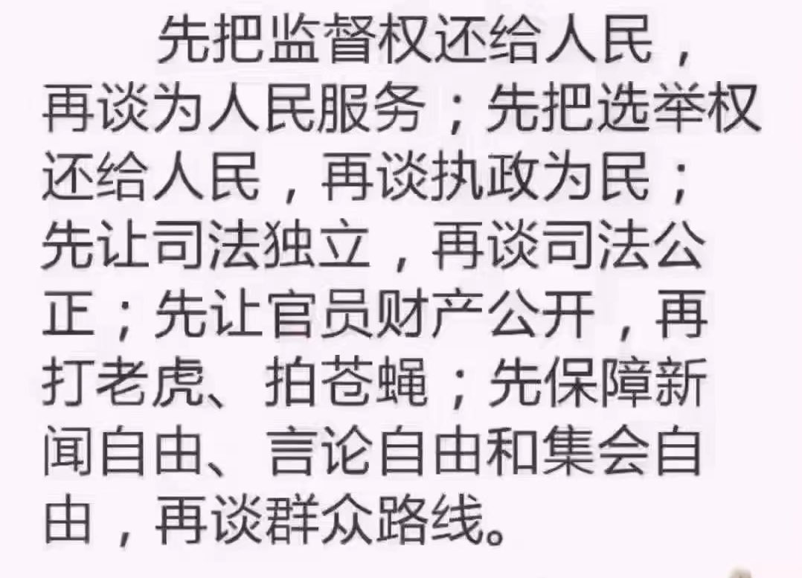
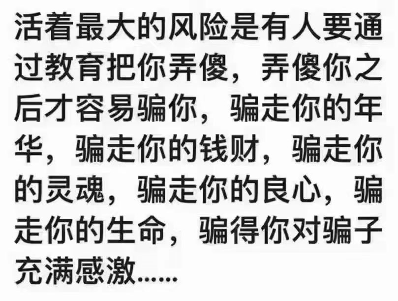
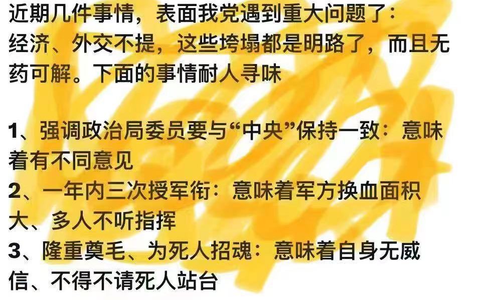
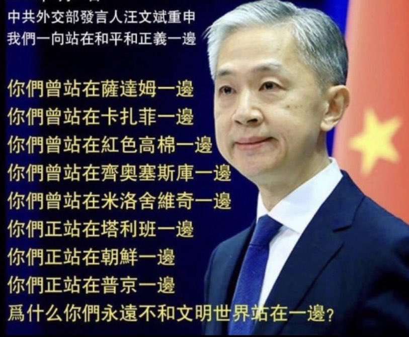

Petrichor 北京时间 2024-01-08T11:05:15Z 1744193520934482293 包子的“丰功伟绩” https://t.co/8V4YnSnQ4Z   Petrichor 北京时间 2024-01-08T11:54:08Z 1744205821200695728 新时代、新风尚。
菜刀加练上锁，社会治安加强
古今中外头一回，喜见包子伟大辉煌。 https://t.co/wmXtMxmi9j   Petrichor 北京时间 2024-01-08T12:04:04Z 1744208323799347610 都说冰糖葫芦儿酸,
酸里面它裹着甜。
都说冰糖葫芦儿甜,
可甜里面它透着酸。
糖葫芦好看它竹签儿穿,
象征苦难，把苦和难连成串,
既有愁来又有烦
生活没难处谁上寒街把它卖？
面对野蛮城管，气愤上心头。
但愿害人虫死光光，
没有愁来没有烦。 https://t.co/J7U7HIJB9M   Petrichor 北京时间 2024-01-08T09:10:24Z 1744164615863300365 中国的国际名声是这么搞坏了的？

看看这张表，就知道中共政府几乎总是站在人类公敌的一方，站在反普世价值的一方、支持独裁者的一方。

具体地说，中国的国际名声是中共政府搞坏的，与我们平头百姓没有多大关系。 https://t.co/lZvAHj2uyT   Petrichor 北京时间 2024-01-08T02:00:22Z 1744056397245845771 这首民歌本来是这样的：

最后一碗米（被抢去）做军粮，
最后一个亲骨肉（被抓走）上战场。

我们老百姓，实在是慘！

他们打下江山啊坐江山，
我们老百姓头上又多座山。

….. https://t.co/vCAuGam7LL   