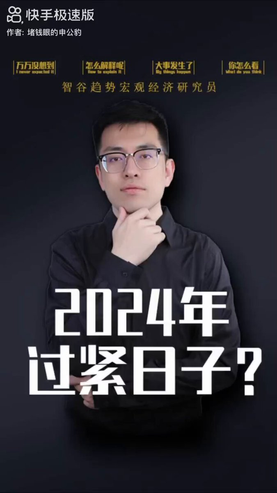
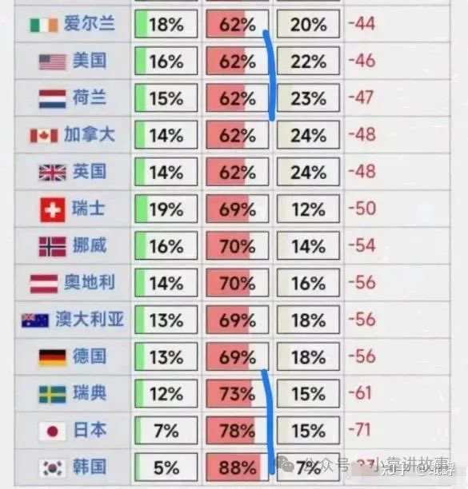
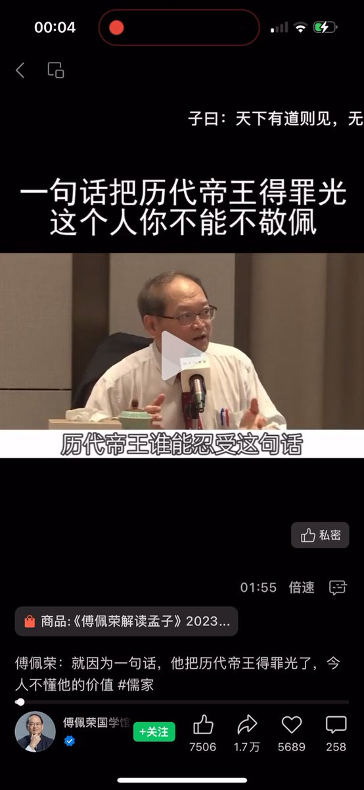
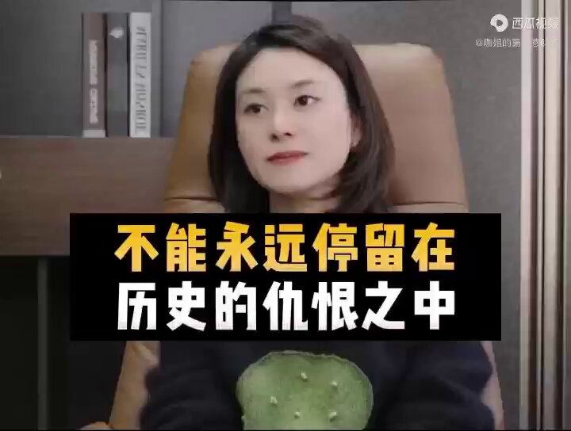
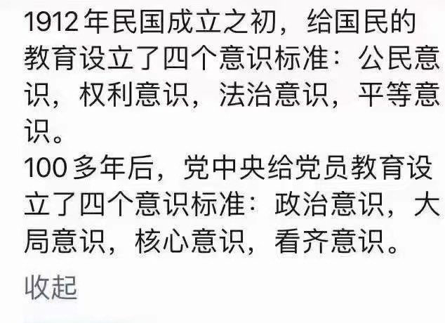

Petrichor 北京时间 2024-01-07T12:42:39Z 1743855644250100015 紧跟习主席，勒紧腰带，过紧日子、度苦日子。

许多人不免要问：本来好好的日子，被他亲自（瞎）指挥、亲自（乱）部署给毁了，为什么还要跟着他？继续往沟里带、绝路上跑？换人，让能干的人来干！ https://t.co/aIDEX2D6kN   Petrichor 北京时间 2024-01-07T19:15:14Z 1743954439973580898 转
最近網絡出現這份《反內戰宣言》，開篇即指明“中國社會科學院台灣問题專家，政協民進，民建中央等民主黨派和平反內戰人士指出”，無個人署名，提及單位尚無表態。這篇宣言是用文件發出，沒有被封殺、屏蔽。

反内战宣言：

中国社会科学院台湾问题专家，政协民进、民建中央等民主党派和平反内战人士指出:

一、和平处理海峡两岸的统一问题是中华民族的民族大义问题，两岸领导人要以高度的政治智慧和民族责任感来对待，历史上国共之争，同族中国民众血刃相见给中国劳动人民带来了无尽的苦难，任何党派和个人为了独争天下内战使老百姓生灵涂炭都成了历史的罪人。邓小平先生以一国两制和平统一祖国的方针显示了第二代领导集体的高度的政治智慧和历史责任感。

二、台湾的国号仍是中国--中华民囯，并且在法理上拥有对外蒙古，海参崴江东六十四屯等多地近三百万平方公里领土的主张权利，如果内斗中国将失去对这些领土的主张权益。

三、台湾在蒋经国先生后已逐步进入与国际接轨的民主社会，多党制民主选举，教育医疗科技养老等民生己达到中等发达国家水平，人均收入三万美元以上，人民安居乐业，我们已失去了解救人家于水火之理由。

四、两岸再战必将大伤中华民族之元气，同族内战将在国际上丢尽脸面，并有被联合国等国际组织对战争发起者追究反人类罪，战争罪，种族灭绝罪等罪行….

五、在中华民族复兴的关键时刻，进行内战是与历史背道而驰的，违背了两岸和平人士达成的九二共识一国两制和平统一的方针。望全国各阶层各民族一起反对内战。   Petrichor 北京时间 2024-01-07T19:42:57Z 1743961417160577233 对中国（中共国，注意不是华人）反感度超过60%的国家有哪些？

韩国对中国的反感度达到了88%，排名第1。
日本对中国的反感度达到了78%，排名第2。
瑞典对中国的反感度达到了73%，排名第3。
奥地利对中国的反感度达到了70%，排名第4。
德国对中国的反感度达到了，69%排名第5。
澳大利亚对中国的反感度达到了68%，排名，第6。
美国对中国的反感度达到了62%，排名第12。

十几年前可不是这样的。国家的信誉让一个人毁了。   Petrichor 北京时间 2024-01-07T08:48:57Z 1743796831023186312 “民为贵，社稷次之，君为轻。”意思是，人民放在第一位，国家其次，君在最后。孟子认为君主应以爱护人民为先，为政者要保障人民权利，这就是孟子的民本思想(部份人以为孟子是民主的先驱)。

孟子说：若君主无道，人民有权推翻政权。孟子认为取得政权要有爱民之心，还要有合法的手段。而且政权还要有取决于民意，若上位者的德行和为政不为百姓所接受，那上位者就要丧失继续执政的资格了。孟子并引用尚书太誓篇的：“天视自我民视，天听自我民听”告诫人君重视民心。

孟子主张君主行仁政，承接性善论，孟子认为“人有不忍人之心”，乃有“不忍人之政”，君主只要将自己的仁德推广，所谓“幼吾幼以及人之幼，老吾老以及人之老”，由爱护自己的家人，到爱护国民，就是仁政。

明太祖朱元璋因不满孟子的民本思想，曾命刘三吾等人删节《孟子》中的有关内容。如《尽心篇》，删“民为贵，社稷次之，君为轻。”十字。又《尽心篇》，删“吾今而后知杀人亲之重也：杀人之父，人亦杀其父；杀人之兄，人亦杀其兄。然则非自杀之也，一间耳。”七句。又《离娄篇》，删“君之视臣如手足，则臣视君如腹心；君之视臣如犬马，则臣视君如国人；君之视臣如土芥，则臣视君如寇仇。”  毛泽东也组织批评孔孟之道。   Petrichor 北京时间 2024-01-07T08:54:50Z 1743798313093038326 民族有病了，那是因为皇帝有病了。

吴王好剑客，百姓多创瘢；楚王好细腰，宫中多饿死。

习皇求仁得仁。

战狼外交的必然结果：国内拳匪风起云涌，表演对大皇帝的效忠。 https://t.co/vtPR7EauNQ   Petrichor 北京时间 2024-01-07T09:13:56Z 1743803119828373579 近代史上，袁世凯被形容为窃国大盗。
但是，当下这位在历史上的评价应比袁世凯更差。有资料表明，他已经是中国历史上在位皇帝中民愤最大的一位。 https://t.co/9rHsdwKvt6   Petrichor 北京时间 2024-01-07T09:33:42Z 1743808092288991656 今天中国决定对5家美国军工企业实施制裁，它们是：贝宜陆上和武器系统公司（BAE Systems Land and Armament）、联合技术系统运营公司（Alliant Techsystems Operation）、宇航环境公司（AeroVironment）、ViaSat公司和Data Link Solutions公司。措施包括冻结在我国境内的动产、不动产和其他各类财产，禁止我国境内组织、个人与其进行交易、合作等活动。

实际效果估计是零。第一，它们在中国没有动产和不动产，它们公司领导在中国没存款，老婆孩子也不在中国。第二，它们也不会卖武器给中国，没有生意往来。中国想买，美国政府也不允许它们卖。   Petrichor 北京时间 2024-01-07T05:03:27Z 1743740084518588618 据传，这几天加拿大朝野上下人都在猜测：中国会如何报复加拿大？因为加拿大联邦法院把一位中国留学生看成是来自“敌对国家的潜在间谍”。这无疑，客观上又是一次选择性的排华（习共）行动。

不买加拿大龙虾、小麦、菜籽油、牛肉？
驱逐加拿大在中国的留学生？
减少中加之间航班？
减少给加拿大人的访华签证？
抓捕一个在华的加拿大人？说他从事间谍活动？
派国安骚扰在华的加拿大公民？
组织在加学习的（公派）留学生举行抗议活动？
通过领事馆命令在加大外宣和“侨领”发起大规模的声援和抗议活动？
…..

能玩的牌大概就是上面这么多了，不过每一件也不是没有成本的。西方反习共的阵营已经布局完毕，尽管放马过来，兵来将挡，水来土掩。

不过，在加拿大的中国留学生、领事馆控制的华人社团、大外宣等人也该反思过去的所作所为，是否利用加拿大的民主反民主、颂独裁？是否有人盗取加拿大技术专利回国办公司，自称是自己的原创性发明？这些个人不良行为对在加华人的形象造成严重的负面影响吧？   