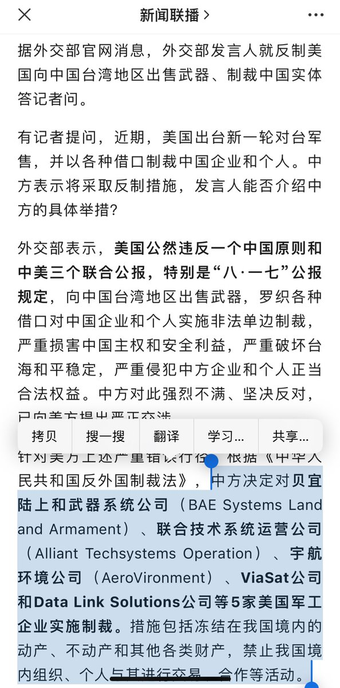
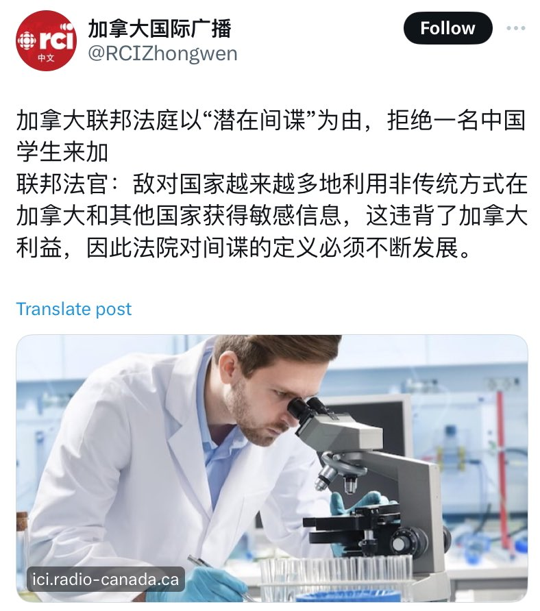

Petrichor 北京时间 2024-01-07T09:33:42Z 1743808092288991656 今天中国决定对5家美国军工企业实施制裁，它们是：贝宜陆上和武器系统公司（BAE Systems Land and Armament）、联合技术系统运营公司（Alliant Techsystems Operation）、宇航环境公司（AeroVironment）、ViaSat公司和Data Link Solutions公司。措施包括冻结在我国境内的动产、不动产和其他各类财产，禁止我国境内组织、个人与其进行交易、合作等活动。

实际效果估计是零。第一，它们在中国没有动产和不动产，它们公司领导在中国没存款，老婆孩子也不在中国。第二，它们也不会卖武器给中国，没有生意往来。中国想买，美国政府也不允许它们卖。   Petrichor 北京时间 2024-01-07T05:03:27Z 1743740084518588618 据传，这几天加拿大朝野上下人都在猜测：中国会如何报复加拿大？因为加拿大联邦法院把一位中国留学生看成是来自“敌对国家的潜在间谍”。这无疑，客观上又是一次选择性的排华（习共）行动。

不买加拿大龙虾、小麦、菜籽油、牛肉？
驱逐加拿大在中国的留学生？
减少中加之间航班？
减少给加拿大人的访华签证？
抓捕一个在华的加拿大人？说他从事间谍活动？
派国安骚扰在华的加拿大公民？
组织在加学习的（公派）留学生举行抗议活动？
通过领事馆命令在加大外宣和“侨领”发起大规模的声援和抗议活动？
…..

能玩的牌大概就是上面这么多了，不过每一件也不是没有成本的。西方反习共的阵营已经布局完毕，尽管放马过来，兵来将挡，水来土掩。

不过，在加拿大的中国留学生、领事馆控制的华人社团、大外宣等人也该反思过去的所作所为，是否利用加拿大的民主反民主、颂独裁？是否有人盗取加拿大技术专利回国办公司，自称是自己的原创性发明？这些个人不良行为对在加华人的形象造成严重的负面影响吧？   