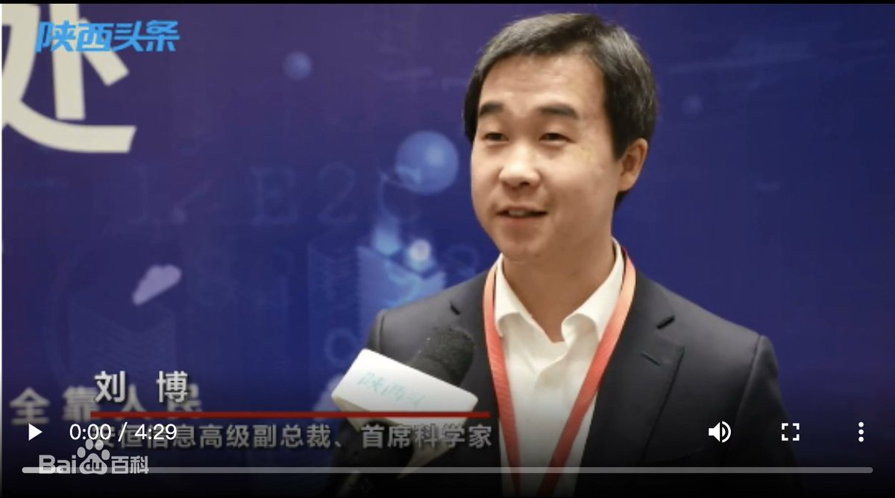

拆墙运动公号 北京时间 2024-01-07T18:01:03Z 1743935770371469606 【#2259专案组 互联网防火墙第044号嫌犯##刘博】（更新)
   性别：男，
1984年生
身份证: 130425198407256310
河北省大名县
手机/微信/支付宝: 15354306212
用户：靳文正，女
国 籍：中国
美国永久居留权
毕业院校：美国马里兰大学
学位/学历：计算机科学博士、
首席科学家
职务：杭州安恒信息技术股份有限公司首席科学家、高级副总裁。

刘博
杭州安恒信息技术股份有限公司CTO
刘博,杭州安恒信息技术股份有限公司CTO（首席技术官） 。毕业于浙江大学 ，并于美国马里兰大学，获得计算机科学博士 。担任大数据态势感知国地联合中心副主任、之江实验室信息安全研究中心副主任 、浙江省智能制造专家委员会委员 、浙江大学-安恒信息前沿技术联合研究中心常务副主任 、中国计算机行业协会数据安全产业专家委员会委员 等社会职务。

杭州安恒信息技术股份有限公司高级副总裁
刘博,杭州安恒信息技术股份有限公司首席科学家、高级副总裁。

计算机科学博士研究生。
2012年至2013年,任美国 Facebook公司机器学习科学家。
2013至2016年任美国 Square公司大数据平台研发总经理,
2016年12月就职于安 恒信息,现任安恒信息首席科学家,AiLPHA大数据实验室负 责人。

担任职务

大数据态势感知国地联合中心副主任
之江实验室信息安全研究中心副主任
浙江省智能制造专家委员会委员
浙江大学-安恒信息前沿技术联合研究中心常务副主任
中国计算机行业协会数据安全产业专家委员会委员
浙江省青年高层次人才协会 副主席

详细资料见: #BanGFW拆墙运动（建墙罪犯录）（#ban_great.wall）:https://t.co/kYtkq7AS0P

合作伙伴：#zhinawiki   拆墙运动公号 北京时间 2024-01-07T03:21:32Z 1743714433312936285 RT @LinShengliang: 拆墻運動 的官網 https://t.co/CKRhIPta3O   