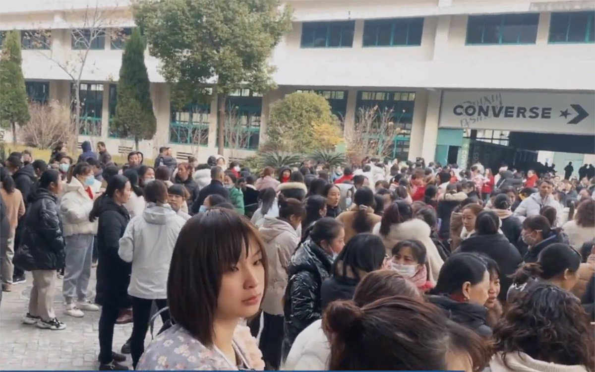
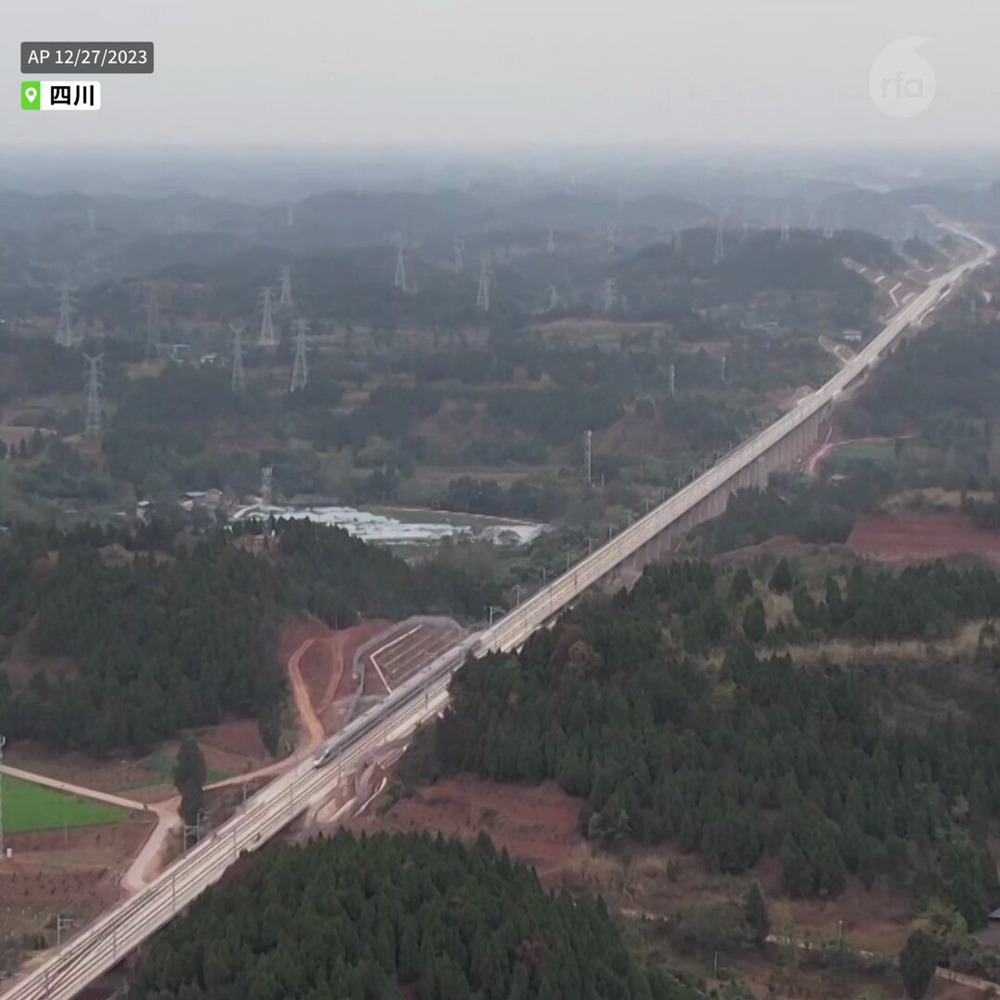

自由亚洲电台 北京时间 2024-01-07T00:28:49Z 1743670968361361433 【台湾民众党桃园党部前发言人被开除党籍】
马治薇此前曾因与大陆关系密切而没以 #民众党 身份参加立委选举，后改以无党籍身份参选。在桃园地检署的调查中，#马治薇 已承认中国以虚拟货币形式资助她参选。1月5日 #桃园 地方法院裁定将其羁押。
详阅：
https://t.co/dyt9ozwS5z   自由亚洲电台 北京时间 2024-01-07T00:40:13Z 1743673838200586383 【香港财政司: 香港经济复苏因地缘政治弱于预期】司长 #陈茂波 在香港电台节目中表示，由于美国对中国打压，和息口高等因素，#香港 去年楼价下跌5.6%，总出口量下跌9.4%，股市交易量下跌14%，全年经济增长仅3.2%。
详阅：
https://t.co/pHc50EJlrA   自由亚洲电台 北京时间 2024-01-07T00:48:39Z 1743675961957372087 【国家纪委开年送惊喜：三人被开除中共党籍】
三人包括：光大集团原董事 #唐双宁、广东人大常委会原党组副主任 #陈继兴 以及中国石油天然气集团原副总经理#徐文荣。#反不完的贪
详阅：
https://t.co/Svss3LNeP6   自由亚洲电台 北京时间 2024-01-07T00:59:11Z 1743678609791840688 在众多来自中国的“#走线者”当中，有两个跟着大人走线的未成年女孩颇为引人瞩目。是什么驱使年轻的母亲和舅舅，铤而走险，带着儿童偷渡赴美呢？
详情：
https://t.co/fKUzGJlH3N   自由亚洲电台 北京时间 2024-01-07T01:33:56Z 1743687356035518652 【台湾对中国投资2023年大幅减少】中国已经不再是台湾对外投资的首选目的地，被美国取代。#台湾 对大陆投资的比例从2010年的高峰开始不断下滑，从2010年的超过八成降到目前只有12%，额度仅为29亿美元。
详阅：
https://t.co/HQx2R4MFjn   自由亚洲电台 北京时间 2024-01-07T01:44:35Z 1743690037214970190 美国 #商务部 发现来自加拿大、中国、德国和韩国的锡板产品被倾销到美国市场，其中中国倾销率居首。商务部此前已经对加、中、德三国实施初步反倾销关税。加拿大贸易部长玛丽·吴（#MaryNg）对该做法表示不满。
详阅：
https://t.co/ZVDbQBLiAo   自由亚洲电台 北京时间 2024-01-07T01:51:59Z 1743691897342681099 【年轻女性对政府催生政策感到厌烦?】《#华尔街日报》报道，中国迫切希望缓解 #人口老龄化 危机，政府近几年陆续取消生育限制，本以为会迎来生育高潮，但实际发生的却是婴儿出生低潮，幼儿园纷纷关闭。
详阅：
https://t.co/rOFJ8NN6vi   自由亚洲电台 北京时间 2024-01-07T01:58:46Z 1743693604357324948 台湾 #国防部 又侦获两枚空飘气球逾越海峡中线，大陆军机13架次舰艇五艘次，对中国大陆“漠视飞航安全、置两岸及国际飞航乘客安全于不顾的态度，表达谴责”。
详阅：
https://t.co/aYAfDDX40v   自由亚洲电台 北京时间 2024-01-07T02:04:11Z 1743694967778808309 前《法制日报》资深反腐记者 #上官云开 被湖北鄂州 #鄂城区 法院判处有期徒刑15年，判决数罪并罚，包括销售假药、寻衅滋事、诈骗、非法拘禁和重婚5项罪名，另外还处罚金人民币38万元。
详阅：
https://t.co/3CP8hxAnRw   自由亚洲电台 北京时间 2024-01-07T02:14:07Z 1743697470180237674 缅甸少数民族武装组织“#三家兄弟联盟”已经控制掸邦北部果敢自治区首府老街（#Laukkai），当地的军方地区总部已经投降。这是缅甸军政府2021年发动军事政变以来受到的最大威胁。
详阅：
https://t.co/xfGUdWS16B   自由亚洲电台 北京时间 2024-01-07T02:22:53Z 1743699673615933776 【鞋厂关闭激罢工 要求补缴住房公积金】台湾 #宝成工业 股份旗下江苏扬州 #宝亿制鞋厂 宣布于2023年12月31日关厂，第二天，工人发起罢工，工厂进出货铁闸被拉下，进出货收发办公室内外挤满了罢工工人，诉求是要求厂方公布解除劳动合同补偿方案。
详阅：https://t.co/IW32zU1jLQ https://t.co/6WoUfBXlr8   自由亚洲电台 北京时间 2024-01-07T05:01:23Z 1743739564189995069 【列车脱节事故疑虑未消，中国再开时速350公里高铁】
新开通的成都-宜宾高铁建有231座桥梁，其中兴隆立交特大基桩曾被施工队举报存在严重质量问题，四川质监部门否认指控。仅在数周前，北京地铁因为雪天刹车不灵，两车厢在强大冲击力之下脱节，100多人骨折，500多人入院。中国的新 #高铁，您会坐吗？ https://t.co/wnnybMmXir   