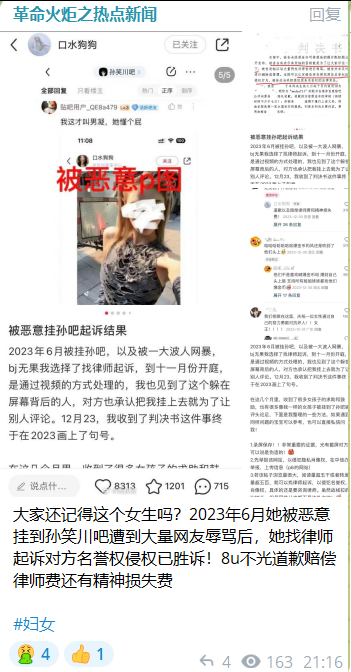

谁将十万横扫三江 北京时间 2024-01-07T11:35:53Z 1743838841138753691 RT @CnFeminism: 📖近期新书资讯｜详情：https://t.co/mo45Fhn0R6 (2023)；https://t.co/cpOqxNY03Q (2024)
▪️贺萧《妇女与中国革命》
▪️陈慧文《当华屋坍塌》
▪️伊莱恩·肖瓦尔特《她们自己的文学》
▪️J…   谁将十万横扫三江 北京时间 2024-01-07T09:34:58Z 1743808412935500267 毛左火炬对此评价道：中修坏透了，擦边女也帮 https://t.co/sH5XSOw8rj   谁将十万横扫三江 北京时间 2024-01-07T09:51:29Z 1743812567666250188 RT @torontobigface: 对所有即将投票的台湾人说一下
如果台湾被中共拿下
你们将享受到的是
1. 世界第一的劳动时长
2.新增数十万违禁词
3.基本不存在的社会保障体系
4.习近平思想成为必修课程
5.贪污腐败横行
6.随时烂尾的楼房
7.随时消失的存款，等等等…   谁将十万横扫三江 北京时间 2024-01-07T09:55:20Z 1743813539503247418 对于一些女孩来说，2023和1923没有什么区别，被认为不值得活着，不值得留在家里，就因为是女性 https://t.co/HUFy5TjlJ8   