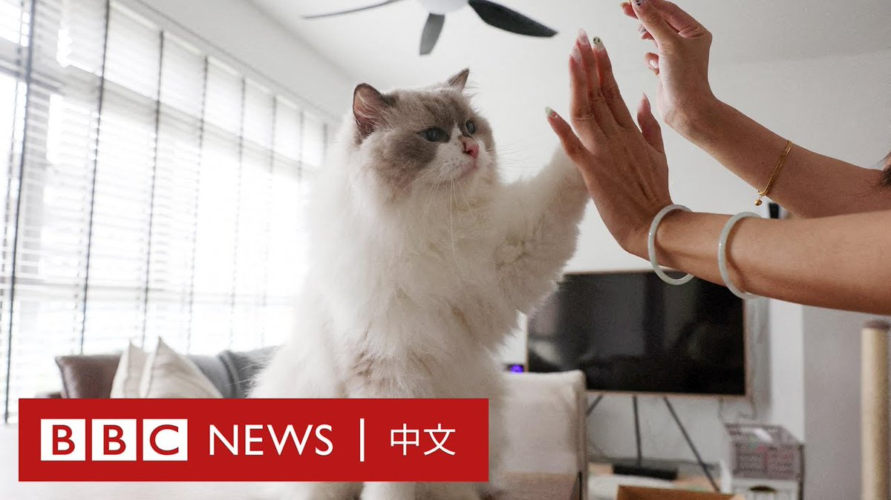

D英国广播公司BBC 北京时间 2024-01-06T20:41:55Z 1743613865701601406 “台湾菜”是什么？当我们想到“台湾料理”，联想到的是什么？台湾这片土地上生活着的不同族群，数百年来经历包括荷兰、西班牙、清朝、日本、中华民国的统治与外来文化的影响——是什么形塑了现今的台湾味道？https://t.co/VuQxeHCCBA   D英国广播公司BBC 北京时间 2024-01-06T15:28:03Z 1743534879403589887 新加坡的“组屋”由建屋发展局兴建，新加坡545万人口中，有80％的人居住在这里。

1989年，新加坡国会颁布“禁猫令”，即禁止住户在组屋中饲养猫，34年以来，一直未有改例。

目前新加坡政府正针对“禁猫令”征求市民意见，令“猫奴”们有望在2024年内，让自己的爱猫合法入住组屋。 https://t.co/94uTt8sWiX   