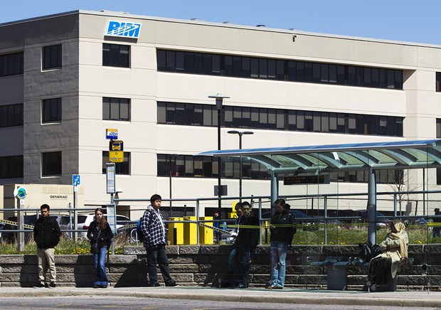
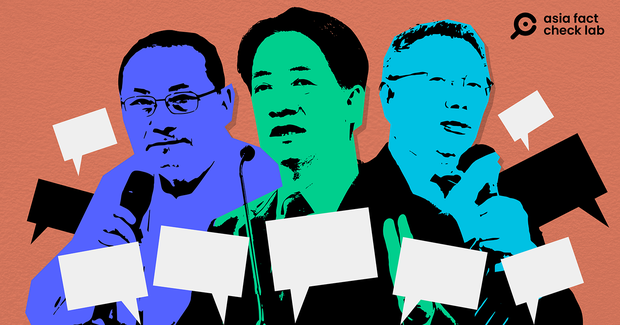
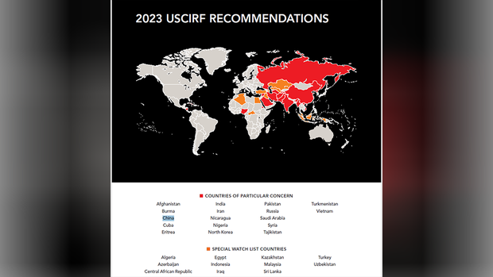

自由亚洲电台 北京时间 2024-01-06T07:20:53Z 1743412281558306973 RT @RFA_Chinese: 【专访赖清德竞总发言人赵怡翔】
【赵：台湾政府的工作就是确保2027攻台时间点无限期往后延】
台湾的 #民进党 总统候选人 #赖清德 竞选办公室发言人 #赵怡翔 接受本台“#亚洲很想聊”节目主持人 #戴忠仁 专访表示，中国统一台湾企图数十年都未…   自由亚洲电台 北京时间 2024-01-06T08:25:52Z 1743428633132511245 一名叫李悦康（Yuekang Li，音译）的中国学生，被加拿大 #滑铁卢大学 机械机电一体化工程专业的博士课程录取，将专攻公共卫生研究。但加拿大移民部拒绝李的签证申请，忧虑李将对 #加拿大国家安全 造成潜在危险。
专家说：判例对保护加拿大学术系统开启了一个新方向。
https://t.co/eBbSg7rYfu https://t.co/YqZNoILxyv   自由亚洲电台 北京时间 2024-01-06T08:28:41Z 1743429344905883977 深度报道｜2024 #台湾大选 看见哪些 #假讯息 的新手法
https://t.co/rlzibp1bKg https://t.co/oH3oCrJeTi   自由亚洲电台 北京时间 2024-01-06T08:33:16Z 1743430498901213219 【数百美军到台湾？胡锡进红线怎么划？美国2024年国防授权法案如何帮台湾？｜#兵家常事】
12月24日，美国总统拜登正式签署2024年度 #国防授权法案，法案要求美国政府扩大美台军事合作，并为台湾军队建立全面性的培训计划，定期向美国国会说明 #对台军售 交付进程。这个法案会对台湾局势带来什么影响？ https://t.co/vtcAiU4prU   自由亚洲电台 北京时间 2024-01-06T09:00:03Z 1743437236849586398 专栏 | #夜话中南海：#毛左 为"底层"发声，公然掀动造反
https://t.co/7Ca5qQjcbV https://t.co/IPr9QS4lq9   自由亚洲电台 北京时间 2024-01-06T09:20:04Z 1743442276045746252 #美国国际宗教自由委员会：中国在美国国会游说特别阴险
https://t.co/FVGjh2OI1F https://t.co/USO53f6A30   