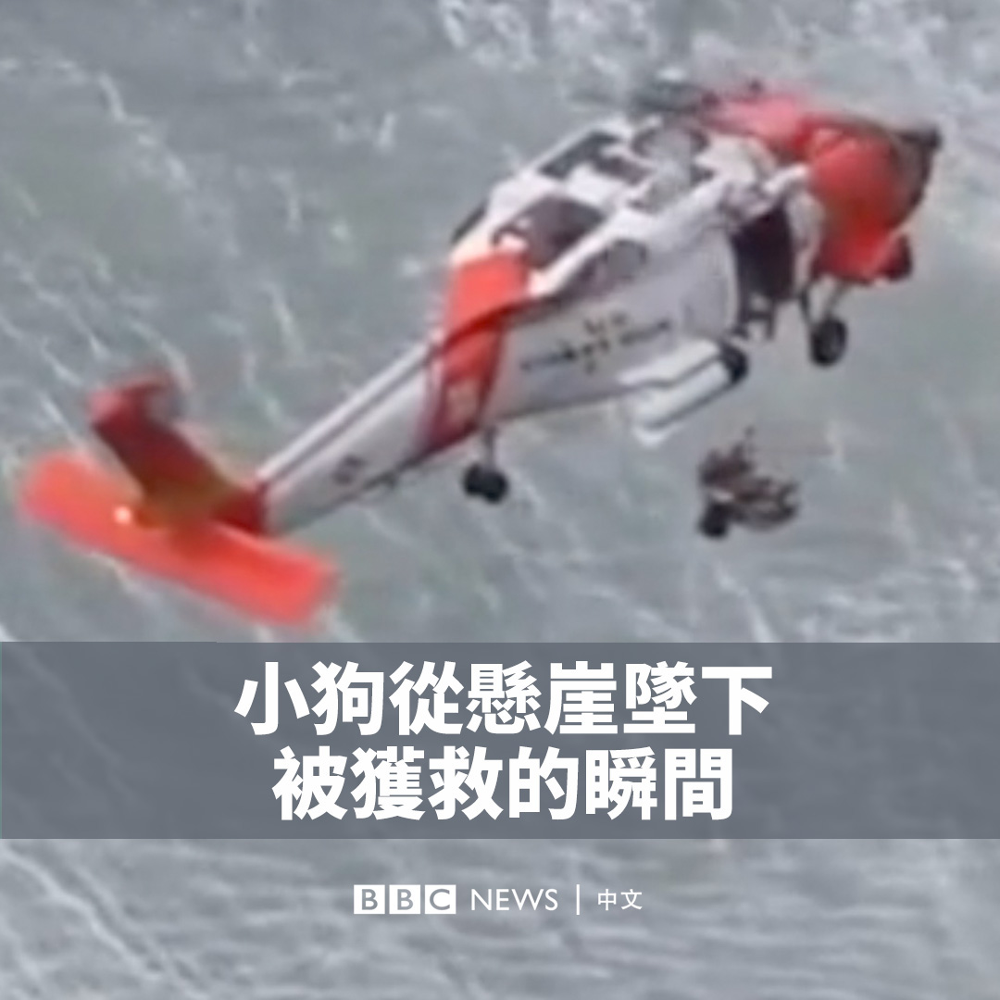
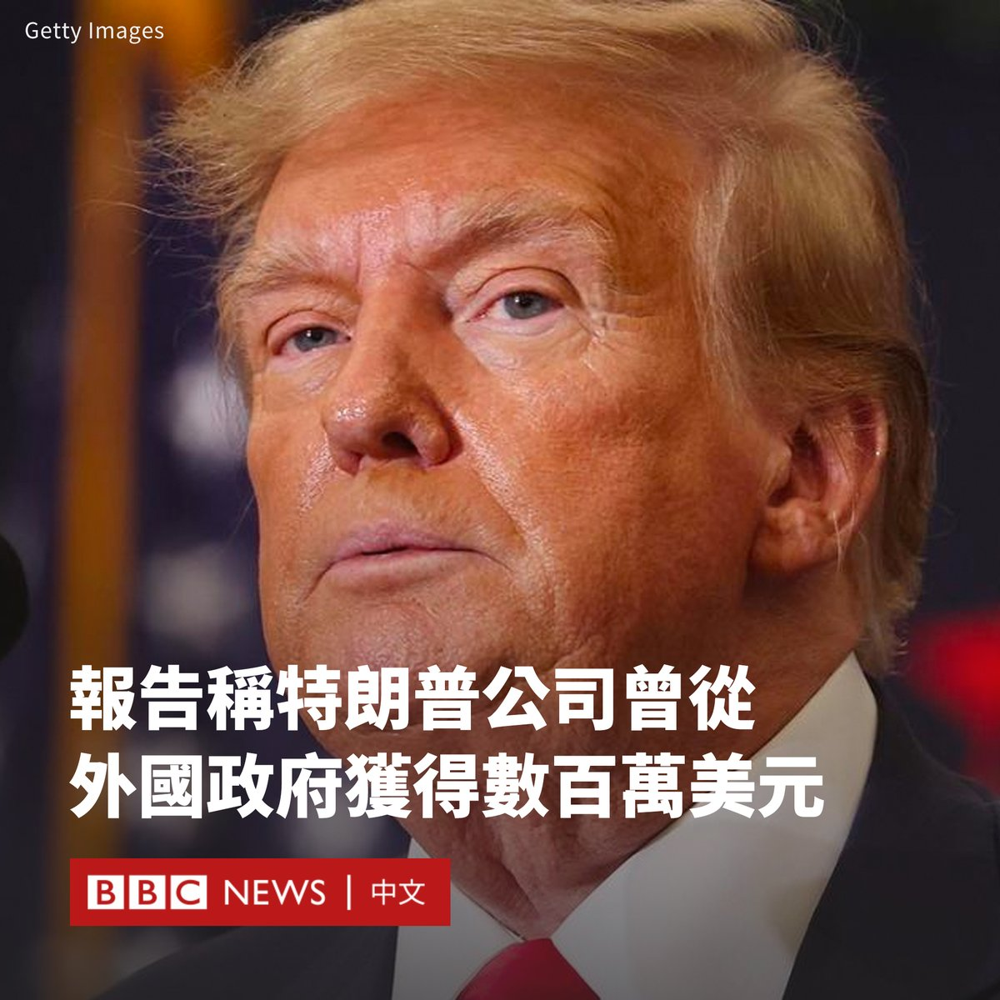

D英国广播公司BBC 北京时间 2024-01-05T10:48:20Z 1743102098739245422 随着中国经济下行和青年失业率上升，数以百万计的年轻人正在面对一个他们没有准备好的未来，而他们如何应对将决定这个世界第二大经济体的命运。https://t.co/W759ZSpsgM   D英国广播公司BBC 北京时间 2024-01-05T11:22:19Z 1743110653592936486 一只名叫利奥的狗从悬崖坠下，美国海岸警卫队通过直升机将它救起，带它与主人团聚。 https://t.co/tkCi962K8c   D英国广播公司BBC 北京时间 2024-01-05T12:46:51Z 1743131925584166951 一名在美中国留学生的家庭遭遇“虚拟绑架”骗局，专家警告称这类骗局已成趋势，全球父母都可能成为受害者。https://t.co/rVmBKFnnFp   D英国广播公司BBC 北京时间 2024-01-05T13:55:17Z 1743149146079658083 根据美国国会民主党人的一份新报告，在特朗普（Donald Trump）担任美国总统期间，其酒店和其他企业共从外国政府接受了超过780万美元。

报告指，中国政府及其相关实体涉及其中的550多万美元。特朗普被指控违反美国宪法接受这些花费。

该报告基于特朗普的前会计师事务所在一项法律案件中提交的文件。特朗普没有立即发表评论。

美国宪法禁止总统在未经国会明确许可的情况下，接受因其职位而获得的礼物或其他利益。

报告称，继中国之后，沙特阿拉伯及其王室是特朗普企业的第二大赞助者，在其产业上花费了60多万美元。

紧随其后的是卡塔尔、科威特和印度。

民主党人表示，这些款项来自至少20个国家的政府或政府相关实体，他们在特朗普位于华盛顿和拉斯维加斯的酒店豪掷现金。

民主党人称，该调查结果只反映了特朗普总统任期的前两年，也只纳入了他的四处房产，因此可能只是特朗普担任总统期间从外国政府获得资金的“一小部分”。

共和党人詹姆斯·科默（James Comer）正在领导对总统拜登（Joe Biden）之子亨特（Hunter）在其父亲担任副总统期间的商业交易的调查。他否认了这一调查结果，并在一份声明中表示：“前总统特朗普有合法的生意，但拜登一家没有。”

特朗普在2017年1月入主白宫后，他让儿子们负责其公司的日常运营，但保留了这些企业的所有权，其中包括华盛顿的特朗普国际酒店（Trump International Hotel），该酒店后来成为游说者和外国代表团常入住的地方。

不过，特朗普于2022年公布的税务记录显示，他的产业在其总统任内出现了重大商业亏损，他缩减了旗下的业务。   D英国广播公司BBC 北京时间 2024-01-05T15:34:22Z 1743174080512065783 台湾2024年总统大选投票日即将到来。在激烈的选战攻防中，台湾原住民的声音却经常被忘却。对原住民而言，他们最关心什么，又如何在有关两岸议题的争议中看待自身的身份认同？https://t.co/6sxQnFyuRO   