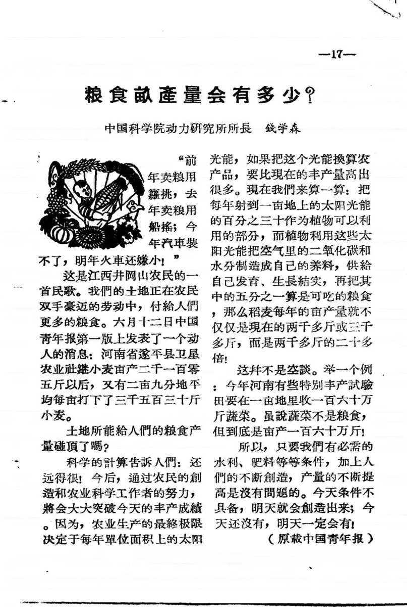
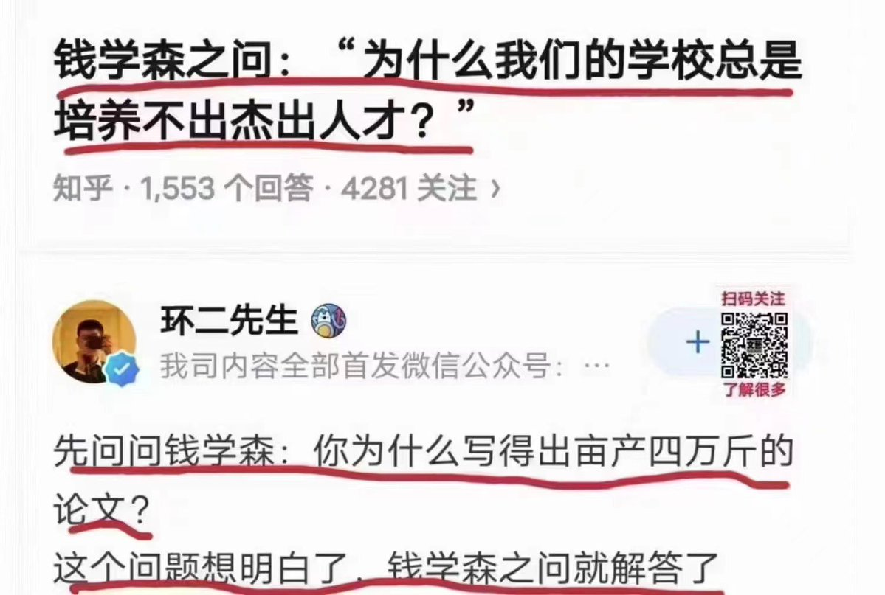
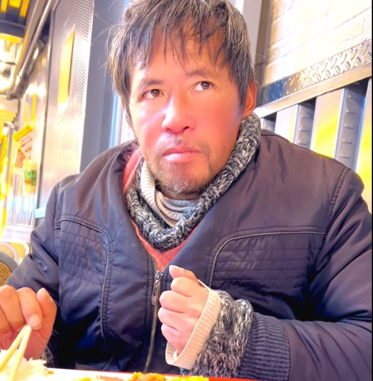
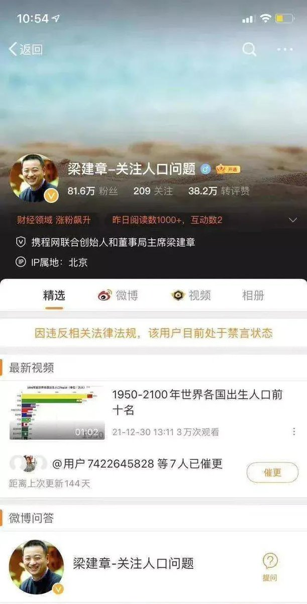
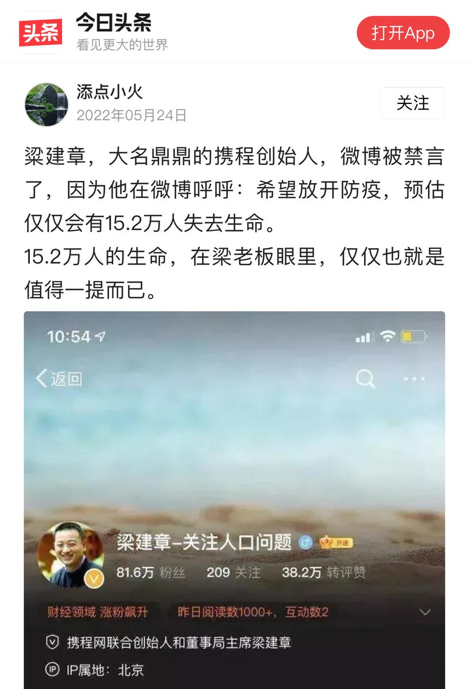
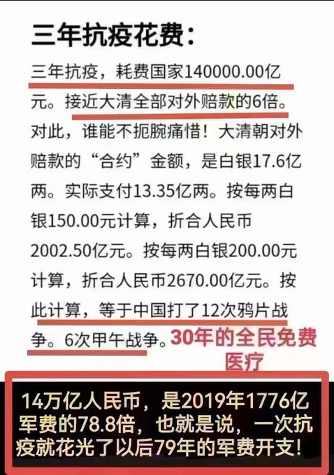
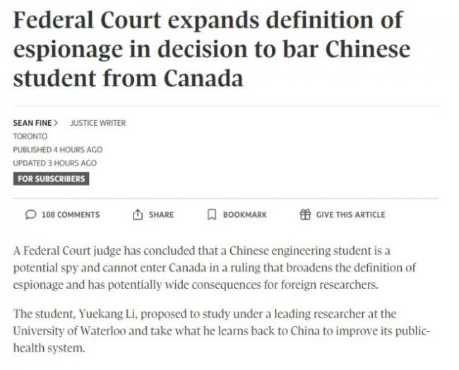

Petrichor 北京时间 2024-01-05T06:39:09Z 1743039389066842196 钱学森自己回答了钱学森之问。自问自答，精彩！

当科学成为政客的陪睡丫鬟，科学就能证明人有多大胆，地有多高产。 https://t.co/jp1rokR6uo   Petrichor 北京时间 2024-01-05T08:41:02Z 1743070061676433637 孙卫东曾与梁建章是同学、被李政道选中深造的他，却在纽约街头成为了流浪汉（人生的成长会碰到很多的困境，主要看自己如何摆脱困境了！）

梁建章，虽然贵为携程总裁，其微博依然被强删，有钱在独裁者面前依然是没有尊严的奴才。 https://t.co/8BJ5xY0sht   Petrichor 北京时间 2024-01-05T11:51:59Z 1743118116429689146 三年抗疫这么大开销，说明：
1. 中科院武汉病毒所特别是石正丽的团队有责任；
2. 习近平亲自指挥和亲自部署的错误。

就这2条。 https://t.co/qrkhzX2TFd   Petrichor 北京时间 2024-01-05T05:03:56Z 1743015430304772503 五眼联盟情报负责人警告称，中国是西方民主国家的最大威胁

加拿大大联邦法院一名法官得出结论，一名中国工科学生是潜在的间谍，因此不能进入加拿大，这一裁决扩大了间谍活动的定义，并对外国研究人员产生潜在的广泛影响。
据报道，这名学生叫李跃康（Yuekang Li，音译），计划到加拿大滑铁卢大学（University of Waterloo）机械和机械电子工程系Carolyn Ren教授课题组学习，并将所学液滴微流控知识带回中国，以改进中国公共卫生系统。Ren经常去中国与中国大学交流。

但是，联邦法院首席法官Paul Crampton表示，李先生的计划符合“非传统”间谍活动的定义——即使没有任何证据表明他曾经从事过间谍活动或接受过间谍培训，也没有证据表明他的研究具有军事用途。

Carolyn Ren在首席大法官面前作为证据的一封信中表示，她的实验室致力于研究的医学应用，并且从未进行过军事用途的研究，也永远不会。她还表示，微流体技术没有军事应用。
资料显示，Carolyn Ren早年毕业于哈尔滨工业大学，2004年获多伦多大学机械工程博士学位。
一名加拿大政府签证官以间谍活动为由拒绝李先生入境，称中国可以针对或强迫他提供违背加拿大利益的信息。李先生向联邦法院寻求司法复核——法官必须决定签证官的决定是否合理。
首席大法官Crampton表示，签证官这一决定是合理的，部分原因是它基于对中国做法的可信报告。美国政府机构的一份此类报告称，中国严重依赖科技学生来推进中国共产党的目标，并使军事和商业部门受益。他还引用了CSIS和CBC的报告。
联邦法院裁决中没有透露这名签证官的名字，他表示，中国利用了“加拿大政府、经济和社会协作、透明和开放的本质”。签证官认为，未经授权披露敏感信息可能会损害加拿大的利益。这位官员引用了一篇名为《中国为何成为微流控超级大国？》的文章。答案是微流控为生物制药和先进医疗产品等关键行业创造了研究机会。
签证官表示，李先生在中国排名前十的高科技行业的专业知识引发了人们的担忧，即中国可能让李先生从事间谍活动。   Petrichor 北京时间 2024-01-05T05:17:23Z 1743018813082173553 进来，多名中国留学生入境美国时，遭到长时间盘查，其手机、电脑等随身电子设备也被检查。一些学生的签证被注销，并被告知5年内不得入境美国。其中中国留学生T某是耶鲁大学博士生，本科是北京某一流大学。据有关人士分析，“海外人员从他们手机中发现充当自干五的证据，例如到推特上谩骂“反贼”、歌颂中共和习近平统治的等。美国如此做法也是对中共国安骚扰在华美国公民的报复措施”。

2023年12月19日，一位从中国返美，在华盛顿附近的杜勒斯机场入境。机场海关在询问T某所学专业后，将其带到询问室盘查8小时，询问其本科在校期间是否获得奖学金、是否受中共当局资助等，并检查其随身电子设备。盘查结束后，T某被告知其所持的留学F-1签证已被注销，且5年内不得入境美国。
另一名被盘查的中国留学生M某，2022年前往美国国立卫生研究院国家癌症中心开展研究。2023年11月22日，M某在杜勒斯机场入境时，被带往询问室盘查，重点被询问了大学科系、导师信息、目前研究内容是否受中共当局资助留学及科研计划是否与中共当局、军方和重点实验室有关等。盘查结束后，美国机场海关执法人员告知M某，其所持F-1签证已被注销，并且是美国务院直接取消的。   Petrichor 北京时间 2024-01-05T03:22:32Z 1742989911400100003 中国大陆这位身作军装的大嘴巴是谁？没文化没修养的瞎吹，不以为耻，反以为荣。

毛泽东的书印数最多，这是应证其独裁和浪费民脂，而非伟大。习近平出版书籍早就超过毛泽东、牛顿、爱恩斯坦….又能说明什么？聪明、正确、真理、永存？屎上雕花，依然是屎，腐烂很快的。 https://t.co/5hXz5g5QNt   Petrichor 北京时间 2024-01-05T03:38:53Z 1742994023344668776 这是发生在日本的一次泥石流，但是估计不是今年元月一日发生7.6级地震后发生的泥石流。

泥石流就是摧枯拉朽，不可抗拒。 https://t.co/iYRfFwZwRV   