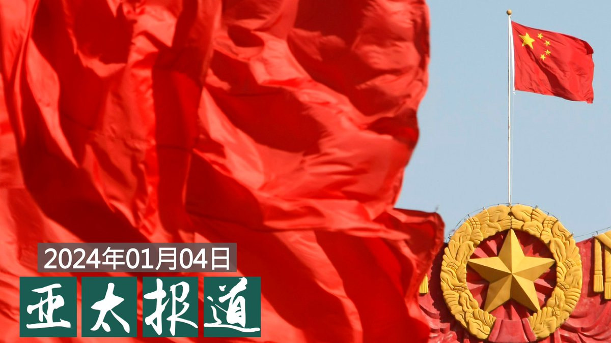
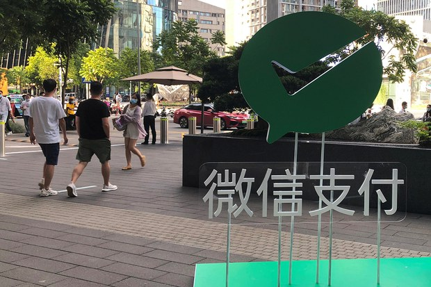
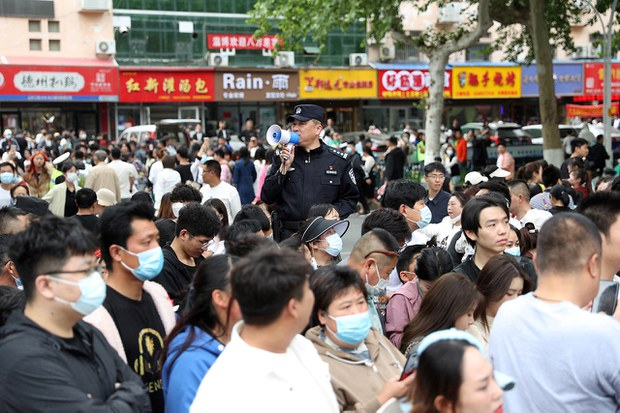
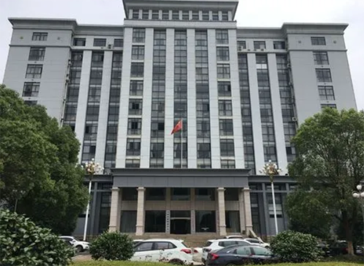
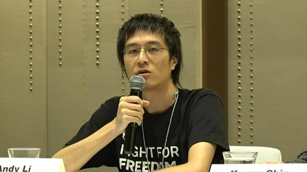
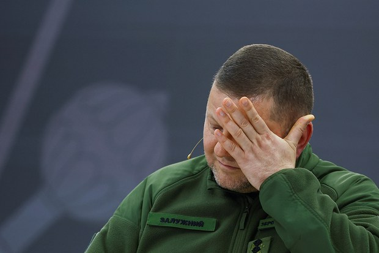
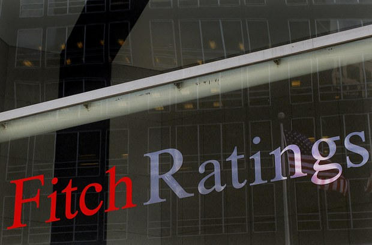
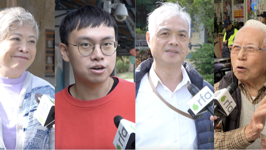
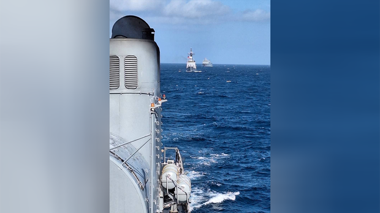
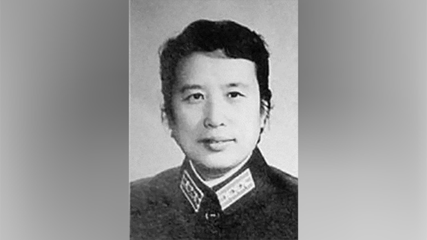

自由亚洲电台 北京时间 2024-01-05T06:11:08Z 1743032339683520596 欢迎收听和订阅播客【#亚太报道】 https://t.co/MjLNSvVMqc
中国各地省级 #两会 即将召开；北京出台 #政商关系新规；美国与菲律宾举行 #南海联合巡航；黎智英案律师团呼吁联合国关注刑讯逼供问题；台湾选民就大选发表看法  #黎智英 #港区国安法 #一国两制 #刑讯逼供 #联合国 #台湾大选 https://t.co/hILaGV9465   自由亚洲电台 北京时间 2024-01-05T06:12:30Z 1743032682324570448 人权团体 #中国人权律师团 于去年12月31日发布了该团体的2024年 #新年献词，以"内卷"一词描述2023年乃至近年来中国政治、经济、法律方面存在的问题，并呼吁建立开放的法制社会。https://t.co/Bv5mTK5f4H https://t.co/v5gJnRK6vX   自由亚洲电台 北京时间 2024-01-05T06:13:49Z 1743033015868199327 #事实查核｜蔡英文派"台妹"招待英国保守党人士？ https://t.co/jKwT9Uvw7J https://t.co/RvTvhuOUwm   自由亚洲电台 北京时间 2024-01-05T03:01:05Z 1742984511502332079 专栏 | #中国透视：中国民营企业的丧钟— 从支付宝变为无实际控制人企业谈起 https://t.co/ki6Gn4qXiU https://t.co/SrhWpsu1aB   自由亚洲电台 北京时间 2024-01-05T03:15:08Z 1742988047074136191 去年上半年，山东 #淄博烧烤 爆红网络，为当地吸引了大量游客，不少人跟风开店，甚至为此借钱。但如今不到一年，热潮便已退去，有不少店主为偿还 #债务，只得转卖便当。https://t.co/r5yHnFaX7P https://t.co/voNLIxHgXp   自由亚洲电台 北京时间 2024-01-05T04:07:44Z 1743001286776357321 近日，北京市政府出台所谓"十不准"的《#政商交往负面清单》，引发舆论热议。有分析警告说，中国当前 #民营经济 信心严重不足，关键在于行政权力凌驾于市场之上。https://t.co/lVHDfKd6Cr https://t.co/kmA1njDhzA   自由亚洲电台 北京时间 2024-01-05T04:08:25Z 1743001459061658026 "#黎智英案"证人据报被刑讯逼供　联合国特别报告员发紧急呼吁 https://t.co/oK5MkBEvOm https://t.co/Odp0YW4B08   自由亚洲电台 北京时间 2024-01-05T04:08:56Z 1743001589428924422 专栏 | #军事无禁区：#俄乌战争 陷入僵局－乌克兰反攻的下一步 https://t.co/aanvJMMZjC https://t.co/sGSINaOLHh   自由亚洲电台 北京时间 2024-01-05T04:09:49Z 1743001809558638999 据美国彭博社1月4日报道，#惠誉评级公司 (Fitch Ratings Inc.) 下调了中国 #四大国有资产管理公司 的 #评级，原因是对其财务状况的担忧以及对政府支持减少的预期。https://t.co/3WWBXmr9c7 https://t.co/Opg8EZxeqa   自由亚洲电台 北京时间 2024-01-05T01:15:38Z 1742957973310472517 再过十天，#台湾 将举行总统和立法委员 #选举。自由亚洲电台记者在台北街头和造势场合采访多位台湾民众，发现他们对经济的关注度更胜于选谁会掀起战争的威胁论。 https://t.co/1s8JnCYlx8 https://t.co/c5YPRWseZE   自由亚洲电台 北京时间 2024-01-05T01:16:54Z 1742958293964972057 美菲二度在南海联合巡航　中国换防长后首次回应 #菲律宾 #中国 #南海 https://t.co/vHcXEAez30 https://t.co/3n3ZZ8PKIe   自由亚洲电台 北京时间 2024-01-05T00:06:37Z 1742940604911473129 据中国媒体澎湃新闻报道，解放军原总参谋部政治部顾问、开国大将 #罗瑞卿 的夫人 #郝治平，因病医治无效，于1月4日在北京逝世，享年102岁。https://t.co/5RYSAA2Yqa https://t.co/ohhIVAK6rB   自由亚洲电台 北京时间 2024-01-05T00:08:04Z 1742940972118671528 专栏 | #绿色情报员：铅毒离你很近（下）从涂料、彩妆到香料避得了坑？ https://t.co/SWZ8Cymiea https://t.co/KCAOrC0qkr   自由亚洲电台 北京时间 2024-01-05T00:09:25Z 1742941310649270690 美国仪器制造商 #赛默飞世尔(Thermo Fisher Scientific) 公司称，他们已不再向 #西藏 销售某些基于DNA的 #身份识别 产品。https://t.co/JNuve02Ugg https://t.co/gOkZ38CfN8   