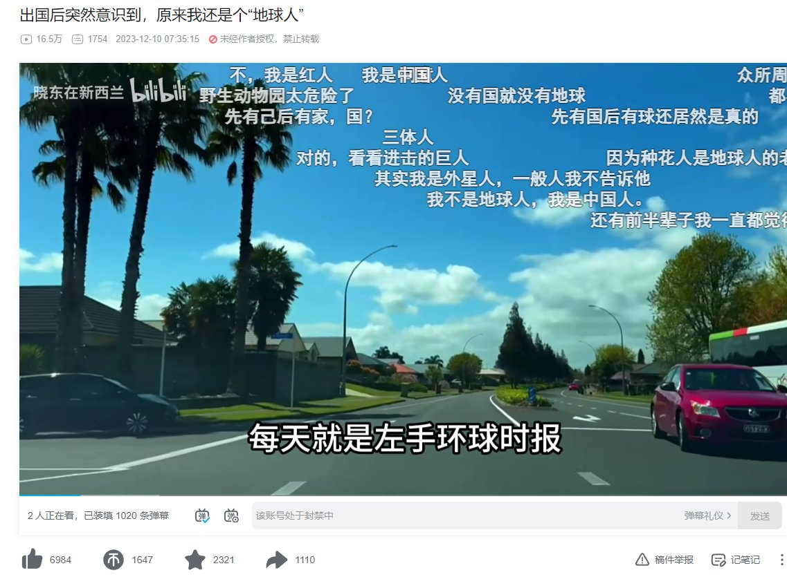

谁将十万横扫三江 北京时间 2024-01-05T11:26:44Z 1743111762273276109 RT @woyongdehuawei: B站UP主晓东在新西兰制作视频《出国后突然意识到，原来我还是个“地球人”》嘲讽国内的洗脑封闭 https://t.co/MpZA1QBxNW   谁将十万横扫三江 北京时间 2024-01-05T13:15:14Z 1743139068186337763 RT @iingwen: 日本有事はつまり台湾有事です。わが国は、石川県能登半島を震源とする地震の被災地支援と復興協力のため6,000万円の寄付を決めました。また、日本のために何かしたいという台湾の人々のために、本日（5日）より政府による義援金口座も開設し、寄付を受け付けていま…   