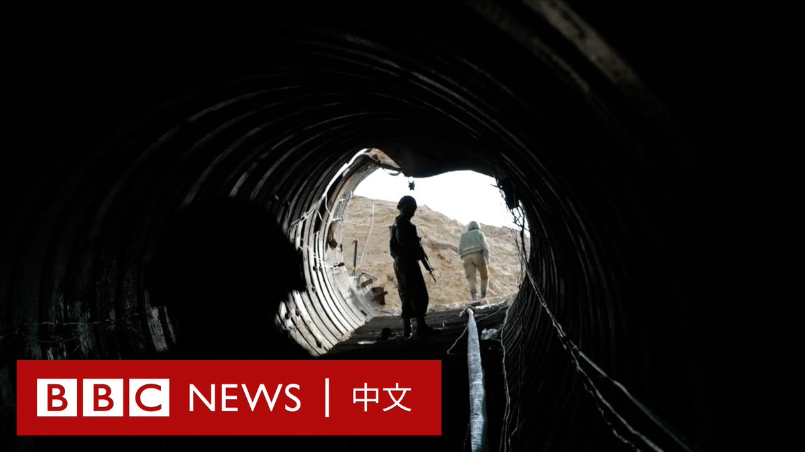

D英国广播公司BBC 北京时间 2024-01-04T11:52:30Z 1742755861972295800 BBC波斯语记者卡斯拉·纳吉（Kasra Naji）和摄影师索兰·库尔班尼（Soran Qurbani）拍摄并访问以色列声称迄今为止发现的地下隧道网络。 https://t.co/Vi0vVuWhPe   D英国广播公司BBC 北京时间 2024-01-04T09:07:40Z 1742714377868890548 学生庄凯（Kai Zhuang，音译）所在的美国高中报告其失踪，后来在犹他州农村的一个野外帐篷里被发现时，他“非常寒冷和害怕”。https://t.co/4RpMwvRVTp   