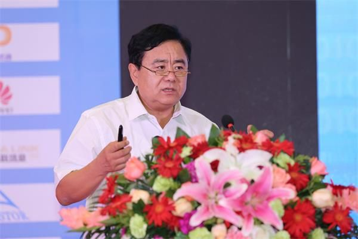

拆墙运动公号 北京时间 2024-01-04T15:40:57Z 1742813351376265627 【#2259专案组 互联网防火墙第003号嫌犯 #李京春】
（更新）
 性别：男
身份证：220104197205078439
吉林省长春市朝阳区
手机号/微信/支付宝QQ：17743119354
银行卡：42757159809771398
开户行：民生银行民生国际卡(澳元卡)
职称：高级工程师
北京科技大学博士生导师
职务：国家信息技术安全研究中心总工程师。

李京春，男，教授级高级工程师。现任国家信息技术安全研究中心副主任兼总工程师，北京科技大学特聘博士生导师。中央网信办党政云审查专家组副组长，国家科技部信息安全专家组成员、公安部信息安全等级保护建设指导委员会委员、国家科技部863 信息安全专家组成员、国家保密局信息化专家咨询委员会委员、国家信息安全等级保护建设指导委员会委员、党政部门云计算服务网络安全管理协调组和专家组副组长，北京市信息化专家咨询委员会委员，电监会和证监会特聘信息安全专家。

擅长互联网加密和监控
#拆墙运动 #BanGFW #反人类罪

中国网络安全审查技术与认证中心首席专家
国家信息技术安全研究中心原副主任兼总工程师 
贵州大数据安全工程研究中心副主任

详细资料见: #BanGFW拆墙运动（建墙罪犯录）（#ban_great.wall）:https://t.co/it5gvN2h9D

合作伙伴：#zhinawiki   拆墙运动公号 北京时间 2024-01-04T02:42:52Z 1742617539106967810 RT @V19841989: 本推虽然保持定期发放免梯网址，但往往很快遭遇封禁。
那么如何获得专享私用网址？除了无风险支持良心犯团体外，也可请您信任的海外异议人士联系我方来为您申领免费网址。感谢您为人权为自由而参与抵抗，敬请转发传播。

求真理得自由！自助者终得天助。#一人一推…   