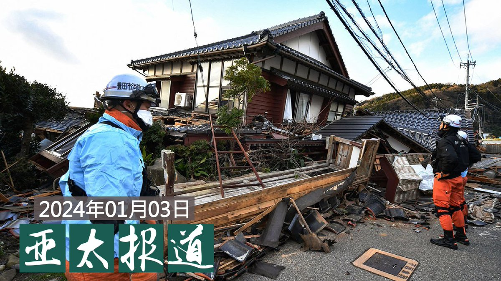
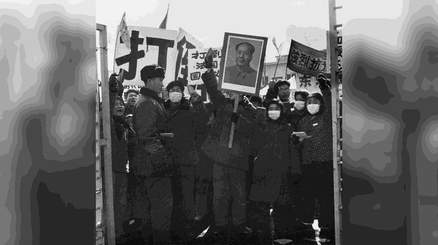
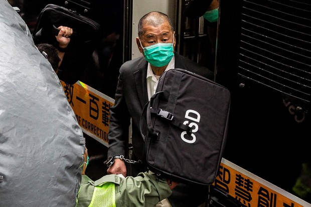
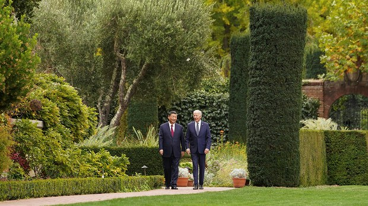
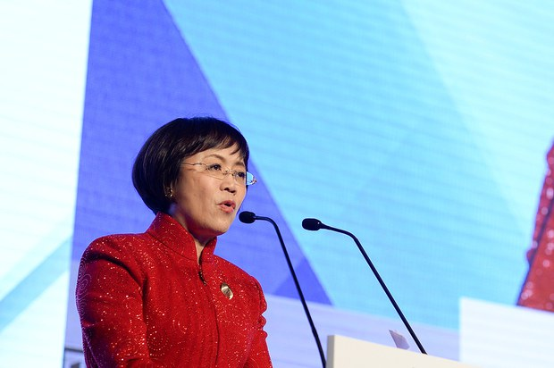
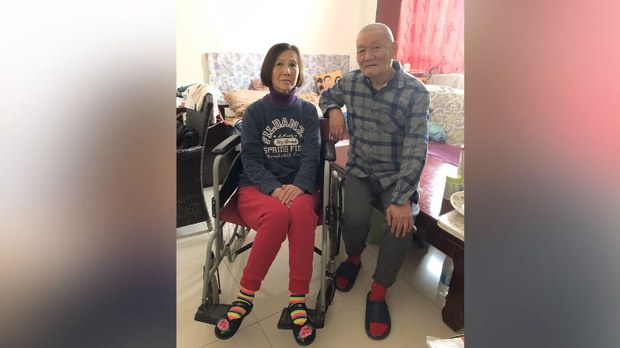
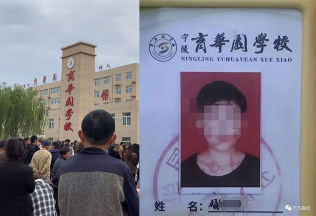

自由亚洲电台 北京时间 2024-01-04T08:00:05Z 1742697368993354009 欢迎收听和订阅播客【＃亚太报道】 https://t.co/MjLNSvVMqc

#中宣部 高官落马 #抖音 主播被罚;电视主播称 #日本地震 为“报应”被停职;英国官员回应 #黎智英 “ 共谋”案；台湾蓝白候选人急甩亲中标签；#北京高薪招聘公交车保安 https://t.co/afee8bgBzB   自由亚洲电台 北京时间 2024-01-04T08:30:01Z 1742704902953161073 专栏 | #纵横大历史：文革系列 第七十五讲　#毛泽东 知道 #红八月 的暴行吗？（一）
https://t.co/RCcmj4FjOw https://t.co/68B402MCQw   自由亚洲电台 北京时间 2024-01-04T03:50:20Z 1742634519394689176 香港传媒大亨 #黎智英 案件的庭审进入第五天，控方以黎智英透过中间人访问前港督彭定康作为"罪证"。对于多名英国公民被点名是黎智英的"共谋者"，英国保安国务大臣予以谴责，强调坚决捍卫英国主权。
部分被点名的"共谋者"也相继反驳港府指控，有被指控者表示从未见过黎智英。
https://t.co/96iWpXKF8H https://t.co/vFY6PnAm4O   自由亚洲电台 北京时间 2024-01-04T05:16:21Z 1742656165367160872 据路透社周二独家消息，五位消息人士透露，中共中央宣传部出版局局长 #冯士新 上周被免职，疑似与去年12月国家新闻出版署宣布的《#网络游戏管理办法（草案征求意见稿）》有关。https://t.co/MkngH2Typ9 https://t.co/UtXlRrQXWe   自由亚洲电台 北京时间 2024-01-04T05:49:44Z 1742664565584994794 美智库：2024年美中进入战争的可能性降低
https://t.co/34BvpMkAip https://t.co/PXigcR7Ddk   自由亚洲电台 北京时间 2024-01-04T02:51:30Z 1742619712734077036 #日本元旦地震 造成的伤亡人数正不断增加。外界关注灾情之际，中国一家电视台的新闻主播却发表日本地震为"#报应" 的言论。虽然当事人已被停职，但中国网民对此的看法却不尽相同。而这起停职风波，又是否反映出官方渲染民粹和仇日主义的态度？
#肖程皓
https://t.co/VPVcI2cLKH https://t.co/QKxuROaz7f   自由亚洲电台 北京时间 2024-01-04T03:22:23Z 1742627486268260809 #台湾大选 在即，中国官员明示暗示台湾人如何投票。蓝白候选人则急于甩开是所谓"北京属意人选"的"红色标签"。
民众党候选人 #柯文哲 指控国民党总统候选人 #侯友宜 是"中共支持的人"，侯则连忙澄清"己所不欲勿施于人"。
https://t.co/YtxivxzMq8 https://t.co/QiWvh6GjIv   自由亚洲电台 北京时间 2024-01-04T04:00:18Z 1742637027861110934 传 #财新 网社长被当局约谈　#胡舒立 在新年报平安
https://t.co/SX9CzbvIYa https://t.co/kTu9M1hQmu   自由亚洲电台 北京时间 2024-01-04T00:57:47Z 1742591094540599812 不久前，曾被房产公司列入拒租房屋“黑名单”的北京维权人士 #倪玉兰 再度遭到逼迁，目前面临无处安身的境地。
正在狱中服刑的“六四天网”创办人 #黄琦，其母亲 #蒲文清 因病重滞留成都，难以回到内江老家过年。

https://t.co/6bWEconx2e https://t.co/Cvip8lq61l   自由亚洲电台 北京时间 2024-01-04T01:58:26Z 1742606357763850275 1月2日，央视新闻报道，河南商丘市 #宁陵 县联合调查组就当地有初中生在校内暴毙公布了调查报告。针对舆论关注死者生前是否遭到霸凌的问题，该报告表示，调查组走访了死者亲属和校方管理人员、教师、同学等40多人次，未发现他生前在学校受到欺凌。https://t.co/BXeTaQ69V3
#他们的良心不会痛吗？ https://t.co/ui1KjBUfP3   