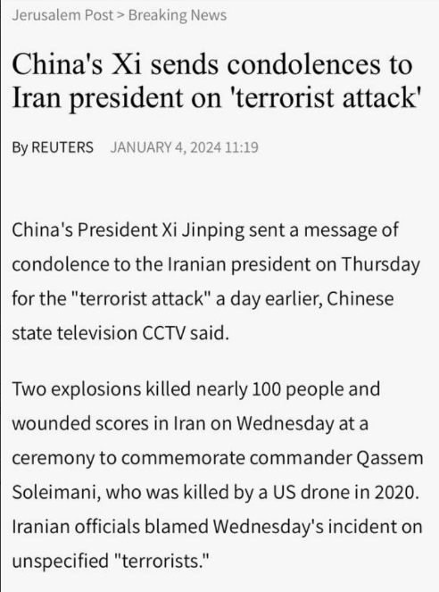
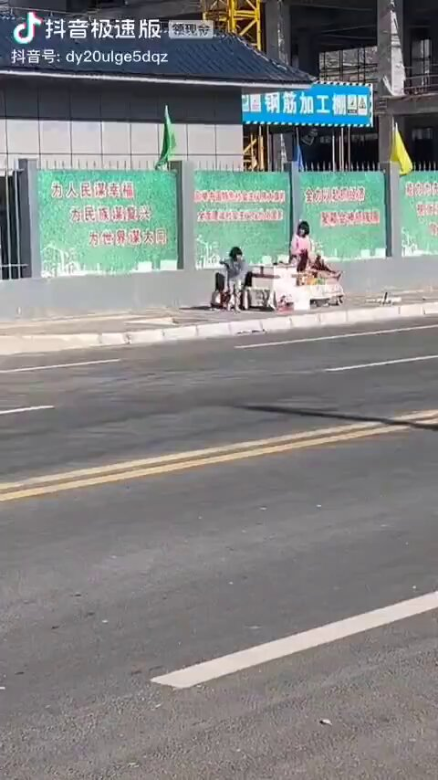

谁将十万横扫三江 北京时间 2024-01-04T18:22:05Z 1742853902071202253 政治刺杀不是恐怖袭击。恐怖主义一般是使用武器不对称、无差别屠杀平民的行为

“恐怖主义”可以说是全人类的公敌，恐怖分子们为了达到某些政治的、宗教的目的，无差别地故意攻击平民，引发社会恐慌。——北京政法网 https://t.co/p5aEDn3AcG   谁将十万横扫三江 北京时间 2024-01-04T18:43:48Z 1742859368683716682 RT @CDTChinese: 你以为过去几年的遭遇，和“底层保安”无关，但你不知道，那种外包的暴力，已经发展成一种成建制的安排，是更任意、却无需负责、无法追究的暴力。因为它们成建制，所以可以在有需要的时候出现，然后隐没在你习以为常的日常生活中，为了保护你的“安全”，杀害另一个…   谁将十万横扫三江 北京时间 2024-01-04T18:57:23Z 1742862787385385454 RT @CDTChinese: 最最重要的是，官方的所有回应和通报，都不足以描述孙奥的嚣张和狂妄。他们都在有意回避孙奥在踩踏老人时的辱骂，在群里叫嚣时的猖狂，以及对于底层人的嘲笑和蔑视。这不是一件什么大事，甚至在网上激起的浪花，都没主持人说日本地震是报应来的大，但是我还是耿耿于…   谁将十万横扫三江 北京时间 2024-01-04T17:25:38Z 1742839694491287737 社会主义国家才会救灾
涿州老乡：¿ https://t.co/vnQq4W6la6   谁将十万横扫三江 北京时间 2024-01-04T12:56:32Z 1742771974580187588 RT @torontobigface: 抖音上有人拍下了三个小女孩，为谋生计，在路边卖水的视频
而在其背后的墙上写着
为人民谋幸福
为民族谋复兴
为世界谋大同
等共产党宣传标语，形成了强烈的反差 https://t.co/P6xGdVRXu1   谁将十万横扫三江 北京时间 2024-01-04T13:39:36Z 1742782812988870772 RT @dikaioslin: 【限额免费读】“一带一路”十年：模糊的倡议，空泛的口号，从不缺席的民族主义｜端传媒 Initium Media
https://t.co/8zt995jZGc   