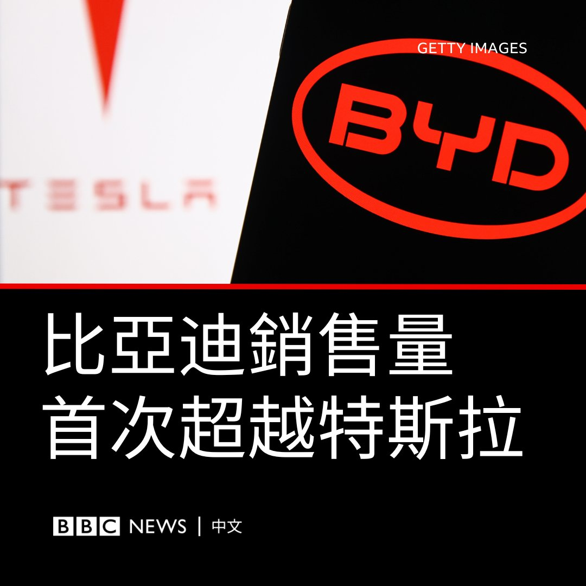
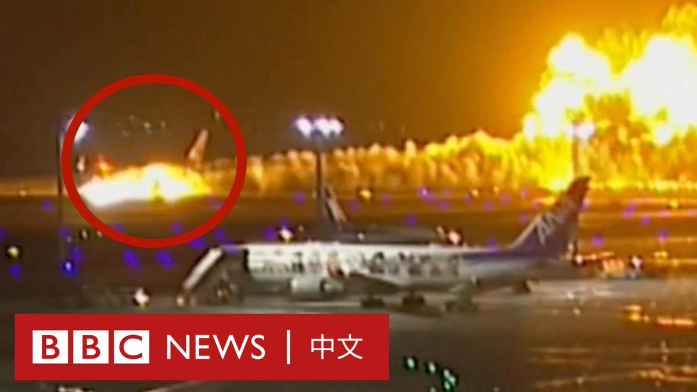
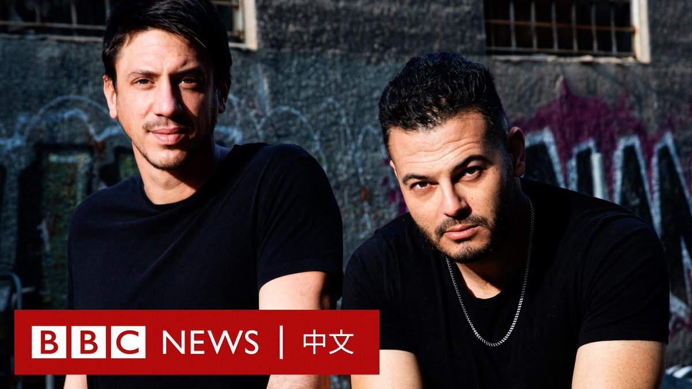

D英国广播公司BBC 北京时间 2024-01-03T14:26:07Z 1742432131689992403 中国汽车制造商比亚迪（BYD）的季度销售量首次超越美国电动车制造商特斯拉（Tesla），两家公司争夺该行业的龙头位置。

比亚迪周一（1月1日）表示，在2023年最后一个季度，该公司售出52.6万辆纯电池汽车。

由于借贷成本攀升，消费者对特斯拉的需求放缓。不过，以全年统计来说，特斯拉的销售量仍然超越比亚迪。

周二（1月2日），特斯拉表示，2023年去年第四季交付48.45万辆车，全年年交付180万辆。

去年1月，马斯克（Elon Musk）曾表示，特斯拉有可能在2023年实现200万辆的交付量。

总部位于深圳的比亚迪公司全年共售出超过300万辆的新能源汽车（NEV），其中包括纯电池汽车和混合动力汽车。

比亚迪称，其总销量中近160万辆是纯电池汽车。

回顾BBC中文解读中国电动汽车产业的AB面：https://t.co/XYSlHyKBP4   D英国广播公司BBC 北京时间 2024-01-03T16:13:20Z 1742459112204489020 日本航空一架飞机周二（1月2日）在东京羽田国际机场跑道降落时起火，紧急救援人员争分夺秒营救出所有乘客和机组人员。

格拉汉姆·布雷斯韦特（Graham Braithwaite）教授是克兰菲尔德大学运输系统主任兼事故调查教授，他向我们解释了在飞机燃油发生泄漏的情况下，紧急服务部门如何面对各项挑战。 https://t.co/JwQ34OKZCX   D英国广播公司BBC 北京时间 2024-01-03T12:08:03Z 1742397385811083265 两年前，他们用希伯来语和巴勒斯坦阿拉伯语进行的说唱表演在网路热播。乌里亚·罗森曼是以色列犹太教育家，萨梅赫·扎库特是巴勒斯坦裔以色列歌手和演员。他们相信应该有另一条出路——暴力无法带来和平。 https://t.co/BJpAcG60k5   D英国广播公司BBC 北京时间 2024-01-03T10:22:23Z 1742370791948185714 弗雷德里克王储是首位完成大学教育的丹麦王室成员，他送四名子女就读公立学校，让外界认为他展现了现代价值观。https://t.co/4dKcKZNeQG   