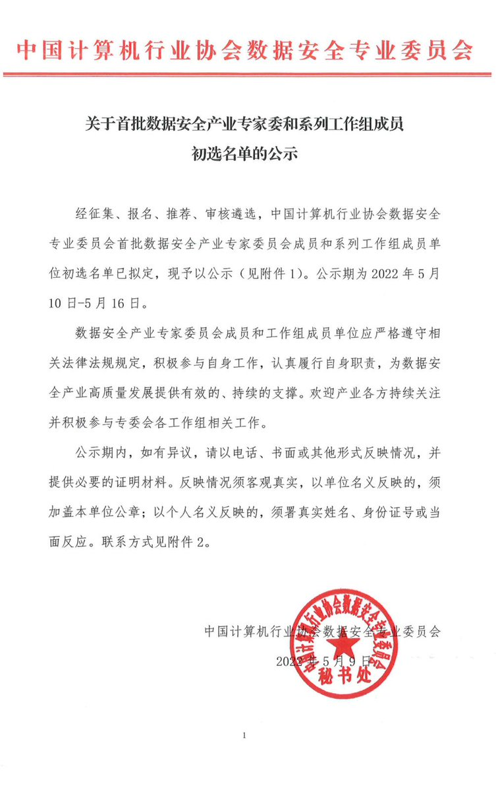
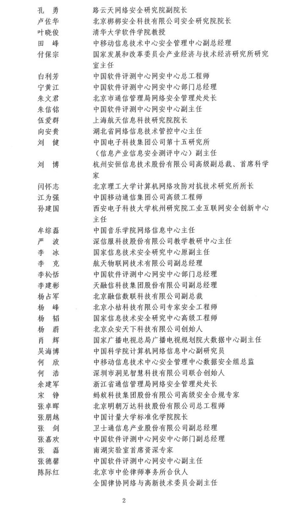

拆墙运动公号 北京时间 2024-01-03T01:20:56Z 1742234534551114097 【 #2259专案组 互联网防火墙第105号嫌犯 #张朋越】  性别：男
1976年10月生 
身份证：210402197610083559
 籍贯：辽宁省抚顺市新抚区 
学历：博士 
毕业院校：燕山大学、浙江大学
 国 籍：中国 
职 称：教授
 手机/微信/支付宝/QQ: 13067804306
 办公电话：0571-87676238 
Email：zhang_pengyue@cjlu.edu.cn 
地址: 浙江省杭州市江干区白杨街道杭州市下沙高教园区学源街道258号中国计量学院 
职务：中国计量大学标准化学院院长 

专业方向：
材料科学与工程 
中国计量大学教授

研究方向 
纳米复合磁性材料
高密度信息存储磁材检测

人物经历 
1995.9 - 1999.7燕山大学 材料学 本科；
 1999.9 - 2002.1燕山大学 材料学 硕士研究生；
 2002.3 - 2006.5浙江大学 材料学 博士研究生； 2006.6 - 2011.07 中国计量学院材料物理与化学教师； 2011.07至今 中国计量大学 标准化学院 副院长/总支副书记。

详细资料见: #BanGFW拆墙运动（建墙罪犯录）（#ban_great.wall）:https://t.co/3i0PFtSU5T
合作伙伴：#zhinawiki   拆墙运动公号 北京时间 2024-01-03T22:16:51Z 1742550595163046023 【#2259专案组 互联网防火墙第036号嫌犯 #卢佐华】（更新）
  性别：女
身份证: 110101197108304022
北京市市辖区东城区
手机/微信/支付宝: 18911518787
地址:1、 北京市朝阳区立水桥花园24号楼2405
地址:2、 北京北京市西城区德胜街道黄寺大街23号阳光丽景7号楼803
地址 ：3、北京北京市西城区德胜街道黄寺大街23号阳光丽景7号楼100032
学历： 博士
职务：北京梆梆安全科技有限公司安全研究院副院长
企业地址：北京市海淀区学院路30号科大天工大厦A座20层1至3室
企业邮箱：service@bangcle.com
market@bangcle.com
单位联系电话：010-62660308

擅长互联网络加密和监控控制
#拆墙运动 #BanGFW #反人类犯罪 

卢佐华，CISSP-ISSAP，梆梆安全副总裁兼安全研究院院长。20多年的安全和IT领域工作经历，熟悉风险评估、安全审计，熟悉各类软硬件安全技术和产品，现专注物联网安全的研究，首次提出物联网微边界安全防护理念，针对物联网中海量的智能终端，带领团队创新研发和设计了物联网多重动态安全防御产品和解决方案，实现了对物联网智能终端细粒度的监控与运营管理，并由此获评(ISC)²ISLA信息安全项目管理人员杰出获奖者。(ISC)²北京分会主席，智能网联汽车产业技术创新战略联盟专家委员会委员，全国信标委软件与系统工程分技术委员会专家委员，CSAE智能网联汽车信息安全标准专家组专家。

详细资料见: #BanGFW拆墙运动（建墙罪犯录）（#ban_great.wall）:https://t.co/S8xTSyjRgx

合作伙伴：#zhinawiki   拆墙运动公号 北京时间 2024-01-03T18:55:59Z 1742500047118332028 RT @Lydia981402: 这些反人类的中共恶人筑起网络高墙,阻隔信息渠道,让中国人民变得愚蠢又野蛮.  
公开这些恶人的个人信息,欢迎大家用各种方式给恶人施加压力，提高恶人作恶的成本！ 
我们勇敢站出来前进一步，恶人就退缩一步！   如果退缩的是我们，恶人不会放过我们,…   拆墙运动公号 北京时间 2024-01-03T05:36:47Z 1742298918363213826 RT @LinShengliang: 一生十六大困惑
一，為什麼一個用成千上萬先烈生命換來的江山，能怕一個老百姓幾句批評的話顛覆了?這是否說明你這個江山成本太高質量太差?假若如此當年你為什麼不用同樣批評建議的方法去將國民政府顛覆了?而非要用這成千上萬生命去顛覆，你當時的腦子灌水…   