自由亚洲电台 北京时间 2024-01-03T11:23:41Z 1742386218904719642 专栏 | #夜话中南海：习近平当局对民间怀毛是爱还是怕？
#毛诞130周年
https://t.co/YT9FQnBl28 https://t.co/jkBe7Hmyqf 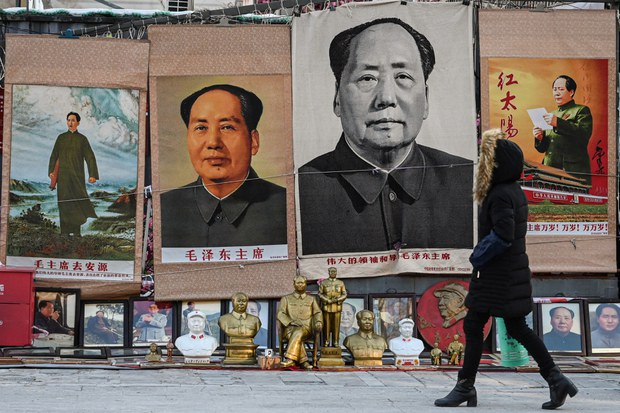  自由亚洲电台 北京时间 2024-01-03T11:30:41Z 1742387983636988367 RT @RFA_Chinese: 欢迎收听和订阅播客【＃亚太报道】 https://t.co/MjLNSvVMqc
#黎智英 拒认港府“串谋”指控；人权组织呼吁终止 #对港引渡协议；荷兰取消 #光刻机对华出口许可；武汉雕塑 “#生三胎”引发舆论嘲讽；台湾民进党候选人在封关民调领…   自由亚洲电台 北京时间 2024-01-03T11:31:09Z 1742388097365512403 RT @RFA_Chinese: 河南 #宁陵 通报 #学生坠亡 调查　称死前未遭受霸凌及有厌世倾向
您信吗？
https://t.co/Vxi1bUrG02 https://t.co/fVpOPWGnps 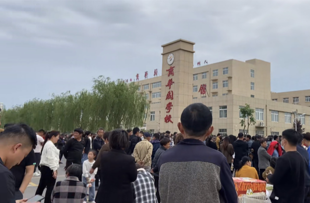  自由亚洲电台 北京时间 2024-01-03T10:05:23Z 1742366514328871363 评论 | 胡平 @HuPing1：荒诞的 #毛诞
https://t.co/qRARtasGBr https://t.co/y9SOPOAusm 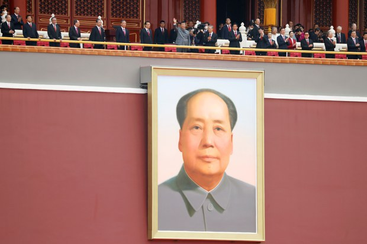  自由亚洲电台 北京时间 2024-01-03T06:30:02Z 1742312320569835928 河南 #宁陵 通报 #学生坠亡 调查　称死前未遭受霸凌及有厌世倾向
您信吗？
https://t.co/Vxi1bUrG02 https://t.co/fVpOPWGnps   自由亚洲电台 北京时间 2024-01-03T07:42:46Z 1742330622780285030 欢迎收听和订阅播客【＃亚太报道】 https://t.co/MjLNSvVMqc
#黎智英 拒认港府“串谋”指控；人权组织呼吁终止 #对港引渡协议；荷兰取消 #光刻机对华出口许可；武汉雕塑 “#生三胎”引发舆论嘲讽；台湾民进党候选人在封关民调领先。 https://t.co/Hey78yo1MT 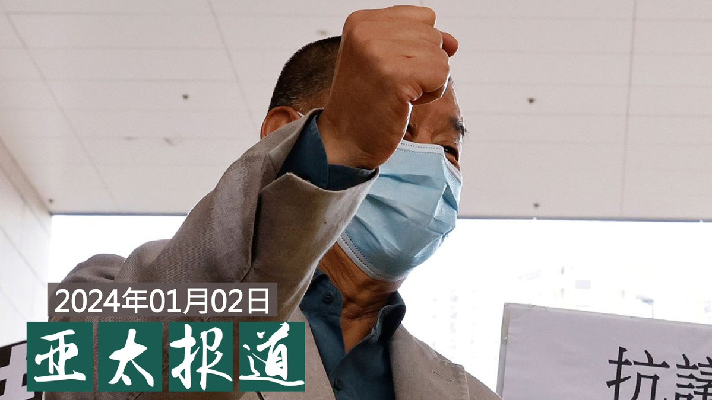  自由亚洲电台 北京时间 2024-01-03T04:25:50Z 1742281065501524465 《#武汉封城》洛杉矶首映　八九学运领袖 王丹 @wangdan1989 致辞：
“我们的纪录片就是记录这场言论自由的灾难”
https://t.co/oMBul8QclX https://t.co/CvfkofmS4U 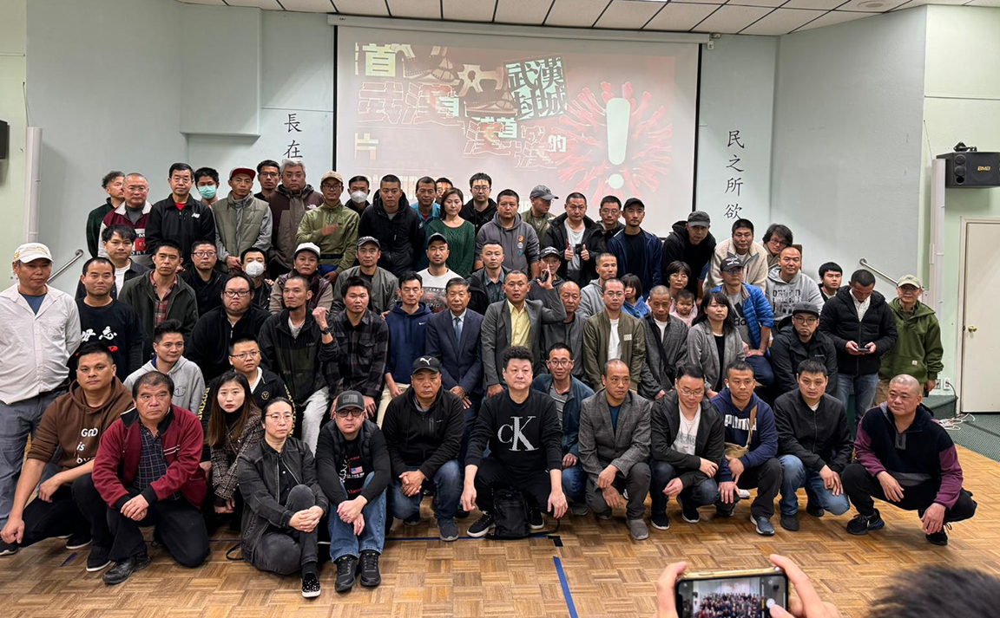  自由亚洲电台 北京时间 2024-01-03T05:53:39Z 1742303166262288417 据路透社本周二报道，在2023年跨越2024年的三天连假中，中国40座城市的 #房屋销售面积 比去年同期降低了26%。其中，小城市的房屋销售降幅最大，最多的地区出现了下降50%的情况。
https://t.co/ZmJqVDcckl https://t.co/jVKGPQCHke 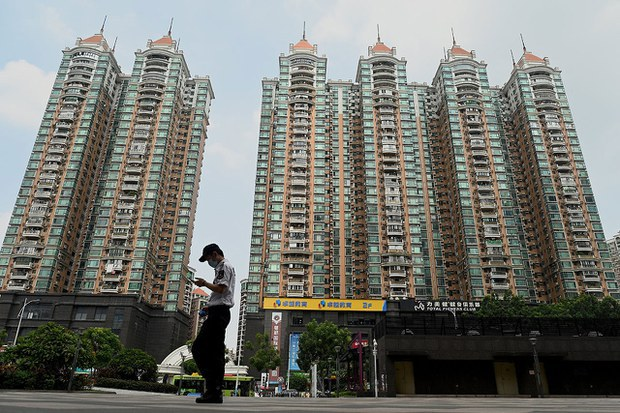  自由亚洲电台 北京时间 2024-01-03T06:15:03Z 1742308549387280451 中国监管部门日前推出 #网络游戏 限制新规则，导致该行业股票暴跌，损失巨大。据路透社2日引用了解此事的五名消息人士称，中国当局因此解除了中宣部出版局局长 #冯士新 的职务。
https://t.co/8Ak6JG8sBF https://t.co/fqEwevtm94 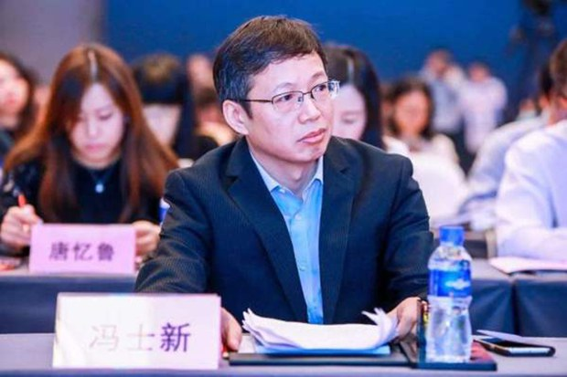  自由亚洲电台 北京时间 2024-01-03T02:40:44Z 1742254614785991126 疫情后主打旅游的港府，＃跨年烟花汇演 吸引大批中国游客前往观赏。但他们不选择在香港过夜，打算回家的人流回程不顺利，大批滞留港铁站和北返口岸的旅客，席地而坐通宵等候过关。这类视频遍布小红书和抖音等平台，更有滞留旅客狠批香港管治效率差。
https://t.co/Ja6gZ2dER0 https://t.co/k6hP72PlEZ   自由亚洲电台 北京时间 2024-01-03T02:57:06Z 1742258734775304691 描述新冠疫情期间武汉遭受封城所苦的纪录片《＃武汉封城》，于12月30日举行全球放映活动，加拿大首映会于 ＃多伦多 举行。
一些在现场观看影片的中国年轻留学生或是新一代移民，对当时情景都大为震撼，因为生活在中国时，他们所接受的资讯和真实情况有着巨大的差异。
https://t.co/E6qaElTlmn https://t.co/5Qdpe3rOH8 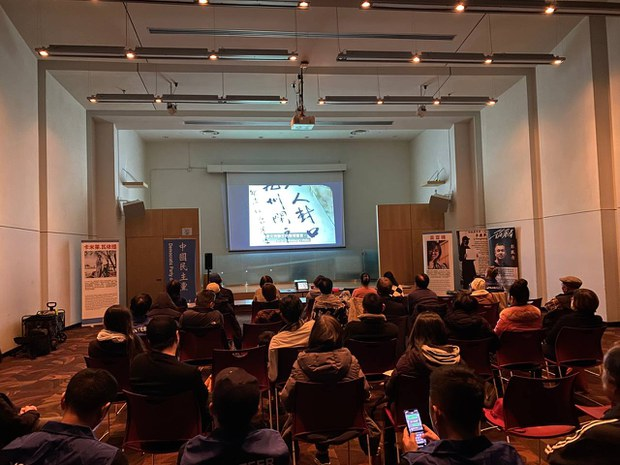  自由亚洲电台 北京时间 2024-01-03T03:16:55Z 1742263720083103779 香港传媒大亨 ＃黎智英  被控"＃串谋勾结外国势力"等罪名的案件，在新一年续审。控方在庭上点名英、美、日多国政要及人权倡议者，指他们是黎智英的"共谋者"或"外国代理人"。
多国议员联署狠批港府捏造证据，促请各国政府立即终止和中港的引渡协议及司法互助协定。
https://t.co/jqlBZaJ50F https://t.co/yWJDgTGyTA 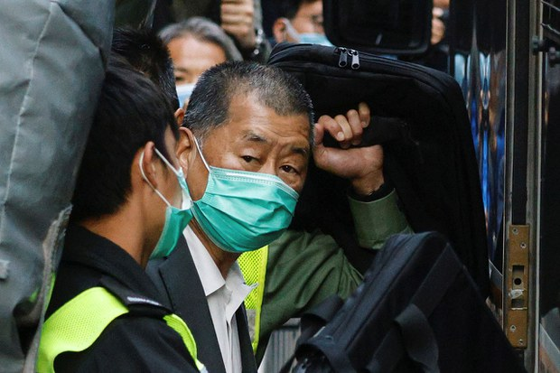  自由亚洲电台 北京时间 2024-01-03T03:51:21Z 1742272385695523053 ＃泰国 宣布3月起 ＃与中国永久互免签证
https://t.co/Jvmwjz9Hkl https://t.co/JPg4VPgosX 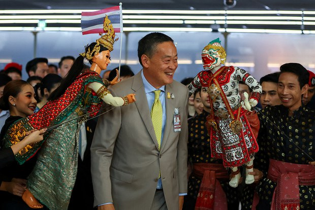  自由亚洲电台 北京时间 2024-01-03T04:00:15Z 1742274624380109221 【阿斯麦撤销对华光刻机出口许可】
据多家国际媒体1月2日披露，总部位于荷兰的顶级芯片 ＃光刻机 制造商 ＃阿斯麦（ASML）应美国和荷兰政府要求，暂停向中国交付光刻系统。此举引发中方强烈不满。
详见 https://t.co/oFTpLTfgZl https://t.co/jWd8s76svf 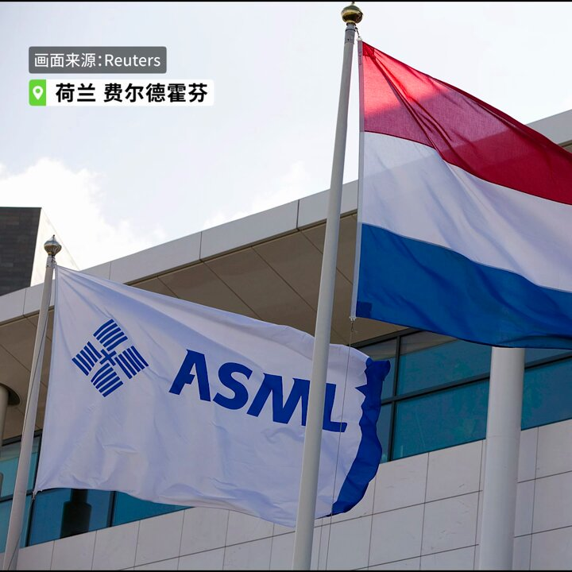  自由亚洲电台 北京时间 2024-01-03T04:10:09Z 1742277117004681432 台湾大选日趋临近，美国华府侨界人士举行中华民国113年元旦升旗典礼。典礼由华府荣光联谊会、华府黄埔同学会和华府台湾同乡联谊会共同主办，台湾的驻美副代表郑荣俊和姜森、国民党驻美副代表秦日新等出席。 https://t.co/HVpBVpu5t9 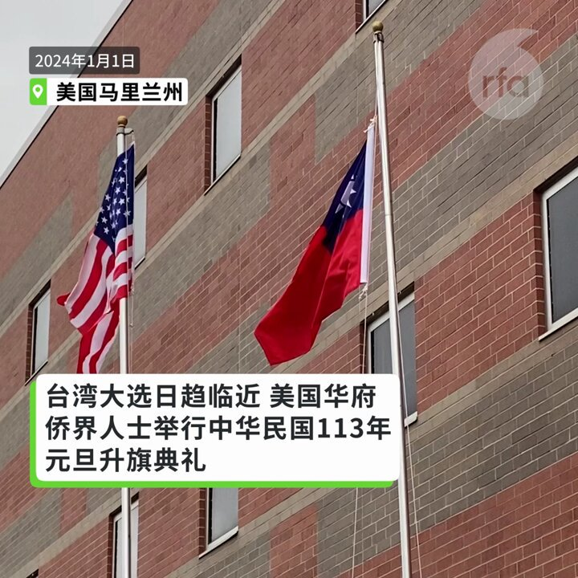  自由亚洲电台 北京时间 2024-01-03T00:55:01Z 1742228011657871649 已开庭的"#黎智英案"， 进入答辩阶段。控方形容，黎智英是本案的主脑，表示他是激进的政治人物，主动接触或通过代表接触多国政治人物，并建议对中港官员实施制裁，以及利用《#苹果日报》 宣传政治议程。#黎智英 当庭表示不认罪。
黎智英太太与黎智英儿子出席旁听。
https://t.co/oenr6kaFjB https://t.co/TmUeJyqwhE 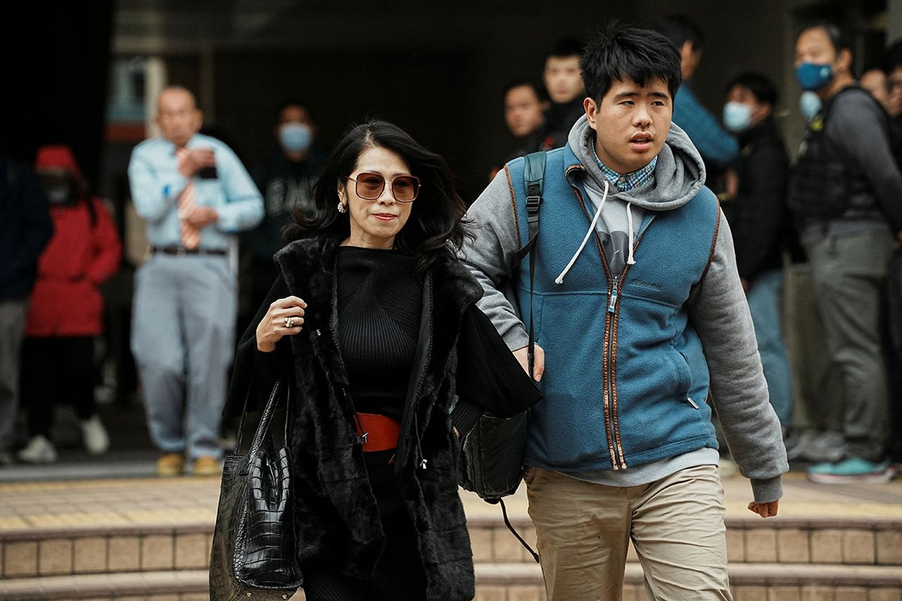  自由亚洲电台 北京时间 2024-01-03T01:45:09Z 1742240626773754324 江苏南通市一名 #访民 上月到北京上访后，被地方政府以逃犯名义带走，其后疑似遭暴力对待而身受重伤，据报正在医院抢救。
近年该访民一直就亲属在爆炸事件中身亡追究责任。公安当局已决定对她执行指定居所监视居住。
https://t.co/9IXfyjQzPI https://t.co/n35F8xQbb4 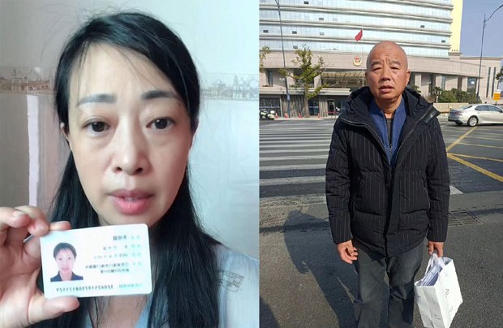  自由亚洲电台 北京时间 2024-01-03T00:13:57Z 1742217677115183556 距离 #台湾大选 只剩十一天，十家 #封关民调 显示，民进党候选人 #赖清德、#萧美琴 持续处于略微领先的局面，高于国民党的侯友宜、赵少康约3%至11%，民众党候选人柯文哲、吴欣盈则紧追在后。
https://t.co/hQAzwTq6zs https://t.co/WoZTwOBONb   