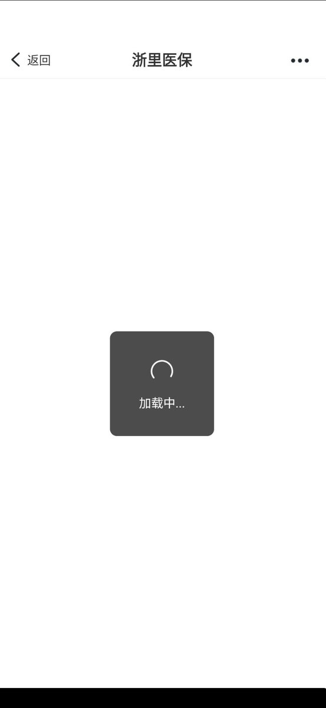

谁将十万横扫三江 北京时间 2024-01-03T16:23:27Z 1742461659313221814 RT @woyongdehuawei: 在海南广电总台停职主持人肖程皓的视频评论区中，能看到的8万多条评论都是支持肖程皓的极端民族主义言论 https://t.co/C5SztY2m3S   谁将十万横扫三江 北京时间 2024-01-03T12:30:42Z 1742403087321722957 RT @woyongdehuawei: 网友投稿

似乎是河南警察以“污蔑国家领导人”对老百姓进行无逮捕证抓捕 https://t.co/Ams0crbaT2   谁将十万横扫三江 北京时间 2024-01-03T10:39:18Z 1742375051654296046 RT @KawawaDolly8964: 有的时候不少左派的宣传方向是错的，他们总会把工人阶级说成“明明他们才是真正的爱国者”
首先我的评价是这种说法很沾民族主义，其次这也反而给统治阶级放出反信号：工人阶级可以被争取分化成为建制派，只需政府稍加教育引导即可，反正他们本质上也是爱…   谁将十万横扫三江 北京时间 2024-01-03T11:47:57Z 1742392327308755434 RT @22HomoPoliticus: 这种评价基本延续了从延安时期开始就奠定的个人崇拜基调。当时发动个人崇拜的历史背景是清洗党内张国焘余党，并且肃清王明派系的影响力。要知道，在延安时期专权开始以前，毛泽东在党内威望并没有现在人想象这么高：他不但没有实权，还因为瑞金时期战略失…   谁将十万横扫三江 北京时间 2024-01-03T09:56:40Z 1742364322968510533 继上海医保余额清零过了年才能用之后，浙江医保也来让你消费了，全是错误，直接不可用，半天也没修复。如果你恰好看病，只能自费咯 https://t.co/IQYcedRaxi   谁将十万横扫三江 北京时间 2024-01-03T09:58:35Z 1742364805661626718 RT @dayangelcp: 标：202X的宏大叙事与鸡零狗碎

文/李承鹏

2023年，按天干地支是癸卯年，犯水兔，玄学家说，这一年易遭洪灾。…   