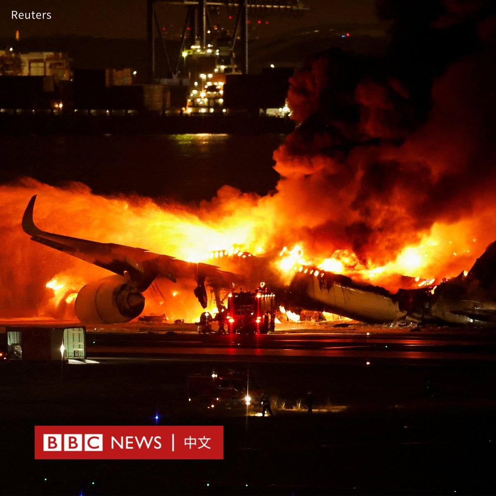
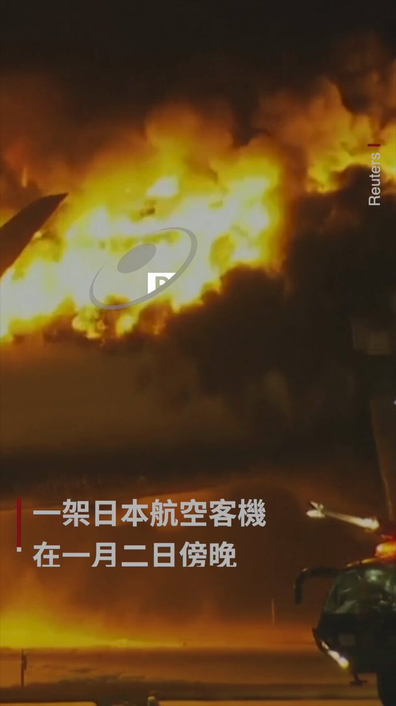
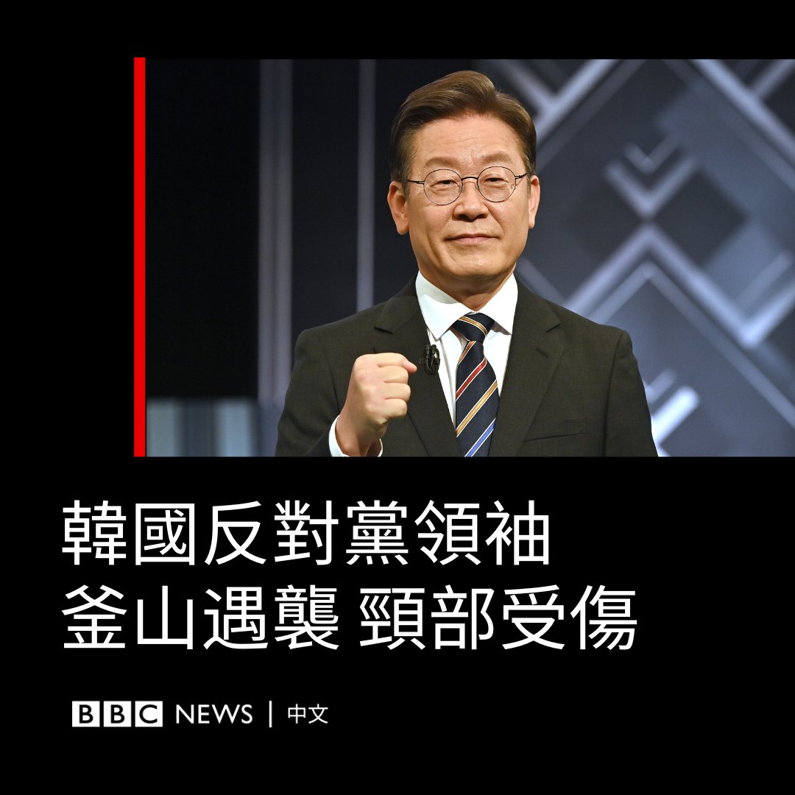
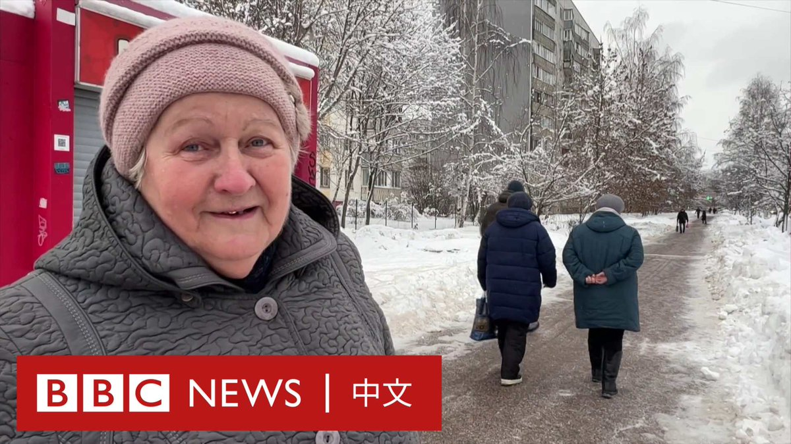

D英国广播公司BBC 北京时间 2024-01-02T22:02:03Z 1742184480855769410 【最新消息】在日本航空公司一架客机与日本海上保安厅飞机发生相撞并起火事故后，官员已确认海上保安厅飞机上有5人遇难。

据日本放送协会（NHK）报导，日航客机上有至少17人受伤，但没有生命危险。

这两架飞机周二（1月2日）在东京羽田机场跑道上相撞，其中日航客机为空客A350，机上有乘客367人、机组成员12人，在起火后全部撤离。海上保安厅飞机为庞巴迪DHC8，有机组成员6人。

据报导，这架海上保安厅飞机当时正在前往新潟航空基地，准备运送物资给地震灾民。   D英国广播公司BBC 北京时间 2024-01-02T18:26:58Z 1742130356440936925 日本航空（Japan Airlines）一架飞机周二（1月2日）在东京羽田国际机场跑道降落时被火焰吞没。

日本航空公司说，机上379名乘客和机组人员已全部撤离。

这架飞机从日本北部的北海道起飞。有报道称，一架海上保安厅的飞机与这架客机相撞，情况不明。

现场画面：https://t.co/MIsnjRffYR   D英国广播公司BBC 北京时间 2024-01-02T18:15:18Z 1742127418268377521 一架日本航空客机在东京羽田机场降落时失事着火，机上367人据报全部安全逃生。

报导指，客机与另一架飞机相撞，该客机从日本北海道起飞。 https://t.co/3fzeTTT55B   D英国广播公司BBC 北京时间 2024-01-02T15:01:09Z 1742078558351061361 日本石川县1月1日发生7.6级强烈地震，大规模搜救行动正在进行。日本气象厅表示，自昨日以来，已发生百余起地震，已有数万人从高危地区撤离。

日本首相岸田文雄称，由于当地道路及基础设施遭到破坏，救援工作极其困难。目前已有多人死亡，人们担心仍有民众被埋在废墟中。 https://t.co/Ez0xkYuAcG   D英国广播公司BBC 北京时间 2024-01-02T13:01:03Z 1742048333315572056 在过去的12个月里，美国、欧洲和其他主要民主国家在国际政治舞台上遭遇了一系列挫折。这是为什么？https://t.co/nYSP1vSkal   D英国广播公司BBC 北京时间 2024-01-02T11:30:54Z 1742025647588077692 据韩联社报导，韩国最大在野党共同民主党党魁李在明1月2日早上在南部城市釜山参访时遇袭，左侧颈部被刺伤。

袭击发生约20分钟后，李在明被送往医院。据报导，他当时神志清醒。

报导称，男性袭击者看似五、六十岁，被当场逮捕。他在记者群访途中走近李在明索取签名，然后拿出随身携带的武器，挥向李在明的脖子。

社交媒体上发布的视频显示，李在明先是倒在人群中，然后倒在地上，数人试图制服袭击者。

照片显示，李在明躺在地上，双眼紧闭，有人用手帕按着他的颈侧。

现年59岁的李在明领导着共同民主党。在2022年总统选举中，李在明以微小差距输给现任总统尹锡悦。人们普遍预计他将参加2027年的下届总统选举。   D英国广播公司BBC 北京时间 2024-01-02T08:01:04Z 1741972842952978754 在香港经济低迷之际，越来越多的香港人选择在假日北上深圳吃喝玩乐，这与此前中国内地游客涌入香港消费的热潮形成对比。官方数据显示，2023年香港居民“北上”的数字大幅超过内地旅客“南下”的数字。https://t.co/kL8ybtmUSw   D英国广播公司BBC 北京时间 2024-01-02T10:01:11Z 1742003069787746622 随着世界进入的新的一年，乌克兰战争也迈入新一年。

许多俄罗斯人仍相信克里姆林宫的说法，即西方应为这场战争负责——但他们对未来有何想法？ https://t.co/h7mePn3DsF   