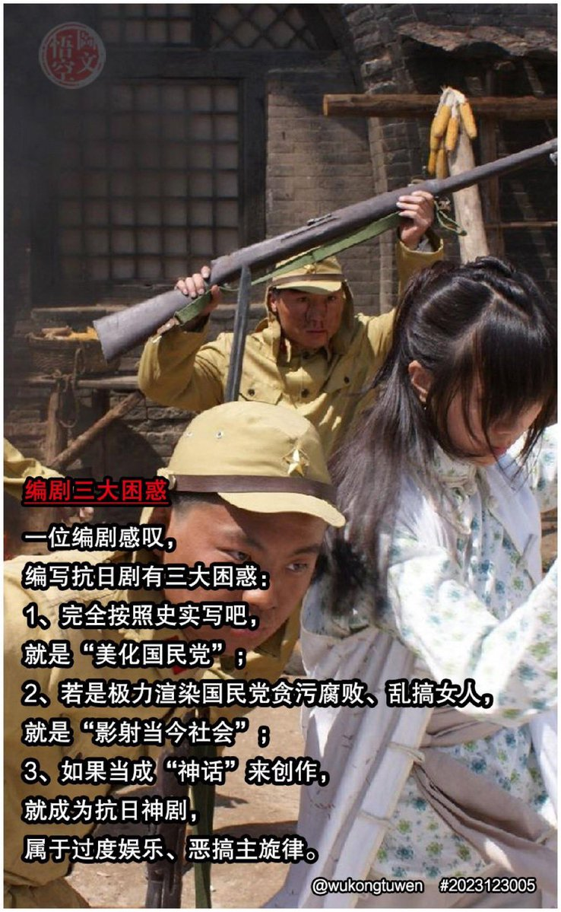
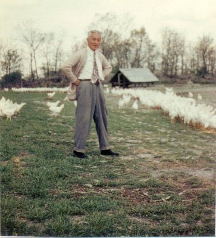
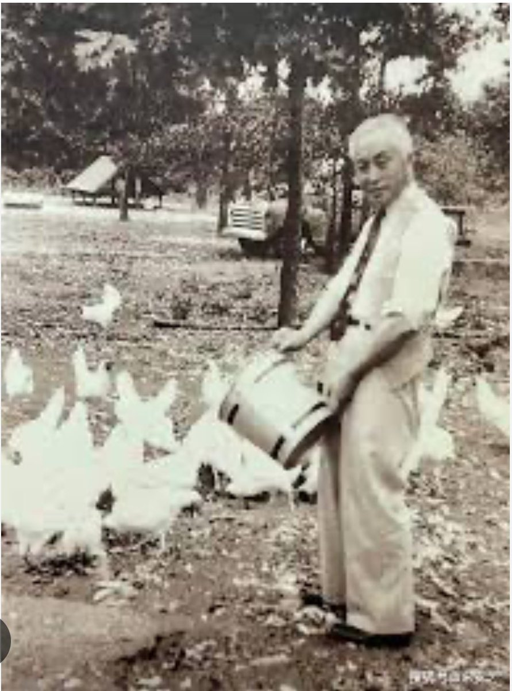
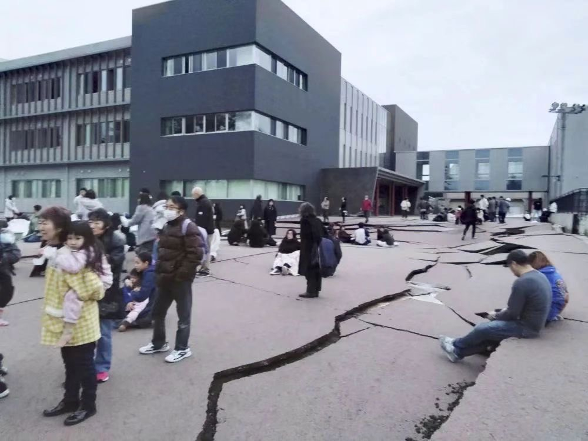
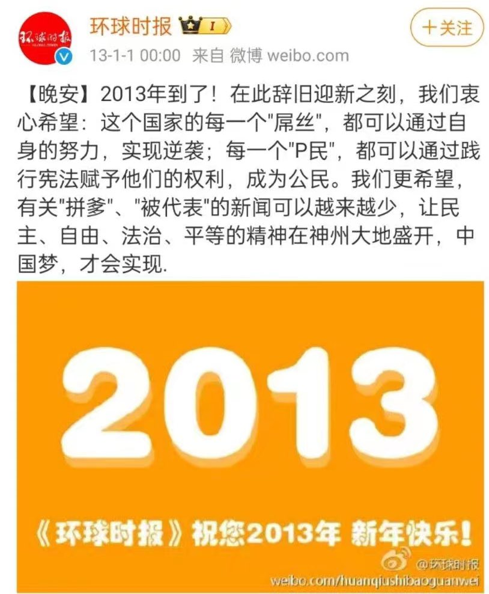
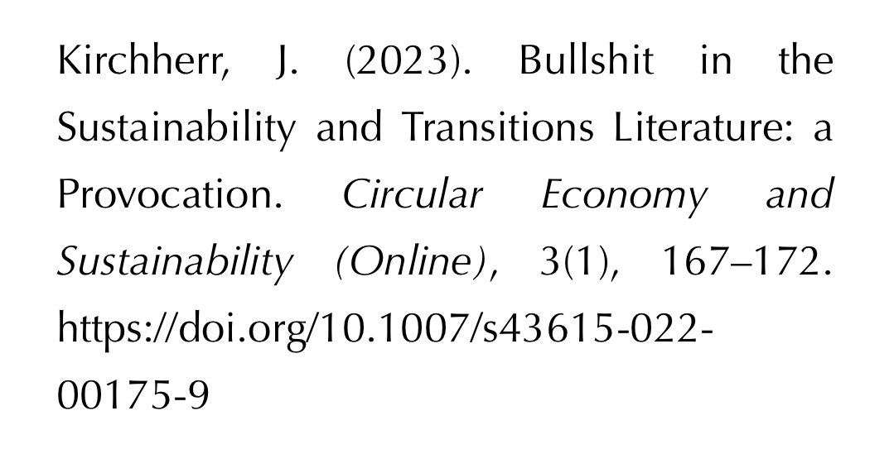
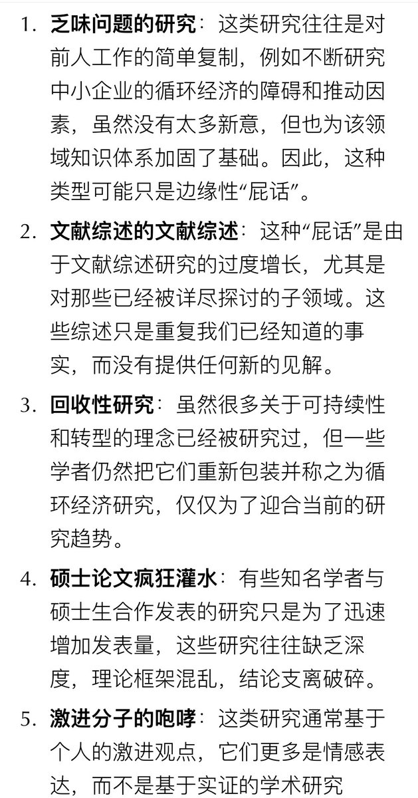
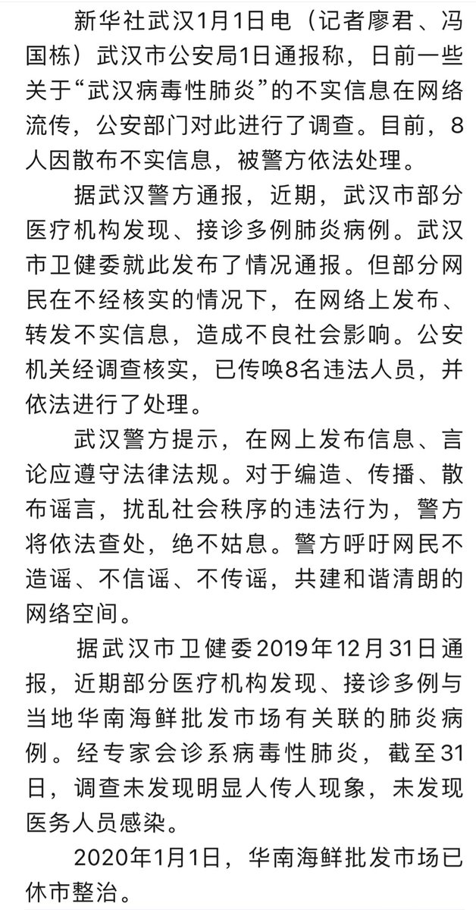
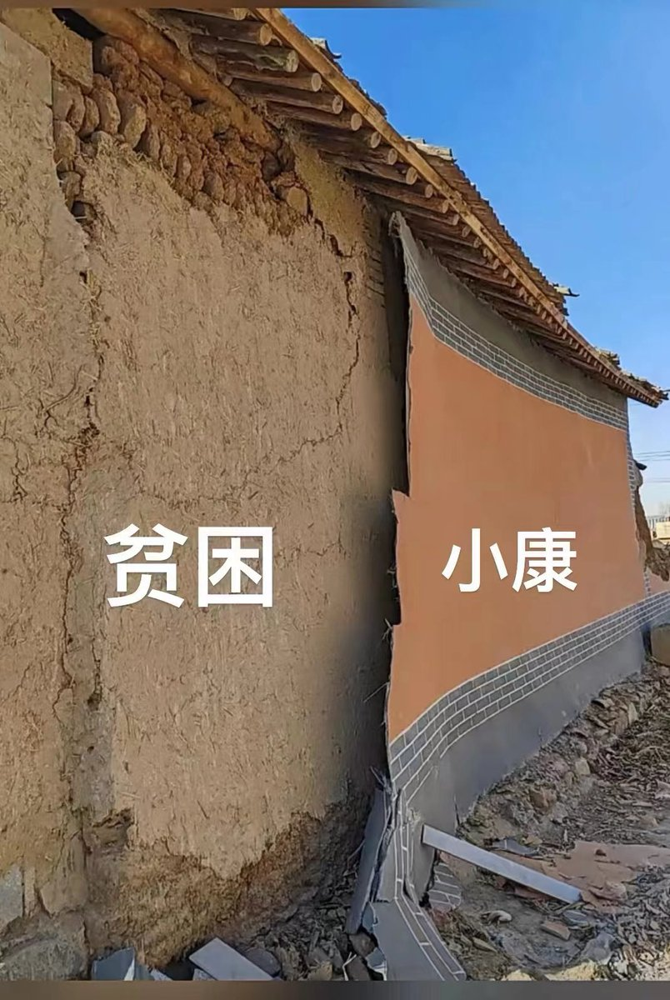
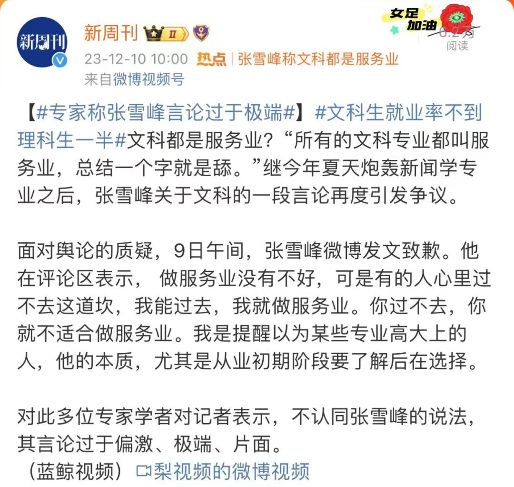

Petrichor 北京时间 2024-01-02T23:50:11Z 1742211694699454772 中共国没有免费医疗制度，不仅印度人理解不了，全世界人（除了三胖）都理解不了。但是，弱民、穷民、疲民、愚民…是中国历代统治者采取的基本国策，夕皇只是中国历史上500位皇帝之一，他的重中之重的任务就是维护其统治，镇压百姓起义。不要听他口头上天花乱坠的说为人民服务。他若真想为人民服务，先解决全民免费医疗吧。否则，就是最大的骗子，而网络电话上的诈骗与他相比则都是小骗子。   Petrichor 北京时间 2024-01-02T12:54:44Z 1742046744240681328 照片这个搞笑了，何不把冥国的职务搞大些，例如，冥国共产党中央委员会总书记，冥国中央军事委员会主席，冥国人民共和国主席，冥国中央军事委员会主席，这样才能在冥国定于一尊，享受极乐生活。 https://t.co/PVkmGmUYEq   Petrichor 北京时间 2024-01-02T13:26:29Z 1742054736231121128 转发网友评论：“不怕笨蛋吃喝玩乐，就怕笨蛋精忠报国”。 https://t.co/g9AyEMx8kj   Petrichor 北京时间 2024-01-02T14:18:20Z 1742067784899563846 收藏这个视频

 https://t.co/OY5yWEBby0   Petrichor 北京时间 2024-01-02T08:08:37Z 1741974744063230026 一个谎需要用一百个谎去圆。而且，碰不碰就露陷。

老实说，现在的共产党比当年的国民党腐败多一千倍。

就拿做过国民党秘书长、组织部长、教育部长、中统局长、中央政校校长、立法院副院长陈立夫先生来说吧，1950年之后，50岁的他去了美国，在新泽西州的一个小镇经营养鸡场，制售皮蛋、辣椒酱、粽子，到唐人街华人中去卖。现在中共哪个副省级官员都不会这么缺钱，个个贪腐流油。   Petrichor 北京时间 2024-01-02T08:38:48Z 1741982337645035817 为了维持生活开销，陈立夫开始放下身段干起了养鸡场。在官场许多年的陈立夫原本连斗鸡都不曾见过，看见鸡群打架都害怕。但他虚心向专业养鸡人求教，从怎么伸手掏鸡蛋学起。就这样陈立夫磕磕绊绊把养鸡场开了起来，挣了点小钱。但是没几年祸不单行，一场森林大火烧掉了养鸡场。陈立夫不得不改行，这时候他已经六十多岁。陈立夫把善做辣椒酱的妻子所制的辣酱拿到华人街去卖，这种家乡产品很受华人欢迎。后来发展到卖粽子、松花蛋等副食。捉襟见肘的时候，陈立夫多次收到蒋介石的接济。   Petrichor 北京时间 2024-01-02T08:40:07Z 1741982668848263174 1965年陈诚去世，蒋经国羽翼渐丰。终于蒋经国在父亲授意下邀请陈立夫夫妇返台定居。陈立夫回国只带了随身衣物、自己的打字机和妻子的缝纫机，其他家具钢琴类都卖掉或送人。阔别台湾十八年的陈立夫结束美国流亡生活回到台湾，这时年过七十。陈立夫不想再回政坛，拒绝了蒋介石给他安排的职务，只是潜心研究医学和传统文化，撰写回忆录，钟情于书法。
陈立夫2001年去世，享年一百零一岁，活过了他所有的政敌和朋友。   Petrichor 北京时间 2024-01-02T10:49:11Z 1742015150926844194 今天日本的地震还是造成石川县轮岛市8人死亡。这是一场7.6级地震。同样一个7.6级地震，1976年中国唐山死24万人。房屋有无抗震设防，是重要的。 https://t.co/jlxeiw1fD9   Petrichor 北京时间 2024-01-02T10:57:02Z 1742017125269614969 《环球时报》2013年的新年愿望实现了吗？时间又过去了10年，这些愿望不仅没有实现，而且离它的距离越来越远了。这10年，可都是习近平在执政啊。

开倒车！全面倒退，经济倒退、民生倒退、自由倒退、法治倒退、人权倒退。习近平说是人民选择了他，那么人民就要为自己错误的选择而付出沉重的代价。 https://t.co/wkZ1e5587u   Petrichor 北京时间 2024-01-02T11:50:54Z 1742030679951511595 韩国人还是非常有血性的，这样的事情不会发生在西朝鲜的包子身上，哪怕许多人背地里恨他要死。

视频为韩国最大在野党（共同民主党）的党魁李在明今天遇袭。 https://t.co/62AElByFxf   Petrichor 北京时间 2024-01-02T07:50:07Z 1741970085424631969 这是一个问题，在中国尤为特出。科技评价依赖数据库，科学共同体失去评价能力。另一方面，各行各业利用手中权力和资源掠夺财富。 https://t.co/wDtMtFqEaf   Petrichor 北京时间 2024-01-02T05:02:10Z 1741927818852798956 近年来，可持续性发展与转型研究领域轰轰烈烈，深入探讨了人类当前面临的紧迫问题。但值得关注的是，在众多跨学科的可持续性和转型学术期刊中，有高达50％的文章可以被归为“学术屁话（scholarly bullshit）”。这类论文经常打着最新流行的可持续性和转型概念（如“循环经济”）的旗号，但真正的学术深度和创新却微乎其微。

“学术屁话”定义为：那些连作者本身也难以为其存在的必要性进行辩解，对科学知识进展作出贡献甚微的研究。

现在有人开始研究地球的宜居性，即地球为什么适宜人类居住，背地里也有人称之为“学术屁话”，目的是从国家骗大笔科研经费。   Petrichor 北京时间 2024-01-02T05:09:52Z 1741929756398956947 四年前的今天，新华社的报道“8人因网上散布“武汉病毒性肺炎”不实信息被依法处理”。
回想起来，不寒而栗。不可能再相信它们了，它们什么都可以隐瞒，什么都可以造假。 https://t.co/0Y0dsH1DIO   Petrichor 北京时间 2024-01-02T02:39:52Z 1741892010426937757 放到新时代里，愚公儿子是找不到媳妇的，穷山恶水、交通不便、经济差、工具原始、出不起彩礼，而且思想顽固不化，没人家会把女儿嫁过去。所以，成为“最后一代”。

愚公儿子们翻山越岭，走了几天，转车去了东莞打工，愚公后来病死老家，无钱治病。他儿子回家奔丧，发现土屋墙上贴了画纸，是脱贫奔小康的新农村建设。当夜发生6.2级，土屋被毁。   Petrichor 北京时间 2024-01-02T03:41:54Z 1741907619487314133 张雪峰称：所有文科都叫服务业，总结起来就是“舔”。
他继续说：文科学校，入读时档次高，但就业时档次低。理科学校，入读时档次低，但就业时档次高。然后张雪峰说：“所以你千万不要为了所谓一时的你心理上对于院校档次的认知，而让自己一辈子都干那种要‘舔人’的行当”。

这是独裁体制下，不允许有独立思想、独立人格、言论自由的最准确描述。   