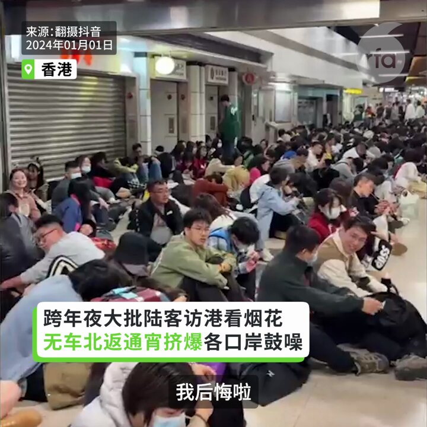
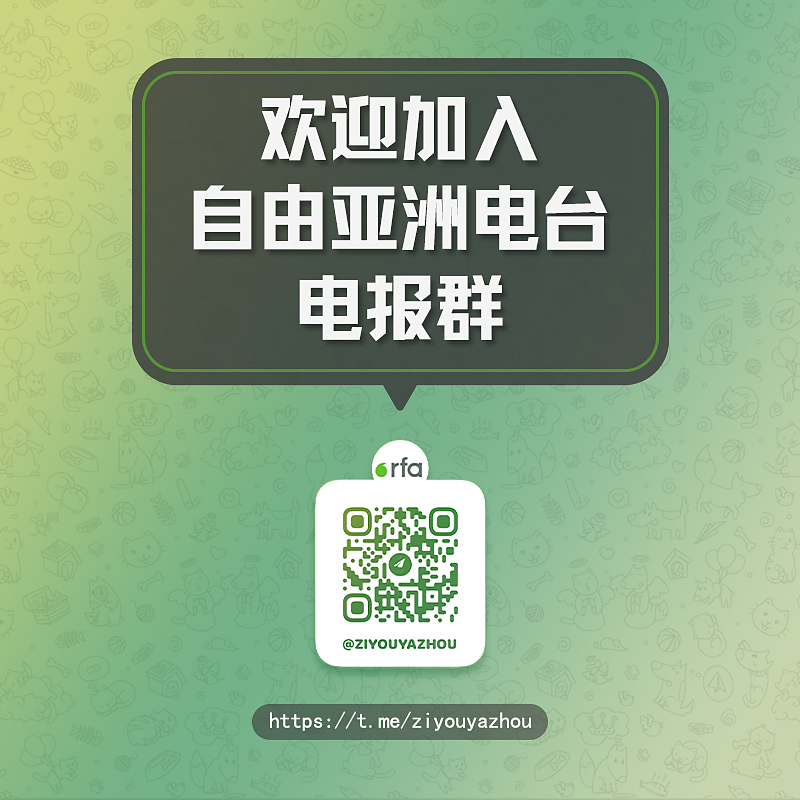
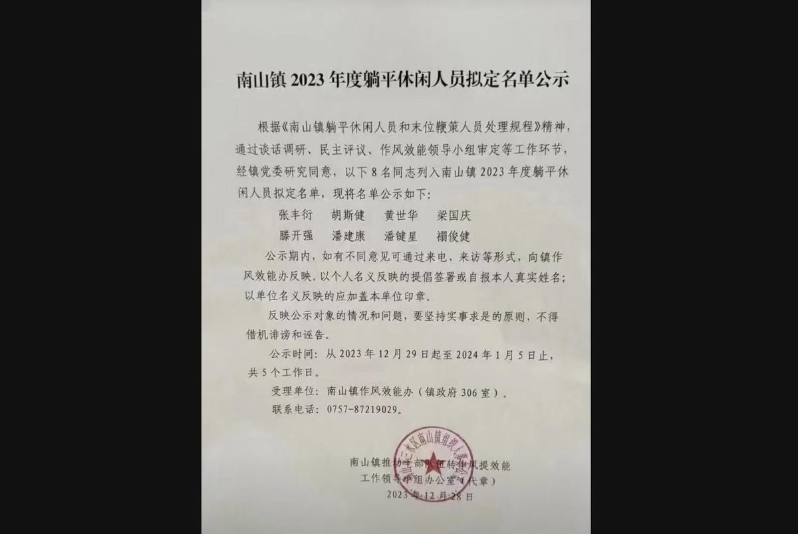
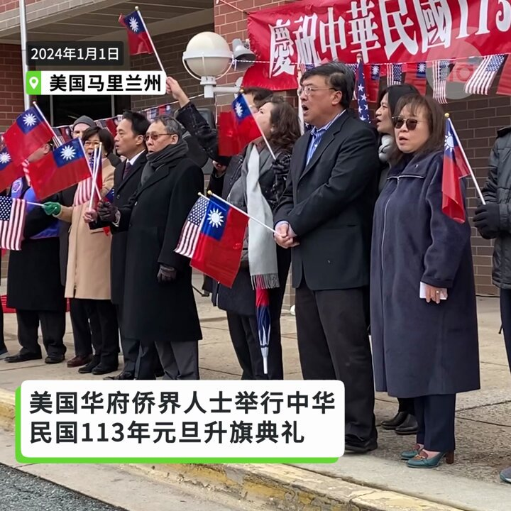
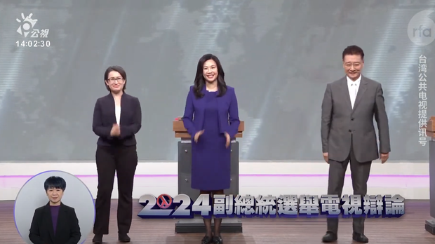
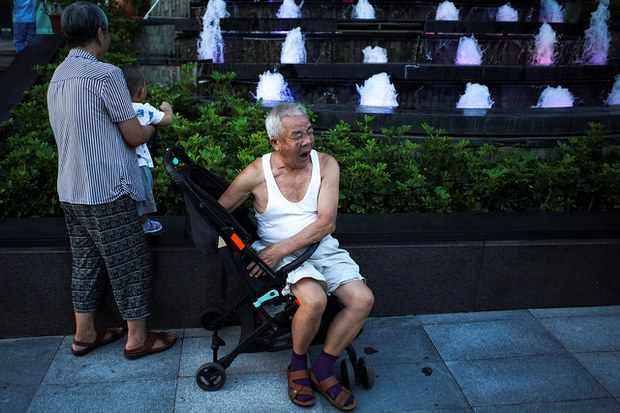
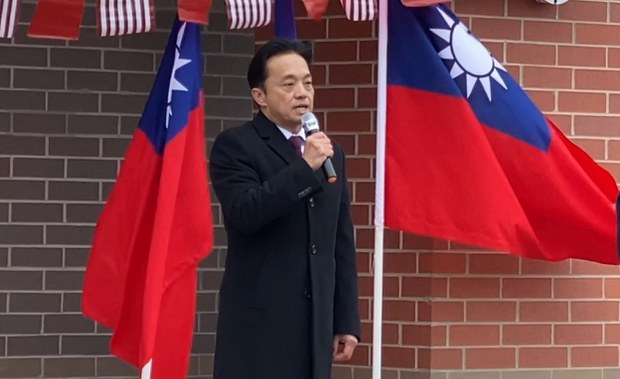
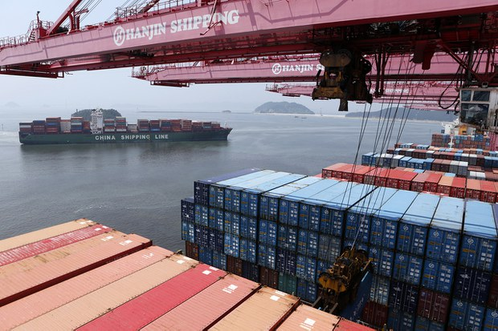
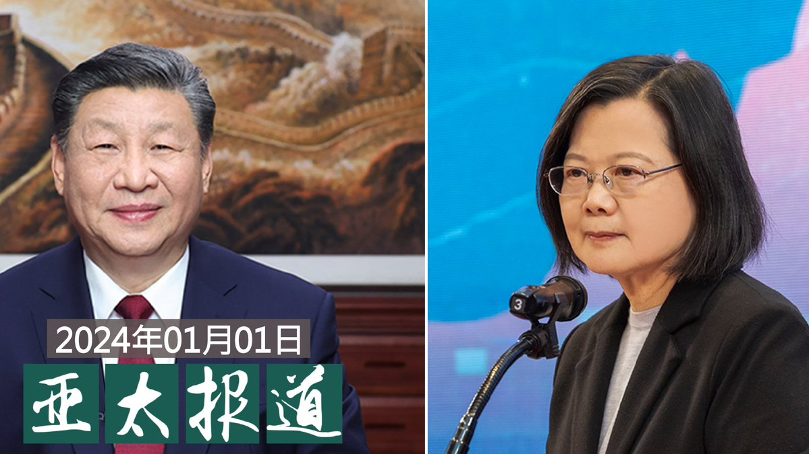
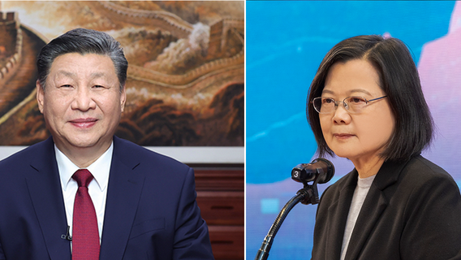

自由亚洲电台 北京时间 2024-01-02T15:06:07Z 1742079809340186749 【香港跨年烟花吸引大批中国游客】
【返程遭阻滞留关口 鼓噪愤怒】
#香港 #跨年烟花汇 演吸引大批中国游客前往观赏，但是结束后唯一24小时通关往来深港的 #皇岗 口岸却消化不了人潮，人山人海，有车票也无法上车。许多人滞留在地铁站、车站外围，人行道及公园坐满旅客，一直到天亮都还塞满人潮。滞留旅客狠批香港 #管治效率 差。   自由亚洲电台 北京时间 2024-01-02T16:09:09Z 1742095673250767143 RT @asiafactcheckcn: 新年快乐🎇

台湾2024 #副总统候选人 电视辩论会在2024年元旦登场，亚洲事实查核实验室针对三位候选人的发言做了一系列的事实快查。

❗本次查核聚焦在 #外交、#两岸、#国防 的议题讨论。详细的内政查核可以到精选读我们在政见发表会…   自由亚洲电台 北京时间 2024-01-02T13:23:24Z 1742053960582681049 RT @RFA_Chinese: 【欢迎加入自由亚洲电台电报群】https://t.co/UkKZmFSRkG https://t.co/Qid2LNZxJn   自由亚洲电台 北京时间 2024-01-02T14:23:45Z 1742069146693832892 【广东一地公布“#躺平”名单】
【8人上榜引发热议】
近日，广东 #佛山 市三水区 #南山镇 发布《2023年度 #躺平休闲人员拟定名单 公示》。在公示期内，当局欢迎实名反映8名被公示者的情况和问题，不得借机诽谤和诬告。相关消息引发媒体关注及网民热议。
https://t.co/KwCHbZY6Lf https://t.co/e7HYPIGHJz   自由亚洲电台 北京时间 2024-01-02T11:42:18Z 1742028517137625455 RT @RFA_Chinese: 【疫情四周年 | 社会怪象丛生, 您记得多少?】
2019年12月30日，吹哨人李文亮医生披露新冠病毒，打响抗疫第一枪。随后的三年里，扭曲的社会乱象层出不穷：慌乱中逃离 #封控、强行软禁、暴力隔离、不够抢的物资、做不完的核酸、大白打斗、#大白…   自由亚洲电台 北京时间 2024-01-02T07:57:49Z 1741972026104107183 1月1日，台湾的驻美副代表 #郑荣俊 在出席华府侨界升旗典礼时表示，台湾选举将再度证明，孙中山当年所倡导的民主制度可以在华人社会实现，而最成功的典范就是在台湾的中华民国。 #台湾大选 https://t.co/QEaeLSvosY   自由亚洲电台 北京时间 2024-01-02T02:23:36Z 1741887914387407185 #台湾大选：副总统辩论会聚焦中国威胁和台湾定位 https://t.co/0WKwrQ9tKy https://t.co/u2vQKdbT4Y   自由亚洲电台 北京时间 2024-01-02T02:24:45Z 1741888205614665908 “#恶俗维基网站”网络维护员 #牛腾宇 在狱中出现精神异常后，家属持续维权。但近日，牛腾宇的母亲接到死亡威胁。此外，有在美国的华人因为声援牛腾宇，疑似受到来自中国领事馆的干涉和滋扰。https://t.co/QNu10zgopf https://t.co/bcFy2AkAm2   自由亚洲电台 北京时间 2024-01-02T02:26:04Z 1741888536981475622 据财新网报道，#深圳 市 #养老保险缴费基数 下限从1月1日起上涨49%。https://t.co/PBqfsL6KZ0 https://t.co/wC59c7kNCI   自由亚洲电台 北京时间 2024-01-02T04:10:09Z 1741914731005583871 台湾大选日趋临近。1月1日，台湾的驻美副代表 #郑荣俊 在出席华府侨界升旗典礼时表示，#台湾选举 将再度证明，#孙中山 当年所倡导的 #民主 制度可以在华人社会实现，而最成功的典范就是在台湾的中华民国。https://t.co/UYix5gG0lj https://t.co/bmcLuZTbKr   自由亚洲电台 北京时间 2024-01-02T04:11:34Z 1741915085411643558 据日经新闻报道，周一韩国公布的数据显示，#韩国 在2023年 #对华贸易 出现了31年以来的首次逆差，#逆差 总额达180亿美元。https://t.co/VCYES9eYAU https://t.co/GCefPbynSg   自由亚洲电台 北京时间 2024-01-02T04:14:36Z 1741915849458614289 欢迎收听和订阅播客【#亚太报道】 https://t.co/MjLNSvVMqc
两岸领导人发表 #新年贺词；#美中建交45周年；#财新 文章再遭下架；#牛腾宇 家属受死亡威胁；#台湾 举行 #副总统候选人辩论会  #侯友宜 #柯文哲 #萧美琴 #吴欣盈  #赵少康 #中国威胁 https://t.co/zm285GhYG6   自由亚洲电台 北京时间 2024-01-02T02:22:28Z 1741887632236527660 台海两岸领导人在2024新年，透过发表贺词表达对核心议题的关注。中国国家主席 #习近平 强调 #两岸统 一是历史必然。而台湾的总统 #蔡英文 则针对“ #九二共识”表示，难用主权换沟通。https://t.co/RZxEH7ZWOd https://t.co/XAbDWn5LTG   