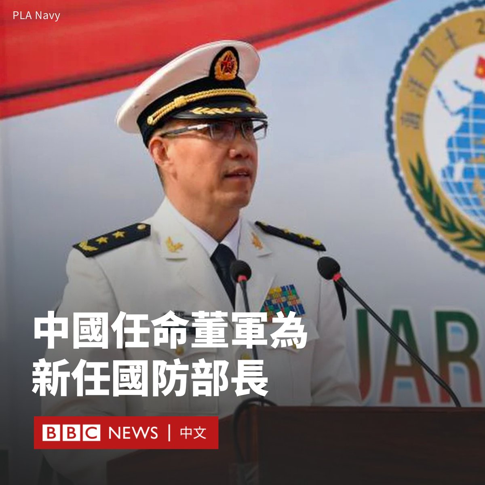

D英国广播公司BBC 北京时间 2024-01-01T08:43:07Z 1741621036234506450 在中国政府两个月前突然免去前任国防部长李尚福的职务后，北京宣布任命前海军司令员董军为新任国防部长。

据中国官方媒体报道，全国人大常委会周五（2023年12月29日）通过决议，任命董军为国防部长，中国国家主席习近平随即签署任命的主席令。

这是中共建政以来，首次由海军将领担任国防部长一职，尽管中国的防长主要负责军事外交，实际上并无作战决策权。

62岁的董军在2021年8月被任命为海军司令员。他此前的职务包括南部战区副司令员，东海舰队副司令员和北海舰队副参谋长等。

自2023年10月底以来，中国防长一职一直处于空缺。当年3月，李尚福被任命为防长，但仅七个月后，他突然被免职，使其创下中国防长的最短任期纪录。

当局至今没有解释李尚福被免职的原因。美国官员曾表示，李尚福正在接受北京的调查。

路透社也曾引述消息人士报道，指李尚福是因军备采购问题而遭到当局调查，这让他在2023年8月底出席一场安全论坛后便从公众视野中“消失”。

中国全国人大常委会在上周五还发布公告，决定罢免中国人民解放军火箭军原司令员等九名将领的全国人大代表职务。   D英国广播公司BBC 北京时间 2024-01-01T01:48:24Z 1741516668969369982 【最新消息】丹麦女王玛格丽特二世（Margrethe II）在新年致辞中意外宣布将于2024年1月14日退位，王储弗雷德里克（Frederik）将继承王位。

现年83岁的玛格丽特二世于1972年登基，至今已在位近52年。 https://t.co/42ipWuNHMi   