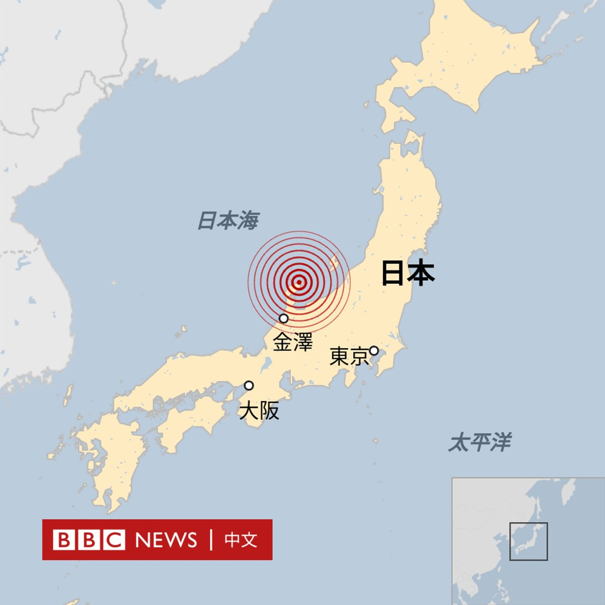
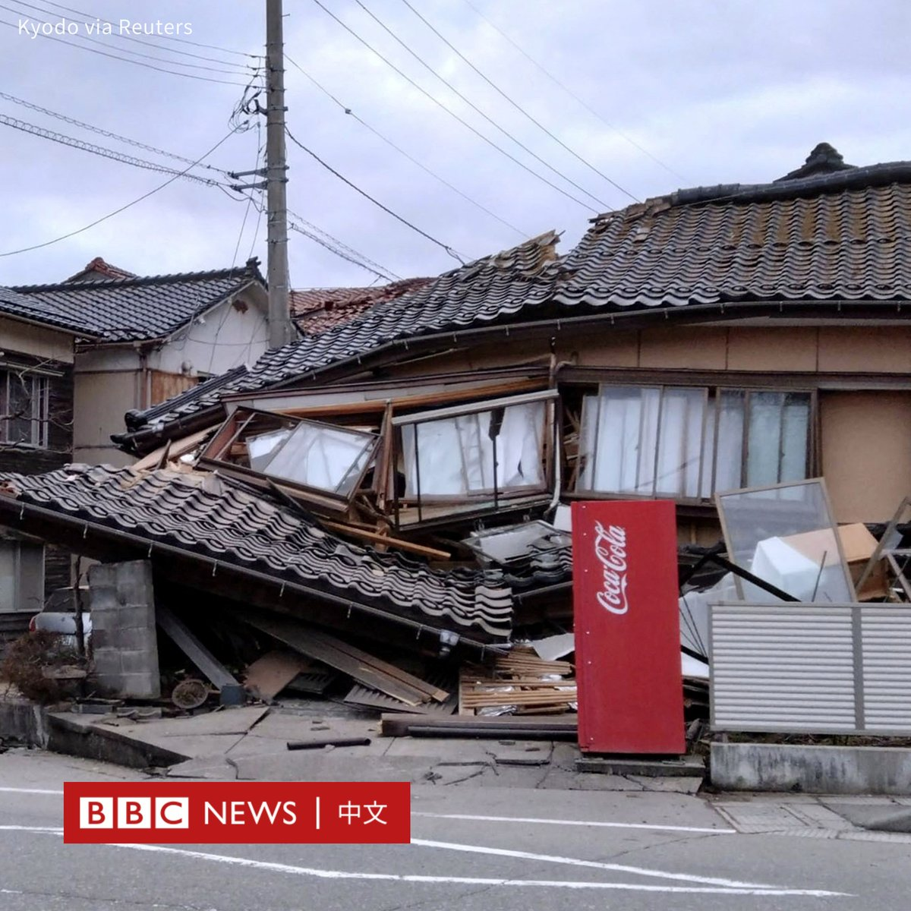
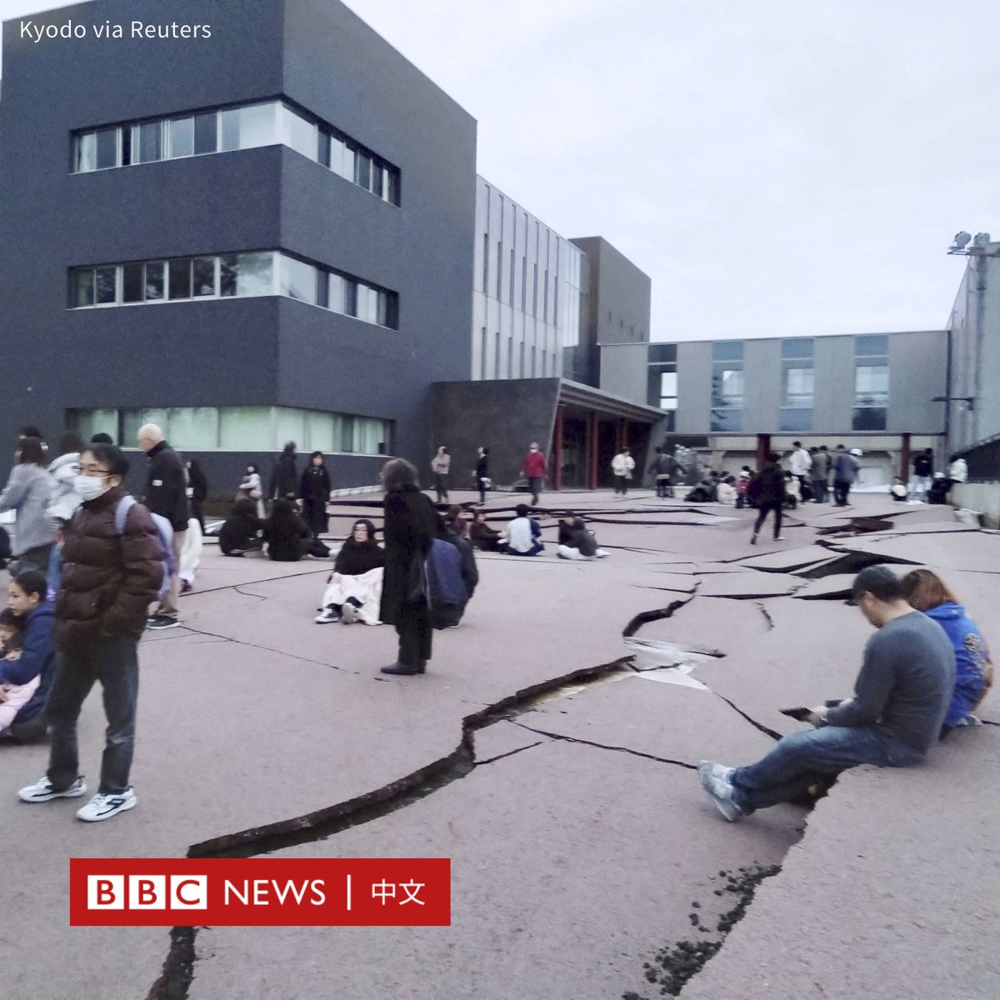
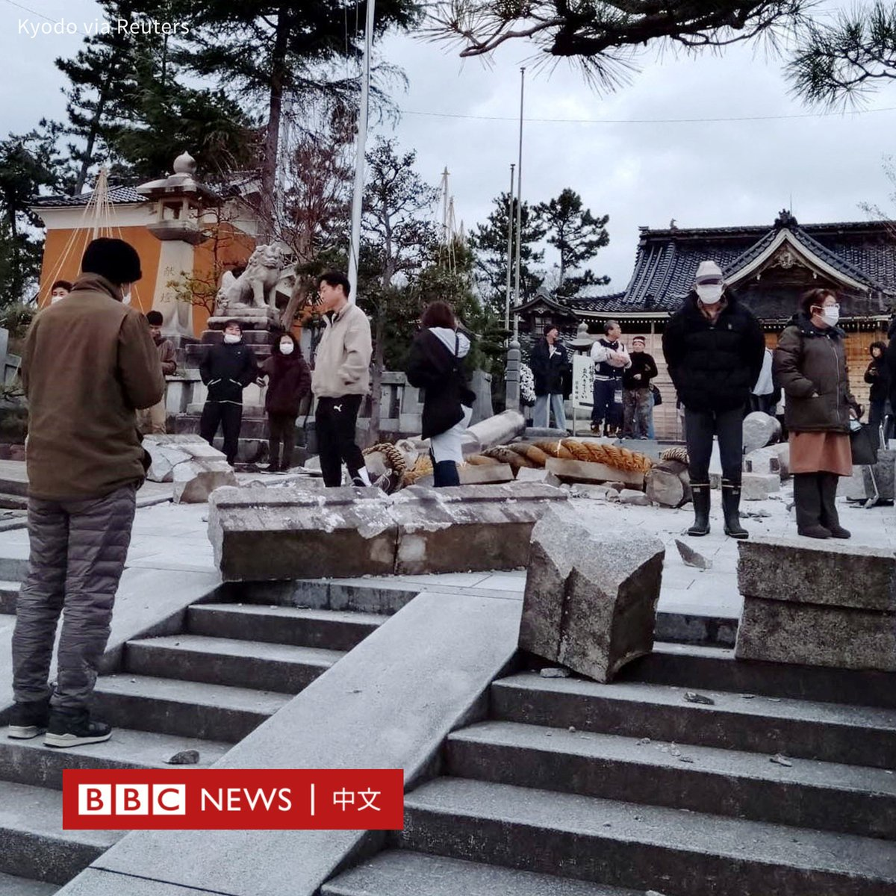
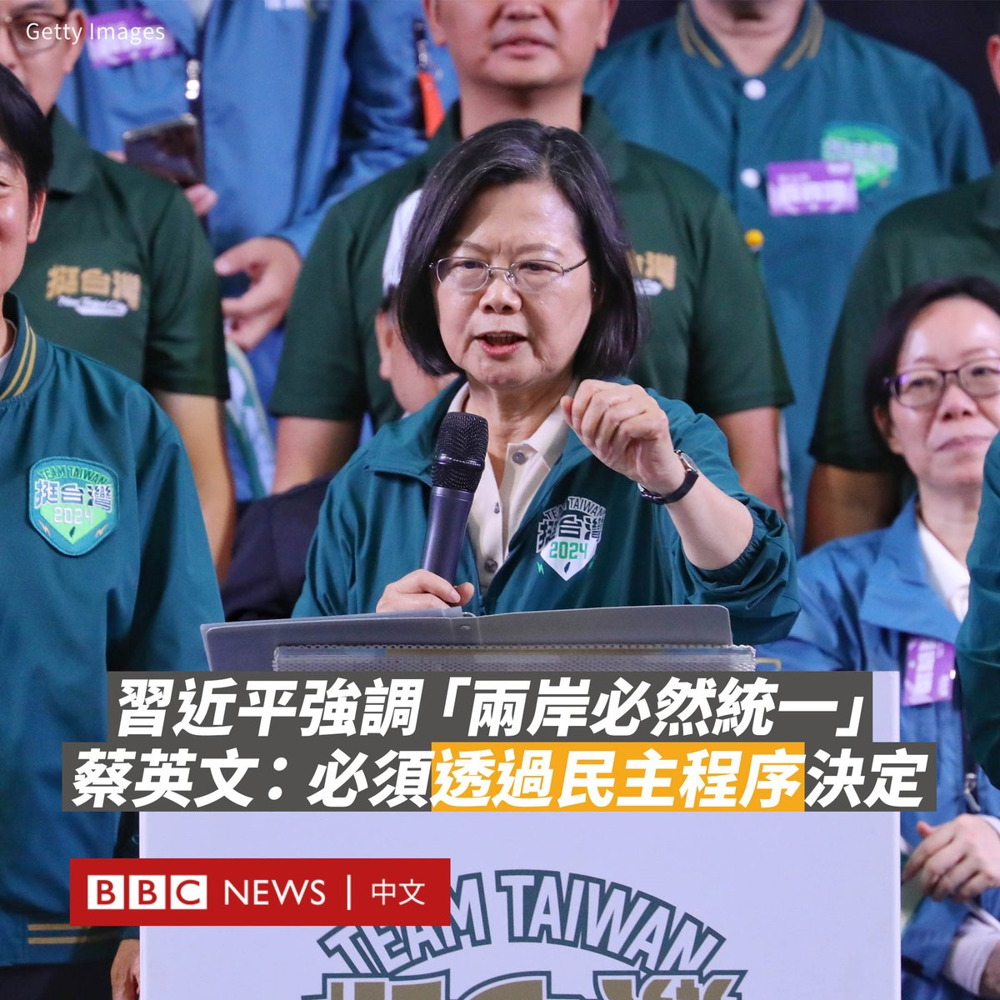

D英国广播公司BBC 北京时间 2024-01-01T20:38:18Z 1741801018051248251 日本石川县能登半岛在周一（1月1日）16时许发生7.6级地震，并触发重大海啸警报后，当地仍处于戒备状态。当局敦促海岸附近的居民前往高地等安全地点避难。

据日本媒体报道，地震发生后，北海道到九州大范围地区都有震感。日本气象厅向能登地区一度发布了重大海啸警报。这是2011年东日本大地震后，当局首次发布此级别的警报。

海啸警报目前已经降级。最初的警报指一些地方的海浪可能高达五米，但到目前为止，最高记录只有一米多。

政府发言人表示，已有六起人员被困在倒塌建筑物废墟下的报告，震后石川县轮岛市多栋建筑起火。

石川县和东京之间的高速公路已经关闭，部分新干线列车也停驶。能登等地仍持续发生规模较小的地震。

日本原子能管制委员会称，受影响地区的核设施尚未报告异常情况。   D英国广播公司BBC 北京时间 2024-01-01T19:05:05Z 1741777559778672838 中国国家主席习近平周日发表2024年新年贺词，其中提及“祖国统一是历史必然，两岸同胞要携手同心，共享民族复兴的伟大荣光”。

台湾总统蔡英文在周一的新年谈话中对此进行回应。她称，两岸的关系何去何从，“最重要就是要符合民主的原则，以台湾人的共同意志做决定”。

“将来要跟中国形成什么样的关系，必须透过我们的民主程序来做最后决定。”

她称，“九二共识、一中原则、一国两制”，是中共三位一体的对台方案，若一味地附和“九二共识”，只会将台湾人圈入在北京所定义的“九二共识”，这将对主权构成“最大风险”。

“持续的以九二共识为通关密语，向台湾人民表达可以与中国沟通，沟通固然重要，但是以主权来交换，未免也太沉重了一些。”她补充道。

在任内的最后一次新年谈话中，蔡英文还表示，台湾摆脱了前一个政府所设定的“先走向中国，再走向世界”的宿命，“现在的台湾，可以直接走向世界”。

她还表示，台北期盼两岸尽速恢复健康有序的交流，也期盼“以和平、对等、民主、对话，共同寻求两岸之间长远稳定的和平共存之道”。

台湾即将于1月13日举行总统大选及立法委员选举。已执政八年的蔡英文将在今年5月卸任。   D英国广播公司BBC 北京时间 2024-01-01T17:02:13Z 1741746640510177325 很多台湾人信奉妈祖等源于中国大陆的民间信仰，两岸宗教团体有深厚联系。在一月大选来临之际，这却让台湾信众被卷入政治角力的中心。https://t.co/ah3nYAj0dm   D英国广播公司BBC 北京时间 2024-01-01T15:00:01Z 1741715884819808715 2023年已经离我们而去，虽然这一年全世界充满了冲突与灾难，但它也有许多让我们开怀大笑的时刻。

让我们重温这些有趣而感人的瞬间。 https://t.co/t0luaT3ow2   D英国广播公司BBC 北京时间 2024-01-01T16:04:56Z 1741732223550963976 【最新消息】据日本气象厅消息，日本西部石川县能登半岛发生7.6级地震，触发海啸预警。 https://t.co/Hkdshg4hkS   D英国广播公司BBC 北京时间 2024-01-01T11:50:13Z 1741668120090337516 随着世界上大多数地区都已步入2024年，让我们看看全球各地的人们如何在璀璨的烟火下迎接新年的到来。🎉🎆 https://t.co/9eb6sxoMeJ   D英国广播公司BBC 北京时间 2024-01-01T08:43:07Z 1741621036234506450 在中国政府两个月前突然免去前任国防部长李尚福的职务后，北京宣布任命前海军司令员董军为新任国防部长。

据中国官方媒体报道，全国人大常委会周五（2023年12月29日）通过决议，任命董军为国防部长，中国国家主席习近平随即签署任命的主席令。

这是中共建政以来，首次由海军将领担任国防部长一职，尽管中国的防长主要负责军事外交，实际上并无作战决策权。

62岁的董军在2021年8月被任命为海军司令员。他此前的职务包括南部战区副司令员，东海舰队副司令员和北海舰队副参谋长等。

自2023年10月底以来，中国防长一职一直处于空缺。当年3月，李尚福被任命为防长，但仅七个月后，他突然被免职，使其创下中国防长的最短任期纪录。

当局至今没有解释李尚福被免职的原因。美国官员曾表示，李尚福正在接受北京的调查。

路透社也曾引述消息人士报道，指李尚福是因军备采购问题而遭到当局调查，这让他在2023年8月底出席一场安全论坛后便从公众视野中“消失”。

中国全国人大常委会在上周五还发布公告，决定罢免中国人民解放军火箭军原司令员等九名将领的全国人大代表职务。   D英国广播公司BBC 北京时间 2024-01-01T01:48:24Z 1741516668969369982 【最新消息】丹麦女王玛格丽特二世（Margrethe II）在新年致辞中意外宣布将于2024年1月14日退位，王储弗雷德里克（Frederik）将继承王位。

现年83岁的玛格丽特二世于1972年登基，至今已在位近52年。 https://t.co/42ipWuNHMi   