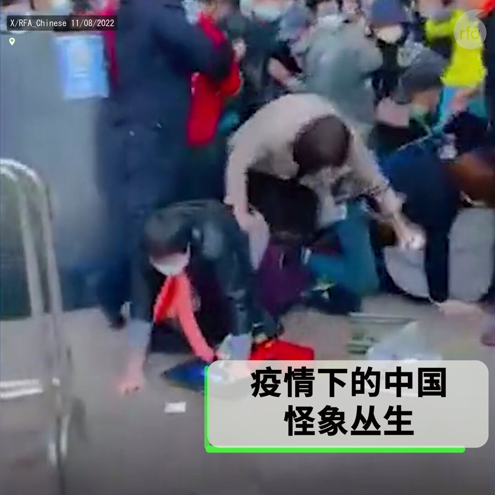

自由亚洲电台 北京时间 2024-01-01T06:29:44Z 1741587470511112552 2024年1月1日起，#美国 游客申请中国旅游 #签证 程序简化，无需提供往返机票、酒店订单、行程单或邀请函等申请材料。
详阅：
https://t.co/OvnRZqJb3D   自由亚洲电台 北京时间 2024-01-01T07:37:42Z 1741604573658100049 【失业大军涌入网约车行当】中国今年新增120万 #网约车 司机，不少餐饮和其他行业小业主都改行做网约车，约车市场逐渐饱和。
详阅：
https://t.co/IAtrcVraAt   自由亚洲电台 北京时间 2024-01-01T08:58:50Z 1741624992146641031 【习近平: 群众生活困难，是前路有风有雨的常态】
国家主席 #习近平 在新年贺词中表示，中国过去一年的步伐，走得很坚实、很有力量、很见神采、很显底气。
但在同一天，统计局发布12月数据显示，制造业采购经理 #PMI 指数为49，低于强弱分界线50，表明经济总体收缩。
详阅：
https://t.co/9G1wZuavvF   自由亚洲电台 北京时间 2024-01-01T04:28:20Z 1741556916294124014 【沪深300指数全年跌12%，连续三年下跌】
2023年，外国投资者通过香港购得深圳和上海股票净额仅为62亿美元，为2017年以来最低。
详阅：
https://t.co/zgKifnU2oQ   自由亚洲电台 北京时间 2024-01-01T04:59:01Z 1741564641178722367 【疫情四周年 | 社会怪象丛生, 您记得多少?】
2019年12月30日，吹哨人李文亮医生披露新冠病毒，打响抗疫第一枪。随后的三年里，扭曲的社会乱象层出不穷：慌乱中逃离 #封控、强行软禁、暴力隔离、不够抢的物资、做不完的核酸、大白打斗、#大白 讨薪、寂寥的街道... 这些景象恍如隔世，却随时可以重演。#2024年，您希望后疫情时代的中国变成什么样子？   自由亚洲电台 北京时间 2024-01-01T02:52:00Z 1741532676354400366 2023年最后一天，中国多地仍在延续雾霾天气。中央气象台上午6时发布大雾橙色预警，范围涵盖河北中南部、河南北部、山东西部、湖北中东部、湖南北部、四川盆地等地。
详阅：
https://t.co/CTXzBOhQQu   自由亚洲电台 北京时间 2024-01-01T03:19:54Z 1741539695543095575 #国家发改委 学术委员会原秘书长 #张燕生 对2024年中国经济作出展望时表示，2024年是中国经济能否回到合理区间的关键一年，又称中国经济潜在增长水平应该是在5%以上。
详阅：
https://t.co/Ehxf6YxC7V   自由亚洲电台 北京时间 2024-01-01T03:43:29Z 1741545629216624865 阿根廷总统 #米莱 致信中国, 拒绝加入金砖国家集团的邀请。米莱在信件中称，阿根廷目前作为正式成员加入该组织的时机“并不合适”。#阿根廷 目前通货膨胀率超过140%。
详阅：
https://t.co/IPxRgzB1Ja   自由亚洲电台 北京时间 2024-01-01T01:16:50Z 1741508726215880939 中国四大一线城市2023年没有出现人口回流的现象，#人口 持续净减少。根据 #国家信息中心 跨城市人口迁徙数据，深圳、上海、东莞、成都、苏州等地在春节后的流入人口远低于春节前流出的人口，其中深圳尤为显著。
详阅：
https://t.co/kcu8IT8GL1   自由亚洲电台 北京时间 2024-01-01T02:05:41Z 1741521017795662056 反映2020年新冠疫情期间武汉封城三月实情的纪录片《＃武汉封城》周六在台湾、纽约、洛杉矶、加拿大、日本、荷兰、德国等地对公众免费放映。
详阅：
https://t.co/RUhbHZ49sa   