谁将十万横扫三江 北京时间 2024-01-01T19:54:03Z 1741789882010526122 https://t.co/1DaKPY4z7j 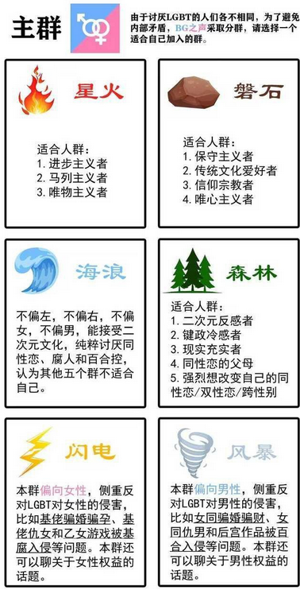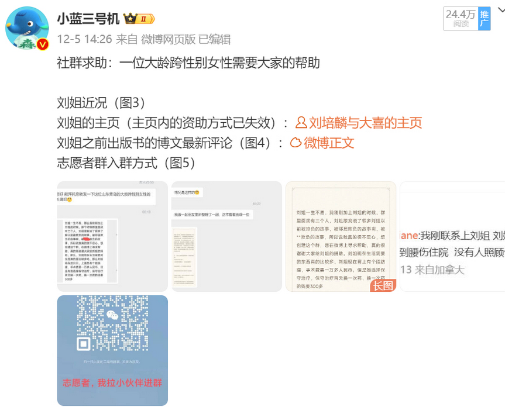  谁将十万横扫三江 北京时间 2024-01-01T20:47:55Z 1741803439435526560 RT @torontobigface: 最近又有数名部队军官被拿下了
现在中国的高官落马已经成为常态
习近平自上台之后，其轰轰的反腐运动一直饱受争议
有人说他是真心反腐，有人说他是铲除异己
那么该如何评价习近平的反腐成果？
反腐又让我们看到了官员什么样的奢侈生活？
方脸说：客观…   谁将十万横扫三江 北京时间 2024-01-01T21:14:01Z 1741810004636979618 RT @xiaojingcanxue: 2023十大等待后续的新闻。/1 https://t.co/fkqTqXPOW8 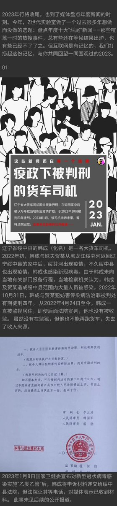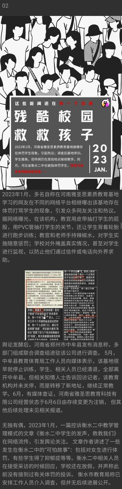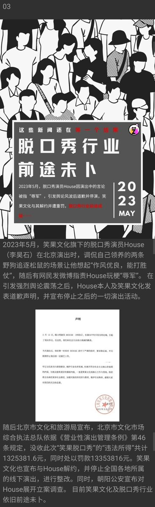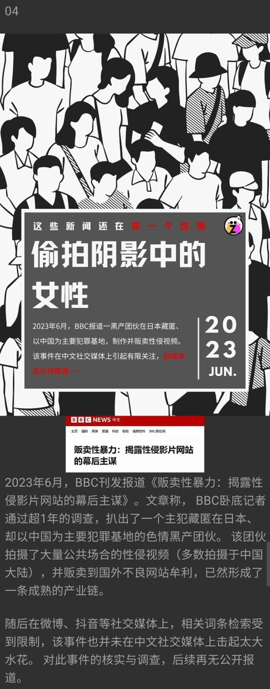  谁将十万横扫三江 北京时间 2024-01-01T21:19:04Z 1741811278363136366 RT @nursenika1840: 其实在国内做警察真的挺好的，警察是国家机器的暴力机关，公务员编制，福利待遇一直是公务员里的第一档，公务员再发不出工资，也不可能让警察发不出工资。

咱不说贪污腐败的事，就算没有贪污腐败，警察的收入在普通老百姓里，都已经赢麻了。…   谁将十万横扫三江 北京时间 2024-01-01T21:26:28Z 1741813137740042733 RT @DXDWX999: 台湾国家总统蔡英文最霸气的演讲，没有之一！🌹 https://t.co/7vPnNrq0tA 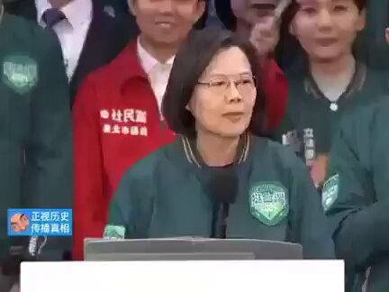  谁将十万横扫三江 北京时间 2024-01-01T19:34:09Z 1741784874019942741 RT @YesterdayBigcat: 纪录片：《宁陵事件》

“做了这个关于宁陵的纪录片，献给勇敢的人们，你们不会被忘记。”

河南省宁陵县中学生疑遭教师虐杀引发的万人示威事件… https://t.co/dl0NR16vHx   谁将十万横扫三江 北京时间 2024-01-01T13:17:19Z 1741690041053909082 网友投稿：四川内江中院正在办理的原内江市经济开发区工委书记、国土局长、工信局长赵永伟被指控受贿罪一案存在以下令人啼笑皆非的事情
一、审判长刘应江法官涉嫌行贿犯罪
二、把关于赵永伟案件如何炮制的材料发到网络上
三、内江纪委书记王渊的硕士毕业论文造假
四、纪委监委办案人员涉赌博恶习 https://t.co/QYyvSO1b6a 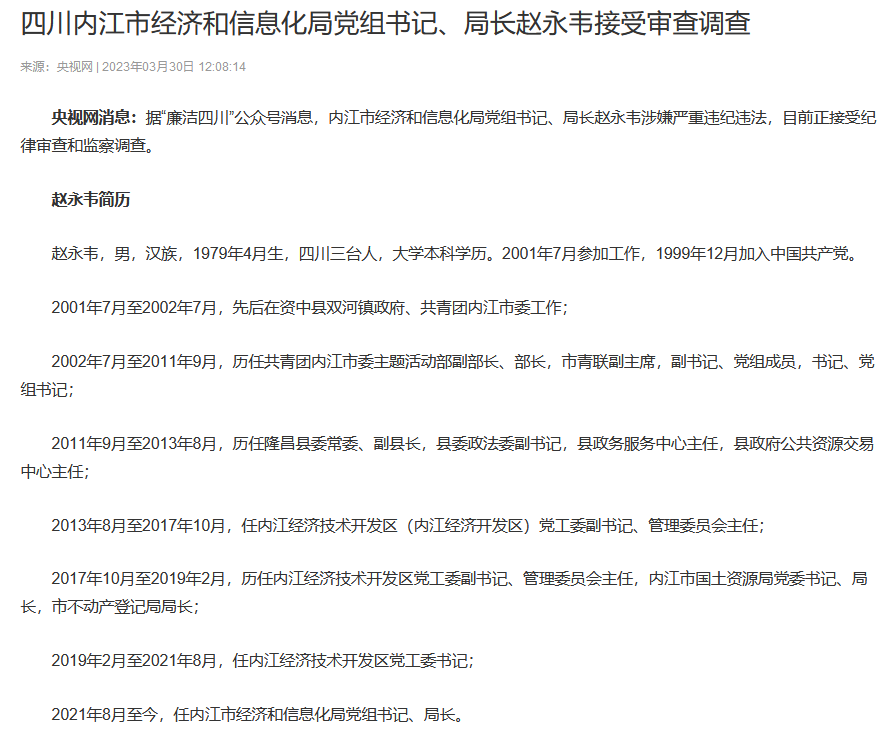  谁将十万横扫三江 北京时间 2024-01-01T11:31:07Z 1741663315619954978 去年有不少人喷我🥳却不知那是多少人幼年之野望 https://t.co/STYo4RZIyP   谁将十万横扫三江 北京时间 2024-01-01T11:47:24Z 1741667413664665714 柯文哲說台灣的債務一直增加，這就是認知戰的一種，事實上我國自2016蔡英文上任後就不斷的在減少債務比，

唯獨2020-2021這兩年呈現些微上升
（疫情期間，各行各業需要補助、各種防疫措施、全世界各國債務比都是暴增。）

然後2022債務比就又開始穩健的下降。
如圖1。
目前台灣是全球債務比最低的國家之一，
如圖2。 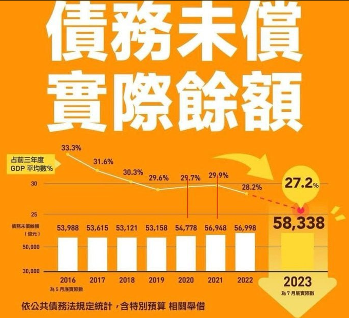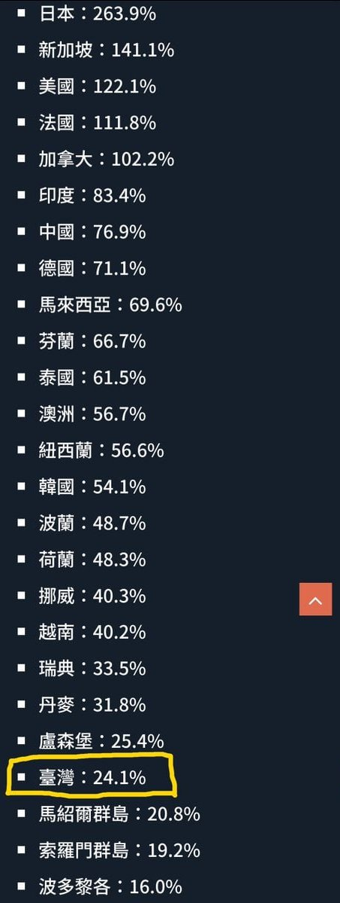  谁将十万横扫三江 北京时间 2024-01-01T10:31:08Z 1741648221158670370 元谋火车站29年前劫杀案再审无罪 当事人此前实际被羁押21年9个月10天，无儿无女。曾喊冤：案发时，我在700公里之外 

PS：服刑减刑二十多年后出狱，也就是老领导退休了，不然你此时发难很容易在抓进去的 https://t.co/JUReqS4RJv 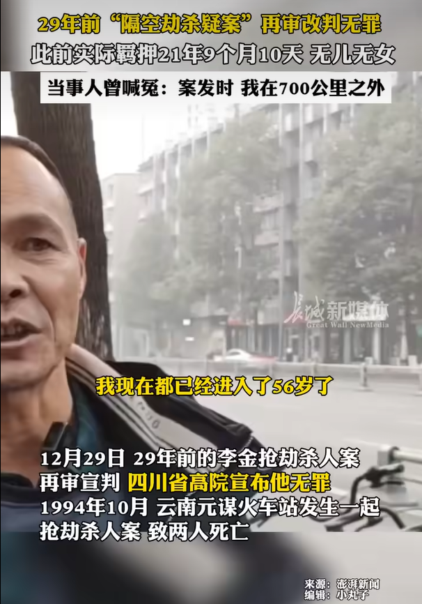  